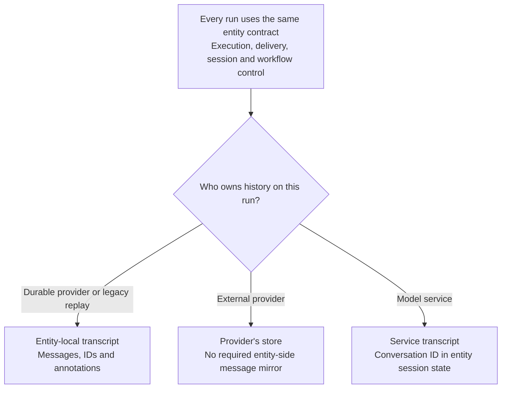
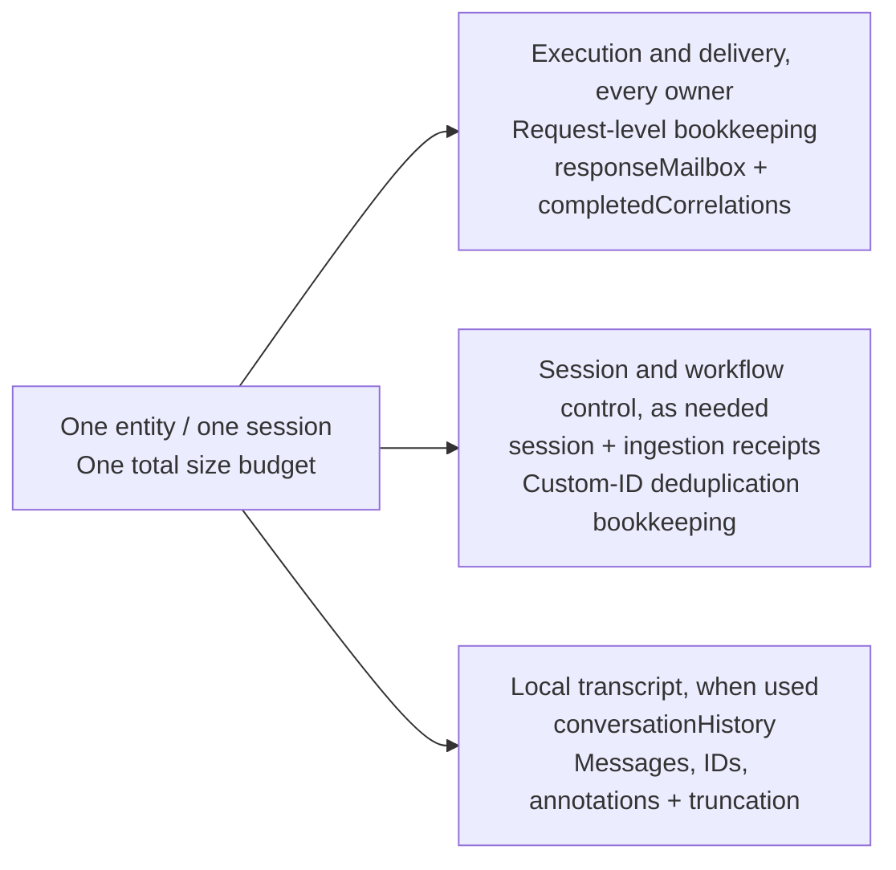
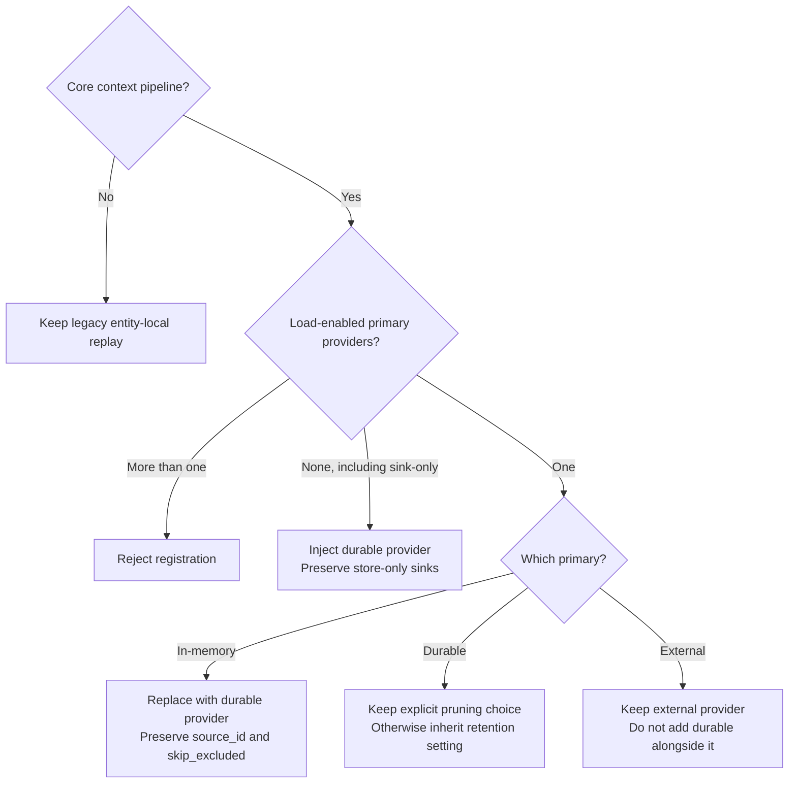
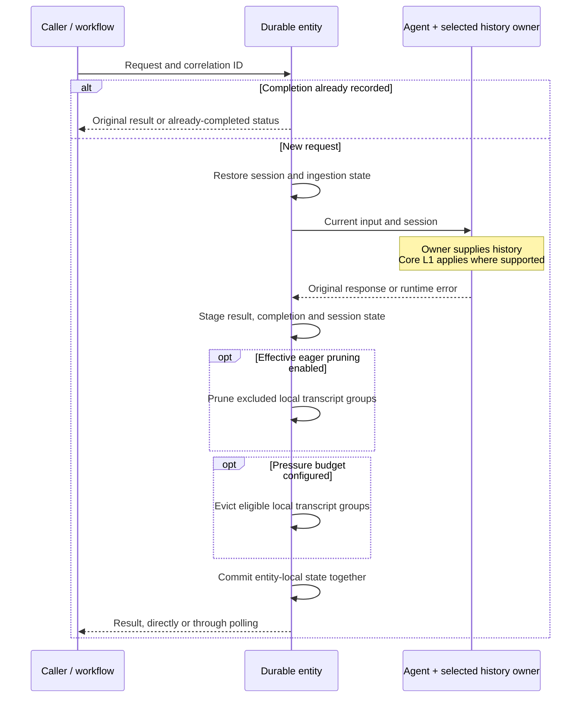
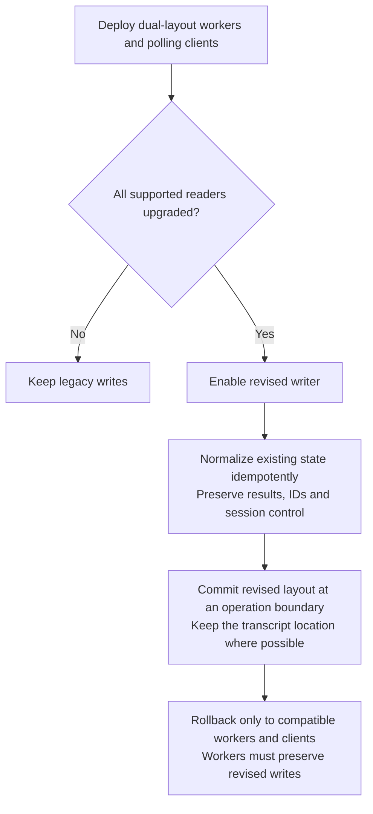

# Thread Compaction for Durable Agents and Workflows

> This copy preserves the canonical proposed contract at `d8f6582`. References to the prototype
> below describe `c4582a1`, not the current PR #59 implementation. See
> [Current Local Implementation Status](#current-local-implementation-status) for local changes
> and unmet release gates. Historical measurements have not been rerun for this documentation update.

## Decision Summary

Use core's history-provider abstraction for durable conversation storage, together with workflow
context projection and per-target delta transport (Options 6 and 4). Keep execution and result
delivery independent of transcript ownership.

- The entity owns request correlation, completion, original result delivery and duplicate-request
  suppression for every history configuration.
- The selected history owner supplies the transcript. Durable-owned history remains entity-local.
  External and service-owned history does not require an entity-side message mirror.
- Workflow delta transport preserves custom selection. Position monotonicity is a cursor
  optimization condition, not a requirement on custom filters.
- Core compaction controls model input. Eager transcript pruning and pressure eviction are separate
  opt-ins, defaulting to `retention="keep_all"` and `max_state_bytes=None`.
- All entity-local slices share one size budget and commit at one operation boundary. External
  writes and tool side effects are outside that transaction.
- New state writers require compatible workers and polling clients, including supported rollback
  behavior for in-flight sessions and workflows.

This ADR specifies a proposed contract for Python and .NET. The existing Python prototype uses a
combined execution/transcript layout. Its coverage and limitations are recorded in
[Prototype Evidence](#prototype-evidence), separately from the implementation requirements below.

**Sections**

- [Context and Terminology](#context-and-terminology)
- [Considered Options](#considered-options)
- [Ownership and State Model](#ownership-and-state-model)
- [Execution, Delivery and Session Lifecycle](#execution-delivery-and-session-lifecycle)
- [Retention Policy](#retention-policy)
- [Workflow Context](#workflow-context)
- [State Evolution and Compatibility](#state-evolution-and-compatibility)
- [Consequences](#consequences) and [Validation Requirements](#validation-requirements)
- [Dependencies and Follow-up Work](#dependencies-and-follow-up-work)
- [Current Local Implementation Status](#current-local-implementation-status)
- [Prototype Evidence](#prototype-evidence)

## Context and Terminology

Durable agents persist conversation state across worker restarts. Durable workflows also carry
conversation context between executors in checkpointed envelopes. These create three distinct
pressures.

| Pressure | Scope | Control |
| --- | --- | --- |
| Model context window | Input to one model call, in both core and durable execution | Core compaction |
| Token cost and latency | History sent on each call, in both runtimes | Core compaction and workflow projection |
| Persisted state capacity | Cumulative state and transport payloads in durable execution | Backend offload and explicit retention |

Reducing model input does not necessarily reduce storage. An exclusion-and-summary strategy can
retain the original messages and add summaries, increasing stored size. A token-window setting is
therefore not a storage-byte limit.

Durable Task Scheduler (DTS) has an unoffloaded message limit of 1 MB. The Azure Storage backend
compresses payloads above 45 KB into a `<taskhub>-largemessages` blob instead, but still incurs CPU,
I/O and memory costs. The design must work without offload and must distinguish a hard transport
limit from an operator-selected storage budget.

Core's [compaction design][adr0019] provides two relevant mechanisms:

1. **In-run filtering** projects the messages supplied to the model without deleting the originals.
   It can operate on context supplied by any supported history provider.
2. **Store reduction** rewrites stored history. In the implementations evaluated for this ADR,
   Python's `after_strategy` targets session-state history, while .NET exposes `IChatReducer` on
   `InMemoryChatHistoryProvider`, including the `strategy.AsChatReducer()` bridge. External stores
   do not share a general rewrite contract. See [Dependencies](#dependencies-and-follow-up-work).

The original durable entity bypassed the history-provider pipeline and rebuilt a session for each
operation. The design restores that pipeline and session state rather than introducing a separate
durable-only compaction API. It must preserve user configuration, message ordering and atomic
tool-call/result and reasoning groups, while keeping deletion explicit and observable.

| Term | Meaning in this ADR |
| --- | --- |
| History provider | Python `HistoryProvider` or .NET `ChatHistoryProvider` |
| Primary provider | A history provider with loading enabled. Additional providers may be store-only sinks. |
| Transcript | Messages and associated history/compaction metadata, distinct from execution receipts |
| `conversationHistory` | The entity's existing persisted transcript field, not a requirement for every history owner |
| Execution and delivery state | Request-level bookkeeping, original results and completion receipts |
| Service-storing client | A client whose default is service-side storage |
| Service-owned run | A run for which the model service supplies history, determined from effective options |
| `source_id` / `history_source_id` | The provider's identifier / the identifier a compaction provider uses to locate that history |
| Non-evictable floor | Serialized entity data that transcript retention cannot remove |

The labels L1, L2 and L3 identify different integration points, not three forms of storage eviction.

| Surface | Mechanism | Effect |
| --- | --- | --- |
| L1, agent context | Core `CompactionProvider` / `compaction_strategy` | Projects model input without deleting stored history |
| L2, eager pruning | `retention="follow_compaction"` | Opt-in deletion of excluded local transcript messages |
| L3, workflow context | `context_mode` / `context_filter` and delta transport | Selects and transports context between executors |
| Capacity safety | Optional `max_state_bytes` budget | Evicts eligible local transcript groups under pressure, independently of L2 |

The Python prototype demonstrates the L1/L2 integration. The evaluated .NET compaction-state
representation has an additional storage constraint described in dependency 4. The target contract
does not imply that both implementations already provide every capability.

## Considered Options

1. **In-run filtering alone, rejected.** It bounds model input but leaves cumulative durable state
   unbounded.
2. **Bespoke pre-write compaction in the entity, rejected.** It duplicates core strategies and
   grouping rather than integrating with the history-provider abstraction.
3. **Separate on-storage maintenance, deferred.** It may suit expensive summarization, but cannot
   prevent state from exceeding its limit during an active turn.
4. **Workflow projection and delta transport, selected.** Honor `AgentExecutor.context_mode` and
  `context_filter`, then avoid resending already-delivered messages to a target.
5. **Automatically derive a lossy store reducer, rejected as a default.** A model-input exclusion
   is not implicit permission to delete. Users can opt into `follow_compaction`, or independently
   set a pressure budget without configuring compaction.
6. **Durable storage as a core history provider, selected.** Reuse the core pipeline and session
   state while keeping execution/delivery independent of history ownership. Each store retains its
   own lifecycle policy.
7. **Large-payload offload, optional and backend-specific.** The DTS
  [large-payload extension][offload] raises the ceiling without deleting content, but requires an
  Azure Blob payload store and is not
   available through every host. Azure Storage already offloads internally. No portable guarantee
   in this ADR depends on offload being present.

## Ownership and State Model

### Transcript ownership

The entity owns execution and delivery in every configuration. That state includes original results
or references, not only metadata. The history owner independently supplies and retains the
transcript.

| History owner | Transcript location | Transcript policy |
| --- | --- | --- |
| `DurableHistoryProvider` | Entity-local `conversationHistory` | Configured eager pruning and pressure eviction |
| External primary provider | Redis, Cosmos, file or its chosen store | The provider's own retention policy |
| Model service | The service | Service retention, continued through its conversation ID |
| Agent without a context pipeline | Entity-local history through legacy replay | Optional pressure eviction |

External and service-owned turns do not require contentless copies of each request message.
Execution correlation does not require a message-level mirror, and entity-local message IDs do not
necessarily identify external-store records. Any message journal needs an explicit consumer and
lifecycle.
Required [workflow deduplication state](#workflow-context) must nevertheless survive transcript
pruning. Selecting a different owner does not implicitly discard existing local history.

### Logical state slices

The state has three logical slices. This separation does not require new nested JSON objects or
relocating `conversationHistory`.

History providers own transcript read, append and reconciliation behavior. The entity runtime
physically commits all entity-local slices at the operation boundary. One owner must append each
transcript input and output, preserving provider storage choices without competing writers. This
does not guarantee a single external append across retries; see
[failure boundaries](#commit-and-failure-boundaries). The prototype's append ownership is described
in [Prototype Evidence](#prototype-evidence).

Each standalone session receives a distinct entity key. Workflow agent entities are scoped by
workflow instance and executor. Their full entity identity also supplies a stable external-provider
session key, so workflow nodes cannot accidentally share a conversation. Old sessions occupy
separate entities and do not consume a new session's capacity.

### Provider selection

Registration selects the history adapter without changing the execution contract or mutating the
caller's agent. Preserve `source_id` when replacing a provider so compaction configured through
`history_source_id` continues to resolve the same history. Core's default history source is
`"in_memory"`. Substitution preserves existing compaction triggers and does not enable compaction.

| Configuration | Registration behavior |
| --- | --- |
| No load-enabled primary, including sink-only configurations | Inject durable history using core's default `source_id`. Preserve store-only sinks. |
| `InMemoryHistoryProvider` | Replace it with durable history, preserving `source_id` and `skip_excluded`. |
| Hand-configured `DurableHistoryProvider` | Preserve explicit `prune_excluded`. If unset, inherit the registration retention policy. |
| External load-enabled primary | Keep it. Do not add durable history alongside it. |
| Service-storing client without an external primary | Keep durable history available for client-owned runs and silent on service-owned runs. |
| No core context pipeline | Preserve the legacy entity-local replay path. |

Reject more than one load-enabled primary. Additional store-only audit or evaluation sinks retain
their configured storage and lifecycle. If substitution is needed, shallow-copy the agent and its
provider list. Substitution does not import content accumulated in an in-memory provider before
registration, and that import scenario is outside the persisted-state upgrade contract.

### Per-run ownership

Resolve `store` from run options, then agent defaults, then the client's `STORES_BY_DEFAULT`.
Durable follows core's per-run choice rather than pinning an owner for the session. An attached
durable provider yields no local history on a service-owned run and is available on client-owned
runs. These are ownership states, not retention modes.

Keeping the durable provider available prevents core from injecting an unmanaged in-memory history
slice into persisted session state on a `store=False` run. An external primary already occupies
that role, so it needs no additional durable provider.

Changing `store` does not migrate service history, create placeholders for missing content, or
promote mailbox responses into the transcript. In a `store=True -> False -> True` sequence, exclude
the saved service conversation ID from the client-owned model invocation and history-provider hook
decisions, while retaining it in session control. The later service-owned run may resume that
service branch if still valid, without importing the intervening client-owned transcript. Neither
branch receives history synthesized from mailbox results. Explicit ownership migration or forking
belongs in the core lifecycle follow-up.

## Execution, Delivery and Session Lifecycle

The execution path is the same for every history owner. Workflow projection and delta selection
occur before the entity receives the request.

### Result delivery and completion receipts

Signal-based client and HTTP paths poll entity state by correlation ID. `responseMailbox` retains
the original success or runtime-error result, including response metadata, as a payload or readable
reference until a configured delivery expiry. The existing polling API cannot acknowledge receipt,
so expiry bounds payload retention. An acknowledgement operation is a possible later capability.

When delivery expires, remove the payload or reference but retain a `completedCorrelations`
tombstone until the entity is deleted. A duplicate correlation returns its retained result or an
already-completed status, not another agent invocation. Transcript compaction and clearing must not
alter results, remove live mailbox obligations, or erase completion receipts. Runtime-error results
and receipts are not model context.

An indefinitely active entity accumulates tombstones without a fixed bound. They can eventually fill
the non-evictable floor even after transcript pruning. This long-session limitation requires
[bounded completion bookkeeping](#7-bounded-completion-bookkeeping) as a durable follow-up, not
automatic receipt expiry under transcript retention.

The transcript and mailbox may share immutable payload storage, but a delivery reference cannot
depend solely on an evictable transcript entry. It must stay readable for its delivery window.
Likewise, an orchestration records the `call_entity` result for replay, independently of entity
completion records and any assistant message retained as history.

### Session restoration

Create each operation's session through the agent's own `create_session()` and restore provider
state. Apply the [per-run ownership rules](#per-run-ownership) to the saved service conversation ID.
Carry the resulting session, pending tool approvals and any inactive service conversation ID
forward on committed successes and errors. The current Python serialization bridge uses
`AgentSession.to_dict()` with JSON-compatibility validation. The state bag may contain more than
metadata, and its full serialized size counts toward the entity budget.

Exclude the durable history provider's transient working buffer from session serialization, not
the durable transcript itself. Rebuild that buffer from persisted messages, IDs and annotations on
each turn. Reconcile compaction changes by message ID before dropping the transient slice. Core's
process-local type registry requires registering already loaded serializable types during restore.
Broad Pydantic subclass discovery is not used because of identifier-collision risk.

Provider-owned versioned snapshots are the intended replacement for broad session serialization.
See [provider lifecycle dependencies](#dependencies-and-follow-up-work) for the missing contract.

### Commit and failure boundaries

Execution, session, ingestion and local transcript changes commit together once per entity
operation. A completion receipt proves a committed outcome, not completion of every intermediate
model or tool call. A worker failure before commit leaves the previous local state intact, and a
retry may repeat those calls and side effects. The design does not checkpoint between tool calls.

External providers and the model service have independent commits. Their writes may succeed before
the entity commits. Local slice consistency therefore does not provide a distributed transaction or
exactly-once execution of uncommitted effects.

An external append followed by a worker failure before local commit leaves no completion receipt
for that attempt. Retrying can append the same logical write again, even with only one append path.
Existing core history providers remain supported without a new idempotency requirement. Stronger
external-write guarantees are an optional
[durable integration capability](#8-retry-safe-external-history-writes).

If capacity prevents the entity commit, even a durable error result may not fit. Report failure
through the operation error channel where available and through diagnostics. A state-polling signal
caller may time out instead. Do not persist a successful completion receipt for an uncommitted turn.

### Service conversation errors

For the structured `previous_response_not_found` error, retry the identical current invocation up
to three additional times within the operation, waiting 0.5, 1.0 and 1.5 seconds. Stop immediately
on a different error. If matching refusals continue, fail the turn.

These retries can recover transient visibility failures without retaining a duplicate transcript. A
genuinely expired conversation ID cannot be recovered this way. Full-transcript recovery is not part
of the design because it requires storing a second conversation continuously. The observations and
storage trade-off are recorded in [Prototype Evidence](#prototype-evidence).

## Retention Policy

Two independent registration controls govern transcript deletion. Application defaults may be
overridden per agent. They do not change the agent's compaction configuration or an external
provider's storage policy.

| Control | Value | Behavior |
| --- | --- | --- |
| `retention` | `keep_all` **(default)** | Do not delete merely because compaction excluded a message. |
| `retention` | `follow_compaction` | Prune excluded local messages after each turn. Without compaction there are no exclusions to prune. |
| `max_state_bytes` | `None` **(default)** | Disable pressure eviction. The backend can still reject an oversized write. |
| `max_state_bytes` | `"backend_limit"` | Use the host's known hard payload limit, 1,048,576 bytes for direct DTS. Fail registration if unresolved. |
| `max_state_bytes` | positive integer | Use that explicit serialized-state budget. |

Neither control enables the other. An explicitly pinned provider `prune_excluded` value takes
precedence over the registration retention mode. The matrix below assumes no such provider override.

| | No pressure budget | Pressure budget set |
| --- | --- | --- |
| `keep_all` | Never delete transcript messages. | Do not prune because of exclusions, but evict eligible oldest groups under pressure. |
| `follow_compaction` | Delete only what the user's compaction strategy excluded. | Delete exclusions eagerly, then evict oldest groups if the remainder still crosses the high watermark. |

### Defaults and scope

Deletion is opt-in because a model-input exclusion should not silently become irreversible storage
loss. The core configuration examined for this ADR likewise leaves in-memory history unbounded,
defaults `RedisHistoryProvider.max_messages` and `compaction_strategy` to `None`, and requires an
explicit `max_context_window_tokens` for context-window compaction. That token setting governs L1,
not entity storage.

Without pressure eviction, an oversized write can fail while the last committed state remains
available. Recovery requires an applicable configuration change, such as enabling pruning or using
supported offload. Raising an application budget alone does not raise a backend's hard limit.
Neither offload nor an external history provider removes the cost of entity delivery/control state.

### Whole-entity pressure budget

Measure the serialized entity JSON, including transcript, mailbox, completion receipts, session,
ingestion metadata and temporary compatibility copies. This excludes transport framing added
outside the state payload. Logical slices do not receive separate allowances or make duplicate
payload bytes free.

When a pressure budget is set, evaluate it before the operation's state commit, after any enabled
eager pruning. Configurable `high_watermark=0.85` and `low_watermark=0.70` must satisfy
`0 < low_watermark < high_watermark <= 1`. Below high, do nothing. At pressure, target low using
core's deterministic oldest-group fallback via `TokenBudgetComposedStrategy(strategies=[])`.

Plan with detached messages whose exclusion flags are cleared, leaving stored annotations intact.
All otherwise eligible old groups compete by age, including groups excluded from model context.
Preserve atomic tool-call/result and reasoning groups. Hold system messages out of the candidate
set, since core's stricter fallback can otherwise evict them. Protect the newest exchange, live
mailbox obligations, completion receipts, session state and ingestion/custom-ID control state.

Calculate that non-evictable floor before deleting anything. If it alone exceeds the configured
limit, fail without deleting transcript history. If the low watermark is unreachable, raise the
target only enough to get below high where possible. If no target below high is reachable, report
the capacity condition without a futile eviction pass.

The strategy accepts tokens, but its budget conversion must use persisted evictable-message bytes
and their token count after subtracting the floor. Do not derive it from `message.text`, which can
be empty for large tool payloads. Remeasure actual serialized state rather than treating the token
estimate as the storage limit. No model call is needed for pressure eviction.

### Observable deletion

Persist `truncation` with `evictedMessageCount`, `firstEvictedAt` and `lastEvictedAt`. Use bounded
aggregate evidence, not a growing list of removed messages. Absence means no recorded transcript
eviction. This record describes lost model context, while `completedCorrelations` describes
completed execution. Neither substitutes for the other.

## Workflow Context

Workflow agent nodes use the same `DurableAIAgent` to `AgentEntity` to inner-agent path as
standalone durable agents. They inherit execution, session, compaction and retention contracts. Only
inter-executor projection and transport are workflow-specific. Each node's transcript stays with its
selected history owner.

### Projection and delta transport

Honor `AgentExecutor.context_mode`: `full` (the default), `last_agent`, or `custom` with a
`context_filter` of type `Callable[[list[Message]], list[Message]]`. Project the upstream
`AgentExecutorResponse.full_conversation` first, then send the target's unseen positions as
`RunRequest.context_messages`. Preserve the selected order among those new messages. These are
invocation inputs, not a mandatory entity-local transcript mirror.

Projection controls which context may reach a target. Delta transport avoids repeatedly sending the
same selected messages without changing that semantic choice. Entity-side deduplication occurs too
late to reduce the serialized call payload. The prototype's complete-projection measurements are in
[Prototype Evidence](#prototype-evidence).

Workflow messages use `wf_{executor}_{position}` identities. Maintain separate delivery bookkeeping
for each `(target, producer)` pair, reconstructed through deterministic orchestration replay rather
than checkpointed independently. Fan-out targets advance separately. Fan-in checks each message
against its own producer's delivery record, never a minimum or maximum across different producers.

Custom filters need not be position-monotonic. A scalar highest-position cursor is an internal
optimization only where Durable can establish that it preserves the delivery decision. Otherwise,
track actual sent and ingested positions, using sets or lossless ranges that preserve gaps. For
example, after delivering positions `[1, 3]`, a later projection `[2, 4]` must deliver both `2` and
`4`. Purity, determinism and sorting each projection do not make position `2` already delivered.

Both source-side delta selection and entity-side redelivery checking must preserve this distinction.
Resending a full projection is insufficient if the entity still rejects every position below its
maximum. Persist ingestion receipts with the entity operation's other local changes. Neither side
forgets delivery evidence when transcript retention removes message content. A previously delivered
and evicted message must not be re-ingested merely because its transcript entry is gone.

Exact position bookkeeping can grow for sparse selections. Count persisted ingestion receipts in
the non-evictable floor, and report capacity failure rather than silently losing selected context or
discarding delivery evidence. This preserves selection of previously undelivered context, not
identical repeated-message counts in every cycle compared with an in-process workflow.

Position tracking covers existing workflow message identities. Changed content under an already
delivered identity or synthesized messages need separate identity and update handling in Durable.
Position tracking alone does not establish full filter parity for those cases.

Custom IDs outside the workflow format are not monotonic positions. The prototype uses a
`known_ids` lookup derived from stored message envelopes. Before omitting externally owned message
records, preserve or replace that lookup in control state with an explicit identity scope and
lifetime. Test repeated context under a new correlation separately from duplicate delivery of a
completed request. Neither form of deduplication implies that local IDs match an external store.

### Replay constraints and projection placement

While executed inside orchestration replay, a `context_filter` must be synchronous, deterministic,
side-effect-free and independent of time, randomness or external state. It can run more than once
for a logical handoff. `full` and `last_agent` are deterministic list projections. A custom filter's
side effects can repeat, its I/O can fail a later replay, and its latency is paid on each episode.
These execution-location constraints do not require position-monotonic selection.

The evaluated Durable Task SDK compares action identity and kind, not action-input equality. A
different recomputed input can be discarded in favor of the recorded result without a
`NonDeterminismError`. This is not permission to use impure filters or a guarantee that arbitrary
user code is safe during replay.

Projection remains in the orchestrator so only its result crosses the handoff. Target-side
projection would carry the full conversation on the wire. An activity could isolate arbitrary user
code from orchestration replay at the cost of a scheduling round trip per handoff. That alternative
and public accessors replacing `_context_mode` / `_context_filter` reads are tracked in
[#79][issue79].

## State Evolution and Compatibility

The state schema is shared by Python and .NET, so additive JSON is not automatically a safe minor
version. The legacy readers evaluated during prototype development accept only `request` and
`response` entries. .NET polymorphic deserialization rejects unknown `$type` values, and Python's
fallback converts them through the same limited enum. Before emitting `errorResponse`, `compaction`
or revised delivery state, establish a compatible version floor. A major-only schema check does not
protect against unsupported minor additions.

**Compatible reading includes behavior, not just JSON.** The prototype's polling paths use
`try_get_agent_response()` to find responses in `conversationHistory`. A client that only preserves
an unknown `responseMailbox` field would still fail to find a moved response. Workers, SDK clients
and HTTP polling code must understand both representations before a writer stops emitting the
legacy delivery representation.

New entry kinds and lifecycle fields use a two-phase rollout.

1. Ship compatible readers and response lookup in both runtimes. They accept legacy and revised
   layouts, preserve unknown optional data, and keep unknown entry kinds out of model context.
   Legacy state resolves completion from recorded response entries. Revised state resolves it from
   the mailbox and completion receipts, distinguishing expired delivery from work not yet completed.
    Workers must also maintain the revised write contract when handling an already-converted entity.
2. After every supported worker and response-reading client meets that reader floor, enable the
   revised writer. A worker cannot inspect the versions of its peers or clients, so this is a
   release and deployment gate, not a runtime handshake.

An in-flight workflow can resume on a new deployment with an old entity. Transition code must read
that state without replaying model or tool calls just to convert it. Conversion may be lazy at the
next entity operation, but repeated conversion must not duplicate messages, mailbox entries or
completion receipts. Preserve recorded outcomes, correlations, message IDs, order, annotations,
session state and ingestion bookkeeping. Keep `conversationHistory` in place where possible rather
than requiring a bulk transcript relocation.

Exact ingestion receipts require the same reader/writer and rollback gates. A scalar maximum does
not reveal which lower positions were skipped. Require recorded delivery evidence or an explicit
version-gated transition for such state; do not infer a fully delivered prefix or reconstruct
receipts solely from the pruned transcript.

Only recorded outcomes justify backfilled completion receipts. If old retention already removed an
outcome, migration cannot reconstruct it or claim that duplicate suppression covered that request.
An existing response may itself have been partially pruned or annotated. Preserve its available
payload and completion evidence, without claiming to reconstruct the original full response.
Immutable original-result guarantees apply to revised writes, not retroactively to changed data.
Legacy response expiry needs an explicit transition policy and grace period, not immediate expiry
merely because an old response predates the new policy. Once converted, an expired delivery must not
fall back to a transcript response and silently become available again. The schema/layout version,
not the absence of one optional mailbox field, identifies which lookup contract applies.

Stage conversion and the operation's entity-local changes before committing them together. Validate
the whole serialized size, including any temporary compatibility copies, and leave the last
committed state intact if conversion cannot fit. Do not migrate an external transcript or infer its
ownership from a locally generated message ID.

Rollback is supported only to versions that preserve both lookup and write semantics for converted
entities. Read-only tolerance is insufficient if the next operation writes its response only to the
old transcript. If a staged rollout is not possible, a new major schema version and gated deployment
are required. A version bump alone does not make old workers or clients compatible. Required tests
include paused HITL resumes, old/new polling, repeated conversion, a new request after rollback,
polling after transcript pruning, Python/.NET round-trips and unknown-data preservation.

## Consequences

- Agents reuse core compaction configuration. Execution/delivery semantics remain consistent across
  durable, external and service-owned history, without a required external message mirror.
- Eager pruning and pressure eviction can be enabled separately. Both remain non-deleting by
  default, so an unconfigured session can still reach its backend limit.
- Pruning cannot change an original result or erase completion evidence. Those protected records
  accumulate throughout an active entity's lifetime and can prevent further writes even when
  transcript retention is enabled. Bounded completion bookkeeping remains a durable follow-up.
- Custom selection can require growing sets of ingestion receipts. That control-state cost belongs
  to Durable rather than a new monotonicity requirement on core filters.
- Pressure eviction changes available future history, not the current model projection. It operates
  near the configured budget rather than deleting continuously.
- Local slices commit together, but external writes and uncommitted tool effects can repeat after
  failure. Optional retry-safe history adapters do not make the entity and store transactional or
  guarantee exactly-once model/tool effects.
- The state transition requires compatible workers and polling clients even if the transcript
  retains its field name. In-flight workflows and supported rollback are release requirements.
- The Python integration uses a session-buffer bridge until core exposes provider lifecycle APIs.
  The evaluated .NET compaction-state format requires additional work for eager-pruning parity.

## Validation Requirements

The following are acceptance requirements for the proposed implementation, not claims about the
existing prototype's coverage.

1. **Provider-independent execution.** Test success, errors, polling, repeated correlations and
   cold reloads with durable, external, service-owned and legacy agents. Verify one transcript
   append path, provider storage choices, stable IDs, annotation round-trips and summary ordering.
2. **Delivery lifetime.** Original mailbox responses and references must survive transcript
   annotation, summary insertion, pruning and clearing. Test delivery expiry, completion receipts,
   and a duplicate request after its transcript response was removed.
3. **Retention matrix.** Exercise all four combinations of eager pruning and pressure budget,
   explicit provider overrides, `"backend_limit"`, custom watermarks and unresolved host limits.
   Test system messages, newest exchanges, atomic tool/reasoning groups, metadata-only floors,
   growing completion/ingestion receipts, oversized results, unreachable targets and truncation
   evidence.
4. **Session continuity.** Restore provider types, pending approvals and service conversation IDs
   on committed success/error paths. Cold-reload through `store=True -> False -> True` with a
   valid saved service ID. The client-owned run must ignore that ID in model calls and history
   hooks; the later service-owned invocation must receive the preserved ID. Neither transcript may
   be synthesized from mailbox results or merged with the other. Also cover transitions without a
   service ID, current-input preservation and contentless legacy records. Exercise bounded
   matching-error retries and immediate failure on others.
5. **Workflow inputs.** Test cycles, fan-out, fan-in, replay, delivery receipts and eviction.
   A custom projection `[1, 3]` followed by `[2, 4]` must deliver both `2` and `4` on the second
   visit at the sender and receiver, including after cold reload and transcript eviction. Assert
   previously delivered positions are not re-ingested, each target/producer advances independently,
   and the selected order is preserved. Distinguish repeated context under a new correlation from
   repeated request delivery. Include custom, missing and fully repeated message IDs, plus
   deterministic non-monotonic projection and any cursor fast path's equivalence to exact tracking.
6. **Registration.** Verify no-primary and sink-only injection, in-memory replacement, preserved
   `source_id`/`skip_excluded`, explicit `prune_excluded` precedence, external-provider preservation
   and rejection of multiple load-enabled primaries.
7. **State transition.** Test legacy reading, idempotent conversion, old/new polling, paused
   human-in-the-loop (HITL) resumes and new requests after rollback. Include partially altered
   legacy results, expiry grace, Python/.NET rewrites and unknown-data preservation. Test scalar
   ingestion state with missing delivery evidence rather than assuming every earlier position was
   delivered when converting to exact receipts.
8. **Failure boundaries.** Inject failures around local commit and external writes. Uncommitted
   effects must not become protected completed operations. Verify the polling timeout/error
   behavior when capacity prevents even an error-response commit. Include an ordinary append-only
   provider whose write succeeds before a worker failure and can repeat on retry; do not claim
   duplicate-free external storage for it. Retry-safe adapters, when added, require separate
   failure-injection tests for their declared guarantees.

Live scheduler-limit tests, offload validation and cross-language compaction parity remain required
as those capabilities are implemented. Any future LLM-based reducer also needs stable summary
identities and retry/idempotency tests. Reduced-budget prototype tests do not substitute for these.

## Dependencies and Follow-up Work

The constraints below describe the implementations evaluated during prototype development, not an
assertion that later package versions retain every limitation. Revalidate each dependency against
the versions selected for its implementation PR. New follow-up issues will be filed after ADR
approval.

Bounded completion bookkeeping and retry-safe external writes are durable-owned follow-ups. They
do not add mandatory capabilities to core history providers.

### 1. Provider-owned store reduction

The evaluated Python `CompactionProvider.after_strategy` mutates
`session.state[history_source_id]["messages"]`, unlike `before_strategy`, which acts on invocation
context. An external provider can therefore supply input for L1 without exposing its store to L2.
.NET similarly attaches `IChatReducer` to `InMemoryChatHistoryProvider` rather than all stores.

The Python durable provider bridges this by publishing a transient session-state working buffer
and reconciling its messages by message ID into entity state during `after_run`. This dependency
must be isolated and tested. It does not give Redis, Cosmos, file or other providers a general
rewrite capability. Core should expose store-rewrite capabilities and diagnose a configured hook
that cannot reach its store.

### 2. Append, lifecycle and snapshot capabilities

`save_messages()` receives new messages rather than a replacement transcript. In the evaluated Redis
provider, `rpush` appends content and `max_messages`/`ltrim` bounds it independently. A Cosmos
container can use TTL. Neither mechanism is a core compaction rewrite contract.

The upstream provider contract needs:

- Discoverable store reduction and `replace_messages()` / `flush()` with an expected version.
- `clear()` / `delete_session()` owned by the provider's lifecycle policy.
- Versioned `snapshot_state()` / `restore_state()` with provider-defined payloads and migration.
- Core's resolved service-versus-client ownership decision, avoiding drift from durable's duplicate
  option-precedence logic.
- Equivalent .NET capabilities, including the message metadata described in dependency 3.

Dependencies 1 and 2 gate general provider-owned compaction/lifecycle parity. They do not gate the
initial Python durable bridge, logical state separation or use of an external provider's existing
API. Versioned `{provider, version, payload}` snapshots must wait for a real provider version and
migration policy. Until then, retain the documented session serialization bridge. Explicit owner
migration/forking is also a core follow-up, not an interpretation imposed on `store` by durable.

### 3. Message metadata across runtimes

Message identity and annotations must round-trip through durable state. The Python prototype
includes the `messageId` and `extensionData` mappings and schema conformance coverage. Unknown-field
tolerance alone did not ensure those fields were preserved by conversion code.

The evaluated .NET `FromChatMessage` / `ToChatMessage` path loses `MessageId` and
`AdditionalProperties`. `[JsonExtensionData]` preserves otherwise unmapped JSON but does not supply
those mappings. The pinned `ChatMessage` exposes `MessageId`. .NET exclusions live on
`CompactionMessageGroup.IsExcluded`, while `_is_summary` is message metadata, so mapping these
fields is necessary but not sufficient for full compaction parity.

### 4. .NET compaction-state representation

The evaluated `CompactionProvider.State` stores `List<CompactionMessageGroup>` with complete
`ChatMessage` copies in `AgentSession.StateBag`. Persisting it alongside a durable transcript
duplicates messages. Omitting it loses exclusions and incremental summarization state. Returning
only included messages can cause `CompactionMessageIndex.Update()` to rebuild that state.

Lightweight compaction metadata keyed by `MessageId` is the desired upstream representation. Until
that gap is resolved, pressure retention can operate independently, but Python's eager-pruning
integration does not establish .NET parity.

### 5. Provider callback cadence

With `require_per_service_call_history_persistence=True`, history providers run per model call
while compaction remains once per run. Annotations made after the final history flush can therefore
be persisted later than intended. The evaluated implementation enables this on `HarnessAgent`.
Preserve the configured cadence and test the final flush ordering.

### 6. Host payload-store access

The Functions Python dependency evaluated here is `>=1.3.1,<2`, without SDK payload-store access.
The inspected `2.0.0b1`/`2.0.0b2` previews require Python 3.13+ and `durabletask>=1.9.0`, but
their `DurableFunctionsWorker` and `DurableFunctionsClient` do not expose the base `payload_store`
parameter. The direct durabletask path does. Exposing that parameter remains a host dependency.

Backend metadata for `max_state_bytes="backend_limit"` is also needed where the host cannot identify
a hard limit. Do not silently infer an unlimited or offloaded budget in that case. An explicit byte
budget remains the portable option.

### 7. Bounded completion bookkeeping

Evaluate acknowledgement plus a defined redelivery window, compact sequence watermarks where the
request protocol permits them, or offloaded completion receipts. Any bound must define what happens
to a duplicate request after its receipt expires without silently allowing completed work to run
again. Idle-session TTL does not bound an entity kept active by new requests. This work does not
block the initial implementation; until a replacement protocol is defined, tombstones remain until
entity deletion and their growth remains an explicit capacity limitation.

### 8. Retry-safe external history writes

Provide stronger append guarantees through optional durable-owned adapters or integration
capabilities using the existing core history-provider API. Do not require every provider to change
its implementation, and do not silently replace a user's selected external provider.

A retry-safe integration needs a stable write identity scoped to provider, session, logical request
and append step, established before the write and reused on retries. The backing store must
atomically apply the append and its duplicate-detection record, or support an expected-version
protocol that distinguishes a prior successful write from a conflicting one. Define behavior for
the same identity with different content, partial batches and receipt expiry before claiming
duplicate-free writes. Preserve provider callback cadence, including multiple appends within a run.

An entity-only receipt, activity or outbox does not alone close the external-write/acknowledgement
gap. The stronger guarantee requires backing-store cooperation, but not a universal core API change
or an entity-side transcript mirror. It protects history appends, not repeated model calls or tool
effects. Existing providers remain supported with the documented possible-duplicate behavior; this
capability does not block their initial integration.

### Release gates and excluded scope

- State and response-consumer compatibility must precede revised writes, following
  [State Evolution and Compatibility](#state-evolution-and-compatibility).
- Moving arbitrary custom projection into an activity and exposing public context accessors are
  tracked in [#79][issue79]. The purity contract remains in force meanwhile.
- Idle TTL and abandoned-session cleanup are separate from bounding an active session, whose
  interactions extend its lifetime. Cross-language cleanup parity remains tracked in [#10][issue10].
- Broad provider snapshot/restore capabilities and owner migration are follow-ups, not additional
  requirements on every external provider for this first implementation.

## Current Local Implementation Status

This section describes the local Python PR #59 implementation as of 2026-09-08. It does not replace
the proposed contract above or the historical `c4582a1` observations below.

- **State and delivery.** New writes use `schemaVersion="2.0.0"`. `responseMailbox` and
  `completedCorrelations` are dictionaries keyed by correlation ID. `ingestedMessages` maps message
  IDs to fingerprint lists, with `null` reserved for legacy known-ID markers. Mailbox results are
  independent inline JSON snapshots of the original serializable response, including metadata and
  structured `value`, not reconstructed transcript entries or raw SDK representations. The default
  delivery window is 60 seconds, configurable with `response_delivery_window_seconds`. Expiry leaves
  completion receipts until entity deletion and never reopens transcript-based delivery.
- **Append ownership.** The selected primary history provider owns transcript appends. Durable
  substitution preserves core input/output/context storage flags and callback cadence, including
  per-service-call persistence. The entity performs a final durable-provider flush after core's
  after-run callbacks. Direct entity transcript appends remain only for legacy agents without a
  context pipeline. External and service-owned runs create no local request-message mirror.
- **Retention and scope.** Defaults are `retention="keep_all"` and `max_state_bytes=None`. Eager
  pruning and pressure eviction are independent. Direct DTS resolves `"backend_limit"` to 1,048,576
  bytes (1 MiB). Azure Functions rejects that unresolved option and requires an explicit positive
  integer to enable a budget. Per-agent and workflow overrides use the public `INHERIT` sentinel
  for budgets, while explicit `None` disables an inherited budget. A pinned `prune_excluded=False`
  disables eager pruning, not pressure eviction.
- **Workflow and service context.** Projection precedes per-target delta selection. Durable-owned
  scoped identities and complete-message fingerprints preserve sparse selections and distinguish
  changed content under an ID. Ingestion evidence survives transcript pruning. This adds no
  mandatory ID behavior to core or external providers. Explicit `store=False` isolates client-owned
  invocation and history hooks from saved or supplied service conversation IDs. The inactive ID is
  retained for a later service-owned turn without merging the branches or using mailbox history.
- **Failures and reset.** Model/runtime exceptions become error results, not a generic non-streaming
  retry. Only the unsupported-stream `TypeError` path falls back to non-streaming invocation.
  Entity-local changes commit once per operation, without exactly-once guarantees for uncommitted
  model/tool effects or external appends. Reset with an external primary raises `NotImplementedError`.
  Local reset clears session and transcript context while retaining live mailbox payloads,
  completion receipts and ingestion evidence. Normal delivery expiry still applies.

### Deployment and migration gates

**The cross-runtime release gate is not satisfied.** Python reads legacy `1.x` and revised `2.x`
layouts, but the current .NET converter rejects major version `2` and has no mailbox response lookup.
Shared-schema validation is not a Python/.NET round-trip. The revised writer must not be deployed
where incompatible workers or polling clients can access converted entities. Rollback requires
workers and clients that preserve both version-2 lookup and write behavior.

Legacy state without scalar ingestion cursors converts at the operation boundary. Surviving response
payloads receive a fresh delivery grace window and legacy completion markers. Existing custom IDs
retain known-ID markers. Conversion cannot recover a previously removed or altered original result.
Non-empty legacy `ingestedPositions` is rejected without guessing a delivered prefix. Resuming those
in-flight legacy workflows requires a version-specific migration using recorded delivery evidence,
which is not implemented. This remains a release gap, not automatic migration support.

### Recorded validation

These local runs use isolated environments and real core releases, without telemetry stubs. Both
packages declare `agent-framework-core>=1.13.0,<2`; the final unit suite was exercised against that
minimum and core 1.16.0. The interpreter matrix includes Python 3.10.19 and 3.13.11 on Windows.

| Run | Recorded result |
| --- | --- |
| Baseline unit suite | 821 passed |
| Final unit suite, Python 3.13.11 / core 1.16.0 | 1,965 passed |
| Final unit suite, Python 3.13.11 / core 1.13.0 | 1,965 passed |
| Final unit suite, Python 3.10.19 / core 1.16.0 | 1,965 passed |
| Full live direct-DTS integration | 42 passed, using the local DTS emulator, Redis and Foundry |
| Full live Azure Functions integration | 43 passed, using Core Tools, local DTS/Azurite and Foundry |
| Static gates | Ruff lint and formatting, strict Pyright for both packages, and MyPy for both test trees passed |

The live suites preceded the final empty-delta shim correction; the correction is covered by real
DT and Functions adapter tests in all three final unit runs. The Functions run used the configured
isolated interpreter and pure-Python protobuf to avoid the known Windows worker issue. These results
are not scheduler-limit/offload or Python/.NET round-trip validation. The deployment gates still
apply despite passing Python checks.

Bounded completion bookkeeping and an optional retry-safe external-history adapter remain deferred
durable-owned work. Neither requires a mandatory core API or ID change, and neither would guarantee
exactly-once model/tool effects. General provider lifecycle and cross-language compaction parity
remain follow-ups.

## Prototype Evidence

The implementation reference is [Python prototype PR #59][prototype], at `c4582a1`. The observations
below were recorded during its development. They illustrate design trade-offs, not guaranteed size
ratios, performance targets or validation of the revised execution/delivery layout.

### Implementation status and compatibility trade-off

The prototype retains the combined `conversationHistory` representation. `AgentEntity` appends
requests and responses, and `DurableHistoryProvider.save_messages()` is a no-op. External and
service-owned request content is cleared after invocation, leaving metadata-only message records.
Its replay converters already skip records with no replayable content.

Retaining that layout avoided relocating transcripts when new workers resumed existing sessions or
paused workflows. The proposed contract separates execution and history ownership without requiring
that relocation. Mailbox and receipt changes still need the state and response-lookup transition
specified above. Empty per-message records are not a universal execution requirement, although the
prototype's custom-ID deduplication fallback consumes some retained IDs.

The prototype demonstrates provider substitution, ID/annotation round-trips, synthetic summary
insertion, reconciliation, session persistence, workflow projection and target-side deduplication.
Its retention tests cover the original `keep_all`, `auto` and `follow_compaction` modes, not the
independent controls specified here. Twenty-turn tests use a reduced budget with `keep_all` as the
control. Scheduler integration covers persisted metadata, external-provider session identity,
schema conformance, downstream workflow context and a Redis-owned conversation. This does not
validate the proposed mailbox/receipt layout, exact delivery tracking, source-side delta transport
or `store=True -> False -> True` service-branch isolation. The target's `ingestedPositions` remains
a per-producer maximum, and the Redis sample appends without a retry receipt.

### Recorded observations

| Scenario | Observation | Design implication |
| --- | --- | --- |
| Six-turn durable conversation with exclusions and appended summaries | 3,422 bytes without compaction, 10,177 with retained originals/summaries, 2,296 with `follow_compaction` | Model-input compaction alone can increase stored state |
| Same strategy with in-memory history | 809 to 1,087 bytes | The growth is not specific to durability, but a backend limit changes its consequence |
| Service-storing client with per-run `store=False` and no durable provider | Persisted session slice grew about 321 bytes per turn | Provider injection must follow possible run options, not only client defaults |
| Store-side strategy with in-memory versus file history | 11 exclusions and 4 summaries with in-memory history, none with the evaluated `FileHistoryProvider` | Session-buffer mutation does not rewrite an arbitrary external store |
| Serialization of a 1 MB prototype state | Approximately 8 ms in the development measurement | Measure overhead during implementation validation, not as a latency guarantee |

The state-size observations used the prototype's combined layout. Mailbox payloads, receipts and
transition data will change that accounting. The recorded timings do not specify a portable hardware
baseline, and are not release acceptance thresholds.

### Complete workflow projection sizes

These are serialized bytes for complete projections before target-side deduplication, not measured
delta-transport results.

| Turns | `full` | `last_agent` | `custom`, last 4 messages |
| ---: | ---: | ---: | ---: |
| 10 | 8,370 | 837 | 1,674 |
| 50 | 42,010 | 841 | 1,682 |
| 200 | 168,560 | 845 | 1,690 |
| 800 | 675,560 | 845 | 1,690 |

At 800 turns the complete `full` projection was 64.4% of the 1 MB limit and `last_agent` about 0.1%.
Reducing context can help when workflow semantics allow it, but is not a general replacement for
avoiding repeated prefixes. The delta implementation requires its own tests and measurements.

### Service conversation visibility

Early Azure OpenAI streaming probes observed returned response IDs that were not immediately
readable, affecting roughly half of sampled streamed responses versus none of the non-streamed
ones. Subsequent development probes found chaining working while `responses.retrieve` still lagged.
These are observations of the service during development, not a claim that the original failure
persists in every deployment.

Retaining both sides locally for full-transcript recovery roughly doubled stored state in an
eight-turn service-backed comparison. The prototype removed that fallback and retained bounded
same-request retry. Expired IDs remain failures, consistent with the decision not to maintain a
second transcript as automatic recovery insurance.

## References

- [ADR-0019, core context compaction][adr0019]
- [DTS large-payload extension][offload]
- [#4, compaction within durable backend limits][issue4]
- [#5, external durable-agent conversation storage][issue5]
- [#10, automatic session cleanup][issue10]
- [#79, workflow context-filter replay][issue79]
- [Python prototype PR #59][prototype]

[adr0019]: https://github.com/microsoft/agent-framework/blob/main/docs/decisions/0019-python-context-compaction-strategy.md
[offload]: https://learn.microsoft.com/azure/durable-task/scheduler/durable-task-scheduler-large-payloads
[issue4]: https://github.com/microsoft/agent-framework-durable-extension/issues/4
[issue5]: https://github.com/microsoft/agent-framework-durable-extension/issues/5
[issue10]: https://github.com/microsoft/agent-framework-durable-extension/issues/10
[issue79]: https://github.com/microsoft/agent-framework-durable-extension/issues/79
[prototype]: https://github.com/microsoft/agent-framework-durable-extension/pull/59
