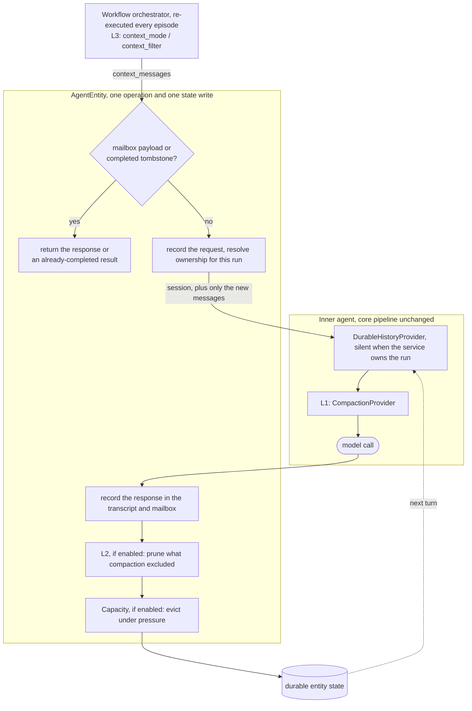
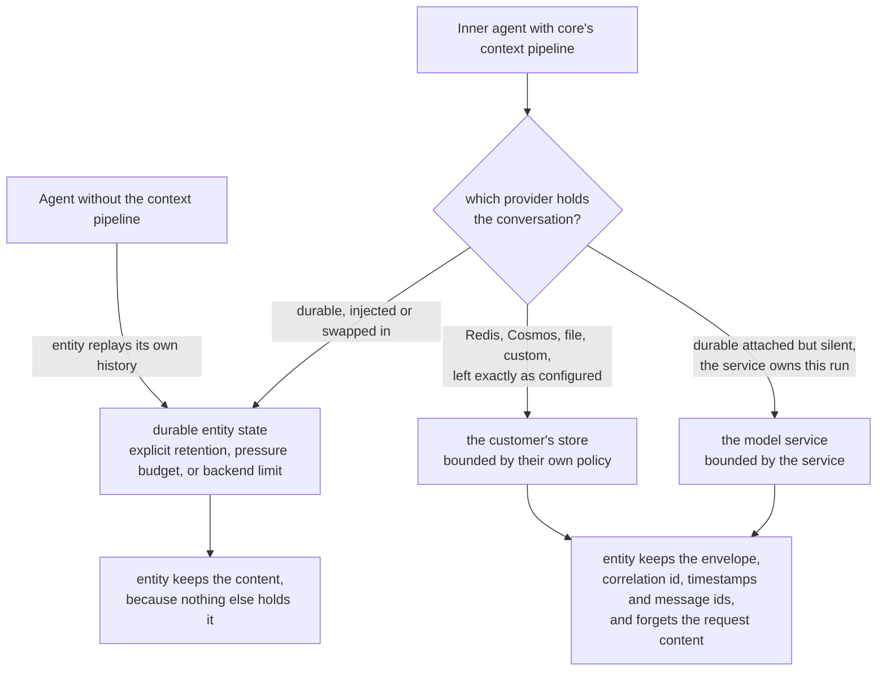
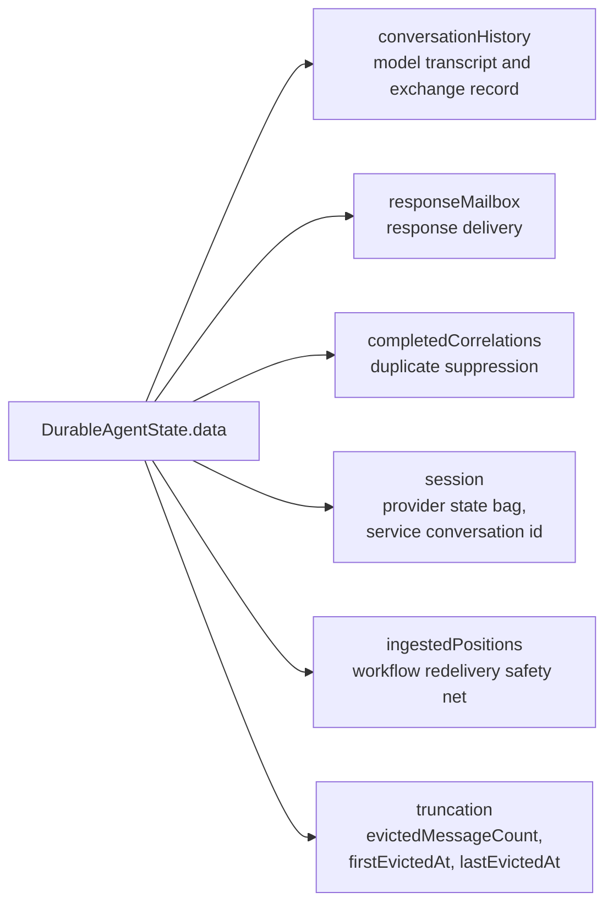
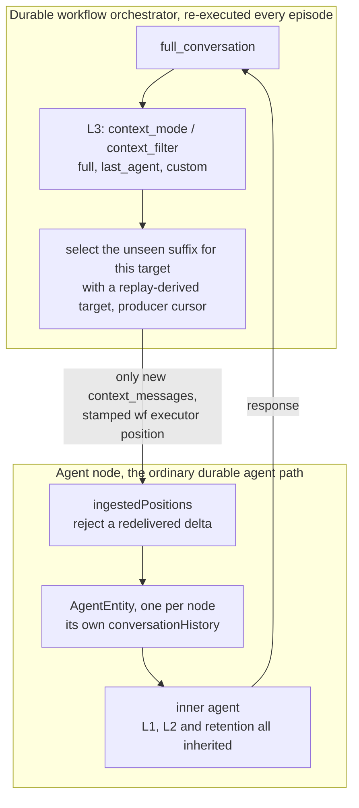
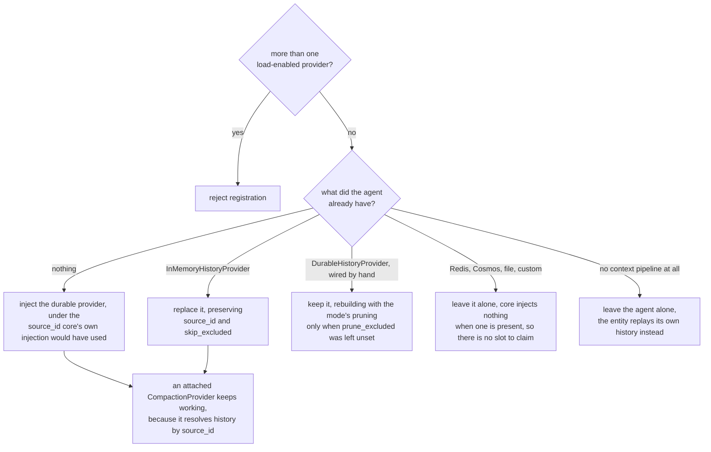

# Thread Compaction for Durable Agents and Workflows

> **How to read this.** The decision comes first. The later sections record the Python prototype
> and the gaps it exposed. **.NET is not implemented yet.**
>
> **Naming.** .NET's `ChatHistoryProvider` and Python's `HistoryProvider` are the same concept. The
> decision sections use the .NET name, and the implementation sections use the Python one.

## Context and Problem Statement

Long-running **durable** agents and workflows accumulate conversation history in durable
storage and replay it on every turn. Durable agents persist a full `ConversationHistory` in
entity state (`AgentEntity` → `DurableAgentState`). Durable workflows persist inter-executor
messages (`AgentExecutor.full_conversation`) as checkpointed envelopes. An in-memory agent keeps its
history in process RAM, where it disappears when the process recycles. Durable history instead
survives restarts and is reloaded on later turns.

It helps to separate **three distinct pressures**, because they have different owners.

| Pressure | What bounds it | Same in core? | Owner |
| --- | --- | --- | --- |
| **Context window**, the model's max input per call | the model | **Yes**, identical in core and durable | Compaction (in-run filter) |
| **Token cost / latency**, resending history each turn | tokens billed / round-trip | **Yes**, same mechanism | Compaction (in-run filter) |
| **Storage capacity**, the cumulative persisted state | backend state-size limit | **No**, durable-only | Backend offload and explicit durable retention |

The first two are per-operation and identical in both runtimes. The third is cumulative.
`ConversationHistory` is one blob appended to every turn and re-persisted whole, so it is bounded by
what the backend will store, and the two backends fail differently. **Durable Task Scheduler caps a
message at 1 MB.** The Azure Storage backend has no hard cap, because it compresses anything over
45 KB into a `<taskhub>-largemessages` blob, but it pays for size in CPU, I/O and memory. So one
backend stops working at the limit and the other degrades toward it, while a core process is bounded
only by RAM and resets on restart.

**Storage capacity is an infrastructure concern, not a context-window concern.** It is relieved
first by raising the ceiling where blob offload is available and only then by deleting. A tool for
bounding what the model reads is not a tool for bounding what the backend holds.

Core MAF already has a compaction system ([ADR-0019](https://github.com/microsoft/agent-framework/blob/main/docs/decisions/0019-python-context-compaction-strategy.md),
.NET `Microsoft.Agents.AI.Compaction`, Python `agent_framework._compaction`) with **two hooks**.

1. **In-run filter.** A `CompactionProvider` (`AIContextProvider`) / `compaction_strategy` runs
   before each model call. It is **non-lossy**. It filters the projection sent to the model and
   stores incremental group state in the `AgentSession.StateBag`, leaving the underlying store
   untouched. This hook works with **any** history provider, since it acts on the messages already
   loaded into the invocation context.

   Non-lossy has a storage consequence worth stating, because durable is where it is first felt. A
   strategy that marks messages excluded and appends a summary standing in for them **grows** the
   stored conversation: the originals remain and the summary is added. Measured over six turns, a
   durable conversation went from 3,422 bytes to 10,177 with such a strategy enabled. This is not
   something the durable layer introduces. The identical strategy against core's own
   `InMemoryHistoryProvider` grew 809 bytes to 1,087. Durable only changes the consequence, because
   it persists the result against a hard backend limit rather than holding it in process memory.
   `retention="follow_compaction"` is the answer for anyone who wants compaction without paying for
   it in storage: the same six turns end at 2,296 bytes, below the 3,422 they would have reached
  with no compaction at all. With the default `retention="keep_all"`, compaction exclusions remain
  non-lossy. A separate `max_state_bytes` budget can evict under pressure whether or not compaction
  is configured.
2. **Store reducer.** **Lossily** rewrites the stored conversation, applying the same strategies at
   the store instead of at the model call. Unlike the in-run filter, this hook is tied to a specific
   storage mechanism in both languages. .NET exposes an `IChatReducer` on `InMemoryChatHistoryProvider`
   only (bridged from any strategy by `strategy.AsChatReducer()`), and Python's
   `CompactionProvider.after_strategy` reads the messages out of session state. Neither offers it to
   a provider backed by anything else - see "Core Interface Gaps" below.

The durable layer benefited from **neither**, because `AgentEntity` **bypassed the history
provider**: it created a fresh session per operation (so the StateBag - and any history provider
store or reducer in it - was discarded) and fed `ConversationHistory` directly as input messages.
Both the in-run filter's incremental state and the store reducer were thrown away every turn.

The goal is **configuration parity**: a user's core compaction config must carry over to a durable
entity or workflow **unchanged**, reusing the same strategies and hooks on the durable runtime,
without a parallel durable compaction API. Storage retention is a separate deployment policy because
it has no meaning for an in-memory agent.

**How should core compaction be reused on the durable runtime, in both .NET and Python, so the same
agent configuration bounds model input and the persisted store can be bounded separately?**

## Decision Drivers

- **Configuration parity.** The same core compaction config (strategies, `CompactionProvider`,
  `IChatReducer`) must apply unchanged when moving core → durable entity → durable workflow. No
  parallel durable-only API.
- **Reuse existing core hooks.** Do not reinvent triggers, strategies or grouping. Reuse the in-run
  filter and the store reducer.
- **Separate storage capacity from context management.** Bound model input with compaction (parity
  with core), raise backend capacity where possible, and configure storage deletion independently.
- **Deletion is explicit and observable.** Entity state is a state bag, not an immutable system of
  record, so deleting from it is legitimate. The user must opt in either by following their own
  compaction exclusions or by setting a pressure budget. Every deletion remains observable.
- **Determinism and idempotency.** Durable entity operations can be retried, so a lossy reducer
  (especially LLM summarization) must not corrupt or diverge persisted state across retries.
- **Message-list correctness.** Preserve atomic groups (assistant tool-call plus tool-result, and
  reasoning pairings) so the model input stays valid.
- **Cover both surfaces.** Durable agents **and** durable workflows, in **both** languages. Core's
  compaction system is agent-level, so a workflow agent node inherits it unchanged. The conversation
  chained *between* nodes is governed by `AgentExecutor`'s `context_mode` / `context_filter` seam,
  which is a plain callable rather than the compaction system. That difference is real and is called
  out rather than papered over.
- **Defer when the model provider owns the conversation.** When the chat client keeps history on the
  service, the client holds no history for core compaction. "Service" here means the model provider,
  not the durable entity. The entity's own durable record still follows its retention policy.

## Considered Options

- **Option 1, in-run filter only (rejected).** Reuse the agent's core compaction without changing
  durable history. This bounds model input but not persisted state.
- **Option 2, bespoke pre-write compaction in the agent entity.** Add durable-specific code that
  compacts `ConversationHistory` inside the entity operation before checkpoint. Rejected because it
  duplicates core's store-reducer behavior.
- **Option 3, on-storage maintenance compaction (deferred).** Compact persisted history from a
  separate entity operation. This may suit expensive summarization but does not prevent in-turn
  growth.
- **Option 4, workflow context projection and delta transport (chosen).** Honor
  `AgentExecutor.context_mode` and `context_filter`, then send each target only the unseen suffix of
  that projection rather than serializing the whole `full_conversation` on every visit.
- **Option 5, auto-derive a durable store reducer (rejected as default).** Derive a lossy reducer
  from a configured in-run strategy. The explicit equivalent is `follow_compaction`. Agents with
  no compaction strategy can opt into independent pressure eviction with `max_state_bytes`.
- **Option 6, durable store as a `ChatHistoryProvider` (chosen).** Back the durable entity's
  persisted conversation with a core `ChatHistoryProvider` implementation, so both core hooks apply
  on the durable runtime from the user's unchanged configuration. The in-run filter runs in the
  agent pipeline (L1), and a user-configured reducer or strategy can bound the durable store (L2,
  opt-in). External history providers also rejoin the context pipeline, and the entity stops
  keeping their content, so each store bounds only what it owns.
- **Option 7, offload large payloads to blob storage (backend-specific, not part of the portable
  design).** Raise the ceiling instead of reducing content, using the Durable Task Scheduler [large
  payload extension](https://learn.microsoft.com/azure/durable-task/scheduler/durable-task-scheduler-large-payloads).
  Non-lossy, and the same technique the Azure Storage backend has always used internally.

  Deliberately **not** counted as part of the chosen design, because it is not available everywhere.
  It adds an Azure Blob payload-store dependency, the Azure Storage backend already does the
  equivalent internally so configuring it there is redundant, and Durable Functions Python cannot
  opt in at all today (gap 6). Treat it as an optimization a specific deployment may enable,
  detected rather than assumed: nothing in this design may depend on it being present. A deployment
  can set an explicit byte budget, or use `max_state_bytes="backend_limit"` when its host exposes a
  hard entity limit. A host that cannot identify such a limit requires an explicit number.

## Decision Outcome

Chosen option: **Option 6, express durable conversation storage as a core `ChatHistoryProvider`**,
combined with workflow context projection and delta transport (Option 4). The two solve different
surfaces.

| Surface | Mechanism | Behavior |
| --- | --- | --- |
| **L1, agent context** | The user's configured core `CompactionProvider` / `compaction_strategy` | Non-lossy projection of model input. The same agent configuration works durably. |
| **L2, eager store pruning** | Core compaction annotations plus `retention="follow_compaction"` | Opt-in deletion of messages the user's strategy excluded. Python only today because .NET is blocked by duplicated compaction state (gap 4). |
| **L3, workflow context** | Existing `AgentExecutor.context_mode` / `context_filter` projection plus per-target delta transport | Controls what crosses between executors without repeatedly sending the same prefix. This is not a core compaction hook. |
| **Capacity safety** | Optional `max_state_bytes` budget | Evicts oldest groups under pressure, independently of whether compaction is configured. |

The surfaces act at different points in a single turn.

  L3 decides what crosses between workflow nodes, L1 decides what the model reads, and the two
  storage controls decide what survives. Only the storage controls delete, and each is opt-in.

This gives agent-level **configuration parity**, not byte-for-byte parity in every workflow cycle.
Durable workflow nodes intentionally deduplicate repeated upstream context before persisting it. The
L3 section explains the measured difference.

Capacity is handled in this order: project workflow context according to its semantics, send only
the unseen suffix to each target, raise the ceiling non-lossily where blob offload is available,
honor an explicit `follow_compaction` choice, then apply pressure eviction only when a byte budget
was configured. An exclusion normally means only "do not send this to the model". It means "delete
this" only under `follow_compaction`.

### Who bounds what

Every store bounds what it owns. This is the rule the rest of this section follows, and it is worth
stating plainly because it decides which copy of a conversation is authoritative.

| Where the conversation lives | What bounds it | What the entity keeps |
| --- | --- | --- |
| The customer's own store (Redis, Cosmos, file) | Their store's own policy, for example Redis `max_messages` or a Cosmos container TTL | The exchange, not the content |
| Durable entity state | Explicit `follow_compaction`, an optional pressure budget, or ultimately the backend limit | Everything, since nothing else holds it |
| The model service | The service's own retention | The exchange, not the content |
| No context pipeline at all | Explicit `follow_compaction`, an optional pressure budget, or ultimately the backend limit | Everything, since nothing else holds it |

The same four cases as a path. The branch decides where the conversation lives, and that in turn
decides what the entity keeps.

Only the durable-entity-state branch makes the entity the owner of the conversation. In the other
two the entity is a record of the exchange rather than a second copy of the content. Responses sit
outside this entirely and are kept in every branch, for the reason below.

The entity records every exchange in every configuration, because correlation ids and response
delivery are its job and nothing else can do them. It does not have to be a second copy of the
conversation, and being one would put the customer's content under two different retention,
residency and deletion policies when they deliberately chose one store for it. So when another
provider owns the conversation, the entity keeps the envelope, the correlation id, the timestamps
and the message ids, and forgets the content.

Orchestrations reach the entity through `call_entity` instead, which returns the value directly. The
same bytes then exist in two places, but they are not two copies of one thing: the orchestrator
records a **task result**, which is what makes its replay deterministic, while the entity records
**what the assistant said**, which is what the next turn's model context is built from. Neither is
removable, and the overlap is two systems recording the same event for different reasons rather than
a defect in either.

**Ownership is resolved per run, as it is in core.** Core gives an explicit `store` in the effective
run options precedence over the client's `STORES_BY_DEFAULT`, so an agent registered against a
service-storing client can still be asked to keep one turn client-side. Durable mirrors that rule
rather than pinning an owner for the session and rejecting a core-supported run option.

A durable history provider is attached at registration even for a service-storing client. It
claims the history slot before core can inject an `InMemoryHistoryProvider` on a later `store=False`
run. Persisting that injected provider with the session grew state by 321 bytes per turn in the
prototype and put the transcript outside durable retention. The durable provider instead yields no
history on runs the service owns, so the model is never sent a transcript the service already
carries.

Changing `store` does not migrate history between owners. A client-side turn after service-owned
turns therefore sees a gap, which is the same behavior as core. The entity still keeps contentless
envelopes in `conversationHistory` for correlation and audit. Their message `contents` are empty,
and the history provider omits those messages from model context rather than rebuilding blank turns.
An explicit migrate or fork operation would be a core capability, not a durable-specific
reinterpretation of `store`.

### Response delivery and duplicate suppression

Model context, response delivery and duplicate suppression have different lifecycles. They must not
all depend on one entry remaining in `conversationHistory`.

For client and HTTP paths, an entity signal is one-way and the caller polls by correlation id. The
response is therefore a delivery obligation. A `responseMailbox` retains each completed response
payload, or an offloaded reference to it, under that correlation id until a configured delivery
expiry. The current polling surface only reads entity state and cannot acknowledge receipt, so the
first implementation uses bounded expiry. A future acknowledgement operation can shorten it.

When delivery expiry passes, the mailbox obligation ends and its payload or reference can be
removed. `completedCorrelations` retains a lightweight tombstone until the entity itself is deleted.
A repeated correlation id then produces an already-completed result instead of another model call
and another set of tool side effects. Pressure eviction never removes live mailbox entries or
tombstones. They can therefore become part of the non-evictable floor and cause a capacity error
rather than permit duplicate execution. Automatic entity cleanup is tracked separately under entity
lifetime.

The response can still participate in model context while its transcript entry survives. The
mailbox controls whether the caller can collect the result, while transcript retention controls
whether a later model call sees it. An implementation may share the underlying payload while both
references are live, but deletion decisions remain independent.

### What the entity persists

Retention, workflow deduplication and session continuity all read and write the same entity state,
so it is worth seeing its shape before the sections that manipulate it.

The fields separate six lifecycles that one conversation array cannot safely own. Transcript
retention, response delivery, duplicate suppression, provider state, workflow redelivery and the
audit evidence of truncation can now expire or fail independently. Pressure eviction deletes only
from `conversationHistory`. Mailbox payloads follow their delivery expiry, while correlation
tombstones are non-evictable proof that an operation already completed.

`ingestedPositions` survives eviction deliberately, because a watermark stored among the messages
would be removed with them and a redelivered workflow delta would then be accepted twice. `session`
excludes the durable provider's own history slice, since `conversationHistory` is the record of
truth and carrying both would store the conversation twice. `truncation` exists because deletion
has to be discoverable afterwards, and its absence says nothing has been dropped.

Each entity holds one durable agent session. A new standalone session gets a new entity key, and a
workflow agent node is keyed by workflow instance plus executor. The 1 MB DTS limit and any
`max_state_bytes` budget therefore apply to one session, not to every conversation for an agent.
Old sessions occupy separate entities and do not reduce the budget of later sessions. How long those
abandoned entities remain is the separate entity-lifetime concern described below.

### Retention

Deletion has two independent controls. `retention` says whether a compaction exclusion is also
permission to delete. `max_state_bytes` says whether storage pressure may delete messages that the
user did not exclude. Neither control turns the other on.

| Control | Value | Behavior |
| --- | --- | --- |
| `retention` | `keep_all` **(default)** | Preserve messages that compaction excluded from model input. |
| `retention` | `follow_compaction` | Delete excluded messages after every turn. With no compaction configured, this has nothing to delete. |
| `max_state_bytes` | `None` **(default)** | Do not evict under pressure. A hard backend limit can still reject a write. |
| `max_state_bytes` | `"backend_limit"` | Use the hard entity-payload limit known to the host, 1,048,576 bytes for direct DTS. Registration fails if the host cannot identify one. |
| `max_state_bytes` | positive integer | Use that explicit serialized-state budget. |

Together they make all four policies expressible.

| | No pressure budget | Pressure budget set |
| --- | --- | --- |
| `keep_all` | Never delete. | Preserve exclusions, but evict oldest groups under pressure. |
| `follow_compaction` | Delete only what the user's compaction strategy excluded. | Delete exclusions eagerly, then evict oldest groups if the remainder still crosses the high watermark. |

**Why deletion is opt-in.** Core follows the same rule for every comparable bound.

| Core mechanism | Default |
| --- | --- |
| `InMemoryHistoryProvider` | Unbounded |
| `RedisHistoryProvider.max_messages` | `None`, unbounded |
| `compaction_strategy` | `None` |
| Context-window compaction | The user must supply `max_context_window_tokens` |

Durable storage should not silently adopt a more destructive default. Without a pressure budget, a
write that exceeds the backend limit fails while the last successfully persisted state remains
available. The operator can then raise the limit, enable a budget, or choose `follow_compaction`.
Failure is visible and recoverable; deletion is irreversible.

**How pressure eviction works.** After the turn is recorded and before the state is persisted, the
entity measures its serialized state. Pressure eviction runs only when `max_state_bytes` is set.
`high_watermark` and `low_watermark` default to `0.85` and `0.70`. They are configurable and must
satisfy `0 < low_watermark < high_watermark <= 1`. Below the high watermark, nothing happens. Above
it, the entity targets the low watermark using detached message copies with exclusions cleared and
`TokenBudgetComposedStrategy(strategies=[])`. Clearing exclusions makes the budget reflect what is
stored, while the empty strategy list bypasses the user's context policy and uses core's
deterministic oldest-group fallback. Atomic tool groups and the newest exchange are protected.

Clearing happens only on the detached planning copy and does not erase stored annotations. Under
pressure, an exclusion is not immunity from capacity eviction: all otherwise eligible old groups
compete by age. `keep_all` means exclusion alone never triggers deletion, while a separately enabled
pressure budget may still evict that group.

The non-evictable floor is calculated before anything is removed. If the floor alone exceeds the
configured limit, the turn fails with a capacity error without deleting old context. If the low
watermark is unreachable, the target is clamped upward and eviction removes only enough to get
below the high watermark where that is possible. If no target below the high watermark is
reachable, the capacity condition is reported without a futile eviction pass. This prevents a
one-token approximation from deleting every evictable message for a target the state cannot reach.

**The budget is derived from bytes, not from text.** The constraint is a byte limit but the strategy
counts tokens, so the conversion is measured from the messages in hand: the persisted size of the
evictable messages against their token count, with everything unevictable treated as a floor the
budget cannot reach below. Deriving it from `message.text` instead would make it depend on the
*kind* of content rather than its size, and a function call has no text at all, so a tool-only
conversation would produce a budget of one token and evict everything it was allowed to touch.

**System messages are held out of the candidate set** rather than left to core's protection. Core
skips system groups in its first fallback, but it has a second, strict fallback whose purpose is to
evict them once anchors alone exceed the budget. Relying on the first therefore holds only until the
budget is small enough to matter. Excluded from the candidates, the agent's instructions are simply
not evictable, and their bytes count toward the floor.

**Eviction leaves durable evidence.** A `truncation` record beside the conversation holds a count and
the first and last eviction times. A log line is evidence to whoever was watching at the time and to
nobody afterwards, which is no use to a user asking later why an answer lost context. It is a counter
rather than a list of what was removed, because such a list would grow without bound in exactly the
situation retention exists to resolve. Its absence is meaningful: it says nothing has been dropped.
`truncation` records loss of model context; `completedCorrelations` records completed execution.
Neither can substitute for the other.

The measured size is the serialized state JSON, not an estimate from message text and not transport
framing added outside the state payload. Measuring a 1 MB prototype state took about 8 ms.

**Why not prune exclusions by default.** A default-on reducer only affects agents that configured
compaction, because nothing else marks messages excludable. It would also turn a non-lossy model
projection into irreversible storage deletion without the user choosing that policy.

**Why not rely on blob offload alone.** It raises the ceiling roughly tenfold and does not remove it.
It is also unreachable on the Durable Functions Python path today (gap 6). Explicit pressure
retention is therefore the portable fallback a deployment can enable on every host.

**Service-managed model context** is outside compaction scope, mirroring ADR-0019. When the model
provider owns the conversation, the client holds no history to compact. Configured entity-retention
policies still apply to the entity's own record. See "Service-managed conversations".

**Why workflows largely come "for free."** Durable workflow agent execution
(`DurableExecutorDispatcher.ExecuteAgentAsync`) runs an agent through the same
`DurableAIAgent → AgentEntity → inner agent` path as standalone durable agents, so **L1, L2 and
optional pressure retention are inherited by workflow agent executors**. The workflow's own
`full_conversation` between executors does not pass through the agent, so it needs the separate
**L3** hook and delta transport.

### Consequences

- **Configuration parity.** Existing agent compaction configuration works durably without changing
  the agent. Retention does not choose the current model projection.
- **Independent deletion policies.** Users can follow their own compaction exclusions without
  enabling pressure eviction, or enable pressure eviction while preserving those exclusions in the
  stored transcript.
- **Opt-in capacity protection.** When a pressure budget is set, it covers external providers,
  service-managed agents, and agents with no context pipeline. With no budget, the backend can
  reject an oversized write. A non-evictable floor can still produce a capacity error either way.
- **Delivery correctness has its own cost.** Mailbox entries and completed-correlation tombstones
  cannot be pressure-evicted. They consume part of the floor so the system fails rather than
  silently re-executing a completed request.
- **Larger entity change.** The history-provider design must preserve response polling and the
  entity's conversation record.
- **Python-only eager pruning.** .NET would duplicate the transcript if it persisted current
  compaction state (gap 4), so a .NET implementation could use pressure retention but not L2 yet.
- **Core workarounds.** Python must publish and reconcile a working buffer because core binds
  store-side compaction to session state (gaps 1 and 2).
- **Threshold behavior.** Pressure eviction changes behavior only near the configured budget. This
  is less uniform than always pruning, but it leaves unaffected conversations unchanged.

### Validation

**Prototype evidence (Python).** Unit tests cover provider substitution, annotation round-trips,
synthetic summary insertion and reconciliation, the original retention modes, session persistence,
and workflow projection and target-side deduplication. A retention test drives a real agent through
twenty turns against a reduced budget. Scheduler integration covers persisted annotations and
message ids, external-provider session identity, schema conformance, downstream workflow context,
and Redis as the sole owner of an external conversation.

**Required for the revised implementation.** Not covered by the prototype yet.

- Response mailbox expiry and completed-correlation tombstones, including a redelivery after the
  transcript response has been evicted.
- Independent eager-pruning and pressure controls, the `"backend_limit"` sentinel, configurable
  watermarks, and a floor that cannot trigger futile deletion.
- Contentless envelope suppression when a session changes from service-owned to client-owned.
- Per-target workflow delta transport across cycles, fan-out, fan-in and orchestration replay.
- Registration failure for more than one load-enabled history provider.

**Longer-term validation.** Tracked here until the ADR is approved and follow-up issues are filed.

- Retention crossing the real scheduler limit against a live backend, rather than a reduced budget
  in process.
- Bidirectional Python/.NET state tests, including unknown entry-kind preservation and rollback.
- The .NET realization and its compaction-state blocker (gap 4).
- Blob offload (Option 7) against a real scheduler. It remains unreachable through Durable Functions
  Python 1.x and the 2.x preview (gap 6).
- Idempotency of an LLM-based reducer across simulated entity retries.

## Cross-Cutting Design Details

- Honor the user's configured reducer trigger. Durable registration must not change compaction
  cadence.
- Reuse core grouping so tool-call/result and reasoning groups remain atomic.
- Pressure eviction is deterministic and uses the estimator tokenizer without a model call. Any
  future LLM reducer must give summaries stable identities and be tested across retries.
- Response delivery and duplicate suppression do not depend on transcript retention. Pressure
  eviction cannot remove a live mailbox entry or the only completed-correlation tombstone.
- Registration permits exactly one load-enabled primary history provider. Additional providers are
  store-only sinks.
- Workflow projection preserves `context_mode` semantics, while a replay-derived per-target cursor
  removes already-sent prefixes from transport. Entity positions remain the redelivery guard.
- The durable history provider belongs in `AgentEntity`. Workflow projection belongs at the
  existing `AgentExecutor.context_mode` / `context_filter` seam.

## Core Interface Gaps for Pluggable History Providers

Prototyping the Python `DurableHistoryProvider` surfaced places where the current contracts assume a
*session-state-backed* history provider. They are recorded here because they affect **any** provider
whose store is not session state (Cosmos, Valkey, durable), not just this one. The prototype works
around them, but the cleaner fix is upstream.

These are scoping decisions rather than oversights, and worth reading that way. Store-rewrite
compaction reaches the one store whose lifetime core controls, and the providers core ships for
other stores bound themselves instead: `RedisHistoryProvider` takes `max_messages` and trims with
`ltrim`, and a Cosmos container has its own TTL. That is the same layering this ADR follows, each
store bounding what it owns. What is missing is not the capability but a way to *express* it through
the provider abstraction, which is what makes it a prerequisite rather than a tidy-up.

1. **Store-side compaction is bound to session state rather than to the provider.** `CompactionProvider`
   has two hooks, but only `before_strategy` works with any provider because it acts on invocation
   context. `after_strategy` mutates `session.state[history_source_id]["messages"]` and assumes that
   mutation rewrites storage. External providers can therefore bound model input but cannot use
   core to rewrite their stores. .NET similarly exposes `IChatReducer` only on
   `InMemoryChatHistoryProvider`.

   The cost today is silence rather than failure: a user who wires `after_strategy` to Redis or
   Cosmos gets no annotations, no summaries, no error and no warning. Verified against core's own
   `FileHistoryProvider`, whose `save_messages` begins `del state, kwargs`: the identical strategy
   that produced 11 exclusions and 4 summaries under `InMemoryHistoryProvider` produced none.

   *Workaround:* the durable provider publishes a working buffer under the session-state key core
   expects. *Upstream fix:* put store-rewrite compaction on the provider abstraction, and in the
   meantime say something when the hook cannot reach the configured store.

2. **`save_messages()` is append-only.** The other half of the same open question. It receives only
   new messages, so changes to existing messages and inserted summaries have no path back to storage.
   Confirmed against shipping code rather than argued in the abstract: `RedisHistoryProvider`
   persists with `rpush`, which can express "add" and nothing else, so even a provider-level
   compaction hook would have no way to say "replace this" or "drop these".
   *Workaround:* the durable provider reconciles its working buffer **by `message_id`** during
   `after_run`. *Upstream fix:* add an explicit replace/flush operation alongside append.

   Gaps 1 and 2 together are a **prerequisite for treating an external provider as the sole store of
   a compacted conversation**, not an upstream cleanup note. Until they are closed, a customer's own
   store can bound what the model reads but cannot be rewritten by the compaction they configured,
   and the durable runtime can only offer that capability for conversations it holds itself.

   **The workaround against the contract it should become.** Today the durable provider publishes a
   working buffer under the session-state key `after_strategy` reads, then reconciles the result back
   by `message_id`. That works, but it only works because the provider is willing to impersonate
   session-state storage. It is invisible to any provider that does not know the trick, it silently
   does nothing for the ones core itself ships for Redis and Cosmos, and it couples us to a key whose
   shape core is free to change. An additive contract on the provider, `replace_messages()` plus
   `flush()` alongside the existing append, would let core drive store rewrite through the
   abstraction instead, make the capability discoverable, and remove the impersonation.

  **The provider contract this should become**, stated here until follow-up issues are filed after
  this ADR is approved:

  1. Store rewrite expressed on the provider abstraction, so compaction reaches any capable store.
  2. `replace_messages()` / `flush()` with an expected version, so summaries, annotations and
    deletions have a concurrency-safe path back.
  3. `clear()` / `delete_session()` so reset and lifecycle behavior belong to the store that owns
    the conversation.
  4. Versioned `snapshot_state()` / `restore_state()` so a provider explicitly declares what may
    survive a durable turn and how that state migrates.
  5. Core exposing its **resolved** service-versus-client history ownership. Durable currently
    re-derives it from `store` and `STORES_BY_DEFAULT`, which duplicates a decision core has
    already made and can drift if core changes.
  6. .NET reaching the same point, which additionally needs `MessageId` and
    `AdditionalProperties` to survive `FromChatMessage` / `ToChatMessage` (gap 3).

  These are upstream capabilities, not prerequisites for the first Python implementation. The
  durable provider's working-buffer reconciliation remains the bounded workaround until the
  contract exists. Provider-owned snapshots replace broad session serialization only after a
  provider can supply a version and migration policy; wrapping an opaque state bag in a versioned
  envelope before then would imply a guarantee no provider has made.

3. **Message-level metadata was not persisted (durable schema).** Python wrote
  `extension_data` asymmetrically, so annotations disappeared on round-trip. This is fixed. The
   shared schema now declares `messageId` and `extensionData` as round-trip-required, describes
   `session` as runtime-discriminated, and has a conformance test. A validator would not previously
  have rejected these fields because the schema permits extra properties. The defect was an
   under-declared contract.

   .NET still loses `ChatMessage.AdditionalProperties` and `MessageId` in
   `FromChatMessage`/`ToChatMessage`. Its `[JsonExtensionData]` property is only an overflow bucket for
   unmapped JSON. `ChatMessage.MessageId` **does** exist in the pinned package and needs mapping.
   Exclusions themselves live on `CompactionMessageGroup.IsExcluded`, while
   `AdditionalProperties` carries the `_is_summary` marker, so mapping both fields is necessary but
   not sufficient for .NET compaction parity.

4. **.NET compaction state cannot be persisted without duplicating the transcript.** This is the
   blocker behind "L2 is Python-only today". `CompactionProvider.State` is documented as living in
   `AgentSession.StateBag`, holds `List<CompactionMessageGroup>`, and each group serializes its full
   `ChatMessage` objects. Every run rewrites it wholesale. That leaves three unappealing choices for a
   durable provider that also persists the session:

   | Choice | Consequence |
   | --- | --- |
   | Persist the session | The conversation is stored twice, in `ConversationHistory` and again in the state bag, so entity state roughly doubles instead of being bounded |
   | Omit the provider state | Exclusions and summaries are discarded and summarization can re-run |
   | Return only included messages | `CompactionMessageIndex.Update()` sees a trimmed front and rebuilds from scratch, losing the incremental state |

   None of this is inherent to the history-provider approach. It resolves if core can persist
   lightweight compaction metadata keyed by `MessageId` rather than whole message copies. Until then
  a .NET implementation can bound entity state through the retention path, which is independent of
  `CompactionProvider`.

5. **Provider cadence splits under per-service-call persistence.** With
   `require_per_service_call_history_persistence=True`, history providers run per model call while
   `CompactionProvider` remains once per run. Compaction can then annotate after the last history
   flush, delaying persistence until the next flush. Only `HarnessAgent` enables this today, so the
   gap is latent.

6. **Blob offload is unreachable on the Durable Functions Python path.** Not a core gap but an
   upstream gap. Version 1.x, which this package pins (`>=1.3.1,<2`), does not use the durabletask
   SDK, so it has no Python-side payload-store seam. The 2.x previews (`2.0.0b1` and `2.0.0b2`, Python
   3.13+) depend on `durabletask>=1.9.0`, but `DurableFunctionsWorker` and
   `DurableFunctionsClient` do not expose the base types' `payload_store` parameter. The direct
   durabletask path does. *Upstream fix:* expose `payload_store` on both Functions types.

Two more core gaps are described where they matter: the process-local state-type registry under
session persistence, and the lack of a public resolved history-ownership decision under
service-managed conversations.

## Cross-Language State Evolution

The state schema is shared by Python and .NET, so additive JSON is not automatically a safe minor
version. The current .NET reader registers only the `request` and `response` discriminators and
throws on an unknown `$type`. The previous Python reader also throws, because its fallback still
converts `$type` through an enum that contains only those two values. Writing `errorResponse` or
`compaction` before both readers understand them would therefore break a mixed-version worker and a
rollback to the previous Python package.

New entry kinds and lifecycle fields use a two-phase rollout.

1. Ship readers in both runtimes that accept the new fields, preserve unknown optional data, and
  round-trip an unknown entry as raw JSON without admitting it into model context.
2. Only after those readers are available may a writer persist `errorResponse`, `compaction`,
  `responseMailbox`, `completedCorrelations` or other new state shapes.

Phase 1 ships as a separate compatibility change before any phase 2 writer. All workers sharing a
task hub must move to that reader floor before a phase 2 package is deployed. A worker cannot
inspect the versions of its peers, so this is a release and deployment gate rather than a runtime
handshake.

Rollback is supported only to a reader from phase 1 or later. If that staged rollout is not
possible, the writer must use a new major schema version and the runtime must gate the write rather
than relying on the current major-only read check. Bidirectional tests must cover Python-written
state read and rewritten by .NET, the reverse direction, unknown entry preservation, and rollback.

## L3 Realization: Workflow Context Parity

A workflow adds one hop in front of the agent path and changes nothing behind it.

Because a node runs the same `DurableAIAgent` to `AgentEntity` to inner agent path as a standalone
durable agent, everything in the first diagram still applies inside it. Only the projection and the
delta transport are workflow-specific. Each node keeps its own history, keyed by workflow instance
and executor, so nodes do not share a conversation and their memory survives restarts independently
of the workflow envelope.

In-process workflows give a downstream `AgentExecutor` the upstream conversation through
`AgentExecutorResponse.full_conversation`, governed by `context_mode` (`full` | `last_agent` |
`custom` + `context_filter`). The durable orchestrator previously flattened that to the **last
message's text**, so a downstream agent lost everything earlier nodes produced.

Agent-level compaction needs no workflow-specific work: `AgentExecutor` passes its own session to
`agent.run()`, so the agent's `CompactionProvider` runs normally. Inter-executor context has no core
compaction hook. Durable instead honors the existing `context_mode` and invokes `context_filter` for
`custom` mode, then sends the projection as `RunRequest.context_messages`. Those messages become part
of the request entry and are visible to agent-level compaction.

### `context_filter` must be pure under durable

Core types the filter as `Callable[[list[Message]], list[Message]]` and requires nothing more,
because an in-process executor runs it exactly once. A durable orchestrator does not resume, it
**re-executes from the top** on every episode, returning recorded results for work already done. The
projection is computed in that re-executed code, so the filter runs again on every replay: roughly
once per node in a sequential workflow, and again each time a workflow parked on a human decision
wakes up.

**The durable contract is therefore stricter than core's.** A `context_filter` must be synchronous,
deterministic, free of side effects, and independent of wall-clock time, randomness, and any
external state. `full` and `last_agent` satisfy this by construction, since they are list slicing.
Only `custom` can violate it.

Violating it fails **softly**, which is worth stating precisely so the risk is neither overstated
nor dismissed. The Durable Task worker detects non-determinism by checking that an action exists at
the expected id and is of the expected kind; it never compares the action's input. The projection is
only ever an input, and nothing branches on it. So a filter that returns something different on
replay does not raise `NonDeterminismError` and does not deliver altered context to an agent. The
recomputed value is discarded and the recorded result stands.

What does bite:

- A filter with side effects performs them again on every replay, so one logical handoff can write
  many audit entries.
- A filter that performs I/O can raise on a later replay, failing an orchestration whose original
  run succeeded and whose result is already recorded.
- A slow filter is paid for on every episode rather than once.

**Why the filter runs there at all.** Someone has to apply the projection, and the placement is a
trade. Applying it in the orchestrator keeps only the projection on the wire, which is what makes
`context_mode` an effective capacity lever. Applying it at the destination would keep user code out
of replayed territory but put the whole conversation back on the wire. Applying it inside an
activity would achieve both at the cost of a scheduling round trip per handoff. The current design
takes the first, and the contract above is the price. Revisiting that, along with replacing the
private `_context_mode` / `_context_filter` reads with a public accessor, is tracked in
[#79](https://github.com/microsoft/agent-framework-durable-extension/issues/79).

Projection and transport are separate. After applying `context_mode` or `context_filter`, the
orchestrator sends each target only positions it has not sent to that target before. The cursor is
keyed by target and producing executor, because fan-out targets advance independently and fan-in
combines positions from several producers. Messages remain stamped as
`wf_{executor}_{position}`.

Each message is compared only with the cursor for its own `(target, producer)` pair. Fan-in does not
take a minimum or maximum across producers: positions from two branches are independent even when
the numeric indexes happen to match. A cursor at 20 means the next delta for that pair begins after
20; it never requests positions that the target later evicted from its transcript.

The cursor is derived rather than checkpointed. A durable orchestrator re-executes the same message
sequence from the top on every episode, so a local cursor map is reconstructed deterministically
before any recorded task result is reused. The entity still persists its highest ingested position
per producer. That is no longer the primary transport mechanism; it is the safety net that rejects
an at-least-once redelivery of a delta. Pressure retention never removes that position map. If the
entity is already ahead of a replay-derived transport cursor, it drops the repeated positions and
accepts only newer ones; neither side asks for an evicted prefix to be sent again.

### Projection and delta transport bound different costs

`context_mode` is a semantic choice about what a target may see. Delta transport is a capacity
mechanism that avoids serializing the same allowed prefix repeatedly. The prototype measured each
complete projection before target-side deduplication as the conversation lengthened:

| Turns | `full` (default) | `last_agent` | `custom`, last 4 messages |
| ---: | ---: | ---: | ---: |
| 10 | 8,370 | 837 | 1,674 |
| 50 | 42,010 | 841 | 1,682 |
| 200 | 168,560 | 845 | 1,690 |
| 800 | 675,560 | 845 | 1,690 |

At 800 turns the complete `full` projection is 64.4% of the 1 MB limit while `last_agent` is 0.1%.
That result explains why projection alone is not a general transport bound: `full` is valid when a
target needs the complete conversation, yet repeatedly sending its prefix remains linear. Delta
transport keeps that semantic choice while sending only the newly visible suffix on each visit.
`last_agent` and fixed-window `custom` projections remain useful because they also bound what the
target is allowed to read, not merely how repeated context is transported.

Stored-id comparison at the entity remains insufficient. Retention can remove old ids, after which
a redelivered prefix would look new and be re-ingested. The small position map survives deletion and
rejects that redelivery. Once content is evicted, the node no longer sees it; accepting the old
position again would defeat retention.

## Zero-Configuration Registration

Registration must not require edits to an agent that already works in core. The entity therefore
substitutes history at construction time. It shallow-copies the agent when substitution is needed,
so the caller's instance remains unchanged.

| User configured | Durable behavior |
| --- | --- |
| Nothing | Inject a durable history provider, using the `source_id` core's auto-injected provider would have, so default-wired compaction still resolves. No compaction by default (same as core). |
| `InMemoryHistoryProvider` (± compaction) | Replace with the durable provider, **preserving `source_id` and `skip_excluded`** so any attached `CompactionProvider` keeps working untouched. |
| `DurableHistoryProvider` wired by hand | Keep it. Rebuild it with the retention mode's pruning only when `prune_excluded` was left unset, since an unset value is the absence of an opinion rather than a decision. A pinned value wins over the mode. |
| Cosmos / Redis / file / custom provider | **Leave alone.** The user chose where their conversation lives, and durable still supplies execution durability. Core injects nothing when one of these is present, so there is no slot to claim. |
| Service-managed history | **Inject a provider anyway.** The service owning the conversation is a property of each run, not of the registration, and a run passing `store=False` would otherwise be answered by a provider core injects and retention cannot see. The provider yields no history on runs the service does own. |
| Agent without the core context pipeline | **Leave alone.** Falls back to replaying persisted history. |

What that looks like as a single decision, taken once at registration.

Substitution is a registration-time decision, but **who serves history is a per-run one**. A
service-managed agent still gets a provider attached here, and the previous diagram shows why that
provider then stays silent on the runs the service actually owns.

Preserving `source_id` is the load-bearing detail. `CompactionProvider` locates history through
`history_source_id` (default `"in_memory"`), so a provider swapped in under the same id is invisible
to the rest of the configuration.

Registration permits exactly one load-enabled primary history provider. A second load-enabled
provider would duplicate model context and could persist another transcript outside the primary
owner's retention, so registration rejects it rather than choosing the first silently. Additional
store-only audit or evaluation providers remain valid and keep the storage and lifecycle policy the
user configured for them.

**Substitution changes where history is kept, and does not move what is already there.** Replacing an
`InMemoryHistoryProvider` hands ownership of the conversation to durable entity state from that point
on. Anything the caller had already accumulated in that provider stays where it is and is not copied
across, so the durable conversation begins empty. In practice this is invisible, because an in-memory
provider's contents do not survive the process that registered the agent, and registration happens
before any turn is taken. It would be visible to a caller who populated a provider in-process and then
registered the same instance with a worker, which is worth knowing but is not a supported pattern. No
migration path is offered for it.

### Entity Context Ownership

1. **Who supplies conversation context?** If the agent exposes core's context-provider pipeline,
   the providers do, so the entity passes a session and delivers **only the new messages**. This
   holds whether history lives in durable state, an external store, or the model service.
2. **Who bounds entity state?** The deployment does, by choosing `follow_compaction`, a pressure
  budget, both, or neither. The entity records the exchange even when another provider owns model
  context, but not always its content. The external provider's own policy remains authoritative for
  the conversation it stores.

The entity therefore replays its own persisted history in exactly one case, an agent that does not
expose the context pipeline. Passing a session re-engages external providers and core's in-run
filter. It does not let core rewrite an external store (gap 1). The session id is derived from the
full entity identity, name plus key, so workflow nodes cannot share an external-provider key.

### What survives a worker failure, and what does not

Durability here is **per operation**, not per step within one. An entity operation records the
request, invokes the agent, records the response and persists once. State is written at operation
boundaries, so a worker lost mid-turn loses that turn's work and the operation is retried from its
start. Provider state and the conversation are consistent afterwards because neither was written.

What that does not give is exactly-once execution of the side effects inside a turn. A tool call
that has already run, or a model call already billed, will run again on retry. This is the same
guarantee an activity gives in Durable Task and it is not weakened here, but it is worth stating
because a reader could reasonably assume that "durable" means checkpointing between tool calls. It
does not, and an agent whose tools are not idempotent should say so through the usual mechanisms
rather than expecting the entity to protect it.

The one asymmetry is a service that stores conversations. If the model service accepted the turn
before the worker died, the service has a turn the entity did not record, and the retry adds another
one. The entity cannot see that, which is a further reason a conversation id refused by the service
is retried in place rather than worked around.

### A conversation id the service refuses

A service that stores conversations can hand back an id it will not accept on the next turn.
Measured against Azure OpenAI, a streamed response reports its id in the completion event before
that response is readable: around half of streamed turns were refused this way when measured,
against none of the non-streamed ones. The id is genuine and was captured correctly, it simply
resolves a moment later. Azure has since treated this as a service defect, and re-measuring found
the chaining path fixed while `responses.retrieve` still lags.

The entity therefore re-sends the identical request up to three times inside the same operation,
waiting 0.5, 1.0 and 1.5 seconds before the attempts. That recovers the case above without a second
transcript or an unbounded retry loop. A different error escapes immediately, and exhausting the
three matching refusals fails the turn.

An id that has **genuinely expired** produces the same error and cannot be recovered that way, so
those turns fail, as they do in core. The alternative would be to resend our own transcript, which
only works if the entity keeps a full second copy of every conversation the service is already
holding, on every turn, against the chance of needing it. Measured over eight turns that roughly
doubled what a service-backed agent stored. Paying that continuously to insure a rare case is the
wrong trade, so it is not made. If the case proves to matter, it returns as an explicit opt-in
rather than a silent cost.

### The session is persisted, not just its conversation id

Providers use session state for data that must survive turns, including pending approvals. Because
the entity creates a session per operation, it persists the serialized session rather than selecting
fields from it. "Serialized session" here means what `AgentSession.to_dict()` produces, which is a
lightweight container: identifiers plus a per-provider state bag. It is not the conversation, and
the exact shape belongs to the hosting runtime rather than to this contract. Two details prevent
duplication and type loss:

- The service-issued conversation id needs no bespoke field of its own - it is already part of
  `AgentSession.to_dict()`.
- The durable history provider's own slice is **excluded** before persisting. It is derived from
  `conversationHistory`, so storing it would duplicate the transcript.

The excluded slice is a transient working buffer, not the persisted compaction record. On each
turn, `DurableHistoryProvider.get_messages()` rebuilds it from `conversationHistory`, including the
message ids and annotations already written there. `CompactionProvider.after_strategy` mutates that
buffer, and the durable provider reconciles those mutations back by message id before session
serialization drops the slice. The next turn therefore reconstructs the same working view without
storing the transcript twice.

Restore applies the stored state onto a session created by the agent's own `create_session()`, so
the agent's session type is preserved. Core's state-type registry is process-local, so the entity
pre-registers serializable types already loaded in the process before restore. Pydantic state remains
a core gap because broad subclass discovery would be collision-prone.

Provider-owned, versioned snapshots are the intended contract. Each provider should decide what may
cross a durable turn and how its payload migrates. Core does not yet expose a provider version or a
snapshot / restore capability, so the first implementation keeps the JSON-compatibility check and
excludes the durable history slice from broad session serialization. The provider lifecycle work
described under core gaps must land before a `{provider, version, payload}` envelope can carry a
real guarantee.

### Service-managed conversations

When the model service stores the conversation, it identifies the thread with an id. The entity
creates a fresh session per operation, so that id is **persisted in durable state and restored on
the next turn** as part of the serialized session. Without it, every turn would start a new thread.

Whether the service owns history is decided with **core's precedence, not the client class alone**.
An explicit `store` in the agent's options wins, and only when it is unset does the client's
`STORES_BY_DEFAULT` apply. This matters because clients that store by default (such as the Responses
API) are routinely put back into client-side mode with `store=False`. Consulting only
`STORES_BY_DEFAULT` would leave such an agent with a plain in-memory provider that the durable
runtime never persists, silently losing the conversation between turns.

Core permits that choice to change between runs. Durable does not migrate service-owned content
back into local history, so a client-side turn sees the same gap it would see in core. The entity's
contentless records remain available for correlation and audit but are not replayed as blank model
messages.

Core resolves this rule inside `Agent._run` and does not expose the result, so this layer
**re-derives it** and can drift if core changes. *Upstream fix:* expose the resolved decision. The
integration sample covers `store=False` against a store-by-default client.

### Retention is a deployment policy, not agent configuration

Compaction annotates, it does not delete. Deletion is configured at **registration** (an app-level
default with a per-agent override) rather than on the agent, so the agent definition stays portable:
the same agent runs in-memory where retention has no meaning. `retention="follow_compaction"` treats
a compaction exclusion as permission to delete. A separate `max_state_bytes` setting enables
pressure eviction and chooses its budget without changing how compaction exclusions are treated.
Both default to non-deleting behavior.

## Follow-up Work After Approval

This ADR records the work now so review can settle its scope. New issues will be filed after the
decision is approved.

- **Provider lifecycle contract, upstream core.** Add concurrency-safe replace/flush,
  clear/delete, resolved ownership, and versioned snapshot/restore. Core owns the abstraction and no
  provider can declare a versioned snapshot today.
- **Provider-owned session snapshots, after that contract.** A `{provider, version, payload}`
  envelope has no real version or migration policy until providers supply one.
- **Explicit history-owner migrate/fork, upstream core.** `store` is a core per-run option. Durable
  should not reinterpret or reject it on its own.
- **Backend metadata for `max_state_bytes="backend_limit"`, where unavailable.** Direct DTS has a
  known 1 MB limit. Azure Storage has blob offload, and some hosting layers do not expose the active
  backend or a hard limit.
- **Cross-language state compatibility, before a PR writes new kinds.** Choose the reader-first
  rollout or a new major schema version, then add bidirectional and rollback tests.
- **Move arbitrary `context_filter` execution out of orchestrator replay.** Existing issue
  [#79](https://github.com/microsoft/agent-framework-durable-extension/issues/79) tracks using an
  activity, which avoids replaying user I/O and side effects at the cost of a scheduling round trip.

## Out of Scope: Entity Lifetime

Idle TTL and cleanup bound how many abandoned entities remain. They do not bound an actively used
entity because each interaction extends its lifetime. Cross-language TTL parity is tracked in
[#10](https://github.com/microsoft/agent-framework-durable-extension/issues/10) and remains a
separate decision.

## More Information

- Parent tracking: [#4, automatic compaction to stay within durable backend limits](https://github.com/microsoft/agent-framework-durable-extension/issues/4)
  and [#5, external durable-agent conversation storage](https://github.com/microsoft/agent-framework-durable-extension/issues/5).
- Builds on [ADR-0019](https://github.com/microsoft/agent-framework/blob/main/docs/decisions/0019-python-context-compaction-strategy.md) (context compaction strategy),
  which defines the in-run / pre-write / on-existing-storage compaction points and the atomic-group
  constraint.
- Core reference mechanisms reused: `CompactionProvider` (in-run filter), `InMemoryChatHistoryProvider`
  + `IChatReducer` (store reducer), `strategy.AsChatReducer()` bridge, and the existing external
  `ChatHistoryProvider` implementations (`CosmosChatHistoryProvider`, `ValkeyChatHistoryProvider`).
- Relevant durable code: `AgentEntity` and `DurableAgentState` (durable agents),
  `DurableExecutorDispatcher.ExecuteAgentAsync` (durable workflow agent execution), and
  `AgentExecutor` (`context_mode` / `context_filter`, `full_conversation`).
