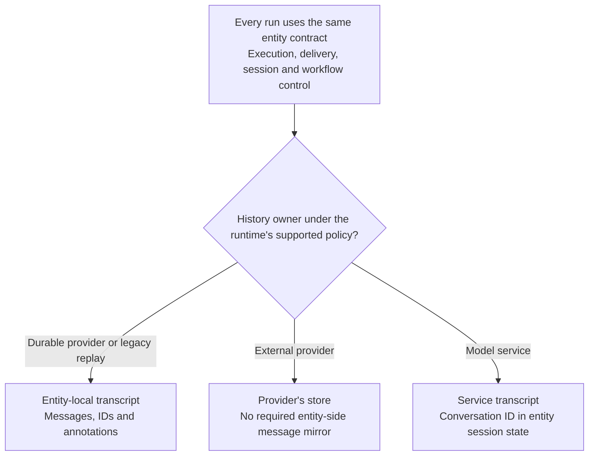
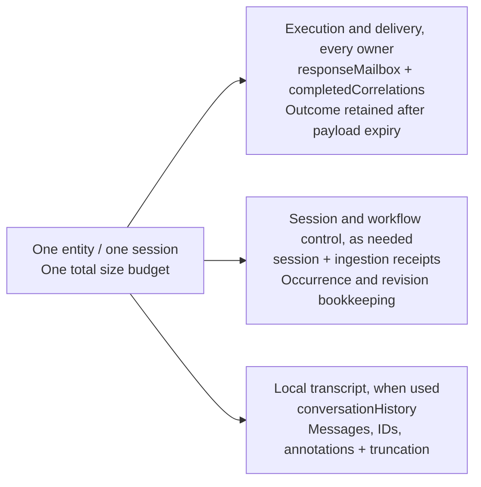
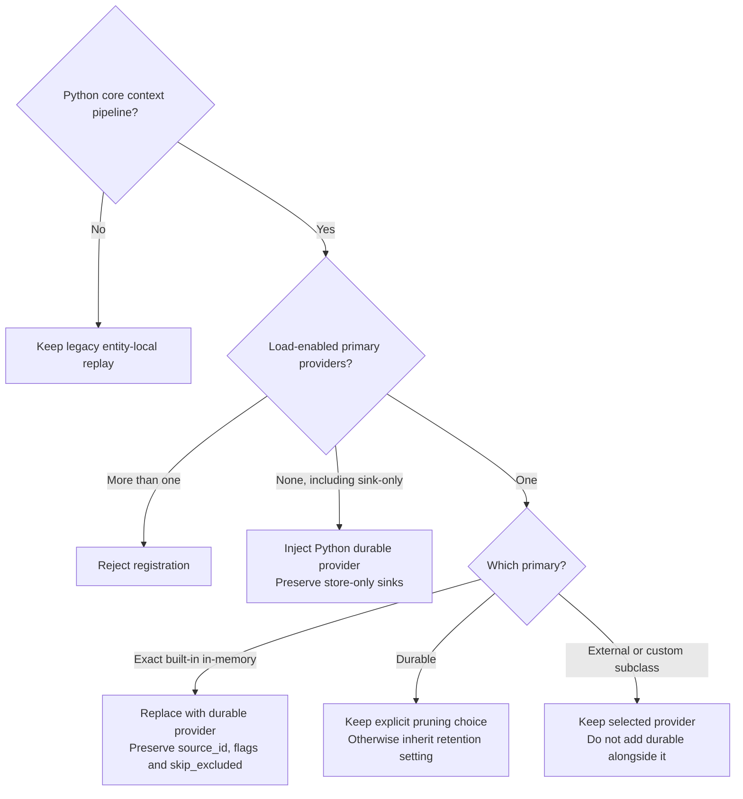
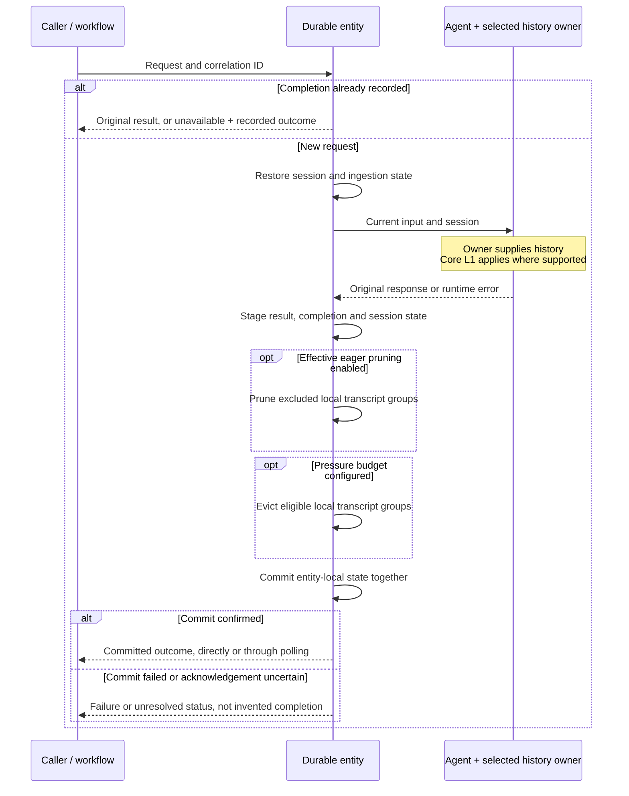
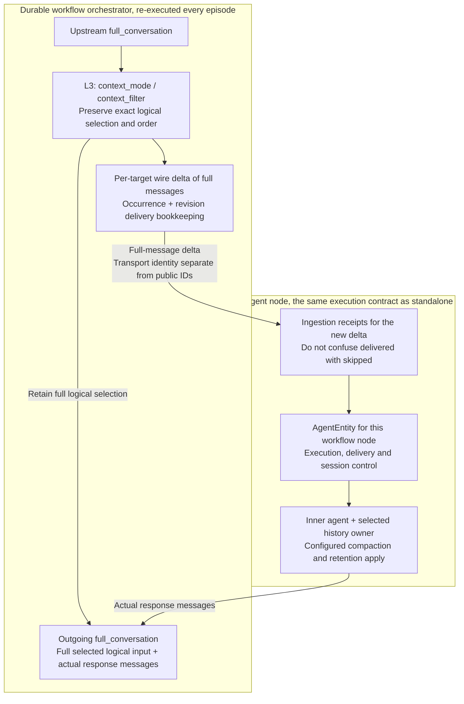
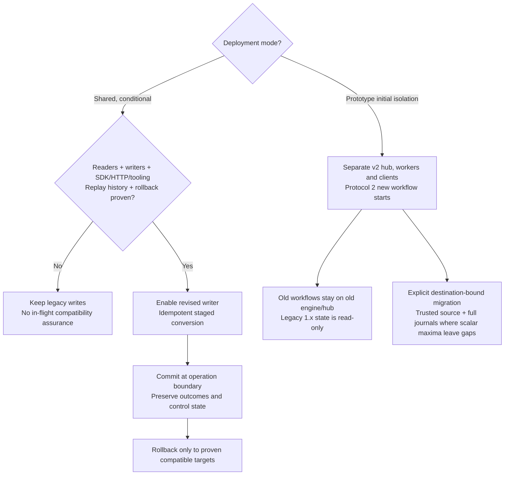

# Thread Compaction for Durable Agents and Workflows

## Decision Summary

Use core's history-provider abstraction for durable conversation storage, together with workflow
context projection and per-target delta transport (Options 6 and 4). Keep execution and result
delivery independent of transcript ownership.

### Shared correctness invariants

- The entity owns request correlation, completion, original result delivery and duplicate-request
  suppression for every history configuration. Revised completion receipts retain the invocation
  outcome after delivery payload expiry.
- The selected history owner supplies the transcript. Durable-owned history remains entity-local.
  External and service-owned history does not require an entity-side message mirror.
- The outgoing workflow conversation preserves the full logical selection, separately from the
  target's new-message delta. Position monotonicity is a cursor optimization condition, not a
  requirement on custom filters.
- Core compaction controls model input. Eager transcript pruning and pressure eviction are separate
  opt-ins. The proposed shared defaults are non-deleting `keep_all` and no pressure budget (`None`).
- All entity-local slices share one size budget and commit at one operation boundary. External
  writes and tool side effects are outside that transaction.
- Shared rollout requires proven reader, writer, client and orchestration-history compatibility,
  including rollback targets. Isolated rollout keeps old executions on their old engine and hub.

### Runtime capability mapping

These are integration proposals, not claims that aligned defaults or all capabilities have shipped.
Shared invariants do not require identical core APIs or the prototype's private APIs and JSON shape.

| Surface | Python integration | .NET integration |
| --- | --- | --- |
| Provider configuration | Load-enabled `HistoryProvider`, `source_id`, store-only sinks | Singular `ChatHistoryProvider`, separate `AIContextProviders` |
| Ownership policy | Per-run `store`, including `True -> False -> True` | Initially session-stable proposal, not a core API limit. Honor supported overrides, reject unsupported transitions. |
| Eager pruning | `follow_compaction` on supported `DurableHistoryProvider`, not external stores | Defer `FollowCompaction` pending safe exclusion, summary, cadence and decorator handling. |
| Pressure retention | Independent of compaction | Independent of compaction. `Auto` denotes pressure behavior, not automatic core compaction. |
| Defaults and budget | `keep_all` and `None` by default. An explicit positive byte budget enables pressure eviction. | Require aligned non-deleting defaults and equivalent explicit-budget semantics. Do not assume they have shipped. |

Architectural decisions remain in [ADR PR #88][adr-pr]. Coverage and limitations of the published
Python prototype are recorded in [Prototype Evidence](#prototype-evidence), separately from the
implementation requirements below.

### Sections

- [Context and Terminology](#context-and-terminology)
- [Considered Options](#considered-options)
- [Ownership and State Model](#ownership-and-state-model)
- [Execution, Delivery and Session Lifecycle](#execution-delivery-and-session-lifecycle)
- [Retention Policy](#retention-policy)
- [Workflow Context](#workflow-context)
- [State Evolution and Compatibility](#state-evolution-and-compatibility)
- [Consequences](#consequences) and [Validation Requirements](#validation-requirements)
- [Dependencies and Follow-up Work](#dependencies-and-follow-up-work)
- [Prototype Evidence](#prototype-evidence)

## Context and Terminology

Durable agents persist conversation state across worker restarts. Durable workflows also carry
conversation context between executors in checkpointed envelopes. These create three distinct
pressures.

| Pressure | Scope | Control |
| --- | --- | --- |
| Model context window | Input to one model call, in both core and durable execution | Core compaction |
| Token cost and latency | History sent on each call, in both runtimes | Core compaction and workflow projection |
| Persisted state capacity | Cumulative state and transport payloads in durable execution | Backend offload and explicit retention |

Reducing model input does not necessarily reduce storage. An exclusion-and-summary strategy can
retain the original messages and add summaries, increasing stored size. A token-window setting is
therefore not a storage-byte limit.

Durable Task Scheduler (DTS) has an unoffloaded message limit of 1 MB. The Azure Storage backend
compresses payloads above 45 KB into a `<taskhub>-largemessages` blob instead, but still incurs CPU,
I/O and memory costs. The design must work without offload and must distinguish a hard transport
limit from an operator-selected storage budget.

Core's [compaction design][adr0019] provides two relevant mechanisms:

1. **In-run filtering** projects the messages supplied to the model without deleting the originals.
   It can operate on context supplied by any supported history provider.
2. **Store reduction** rewrites stored history. In the implementations evaluated for this ADR,
   Python's `after_strategy` targets session-state history, while .NET exposes `IChatReducer` on
   `InMemoryChatHistoryProvider`, including the `strategy.AsChatReducer()` bridge. External stores
   do not share a general rewrite contract. See [Dependencies](#dependencies-and-follow-up-work).

The original durable entity bypassed the history-provider pipeline and rebuilt a session for each
operation. The design restores that pipeline and session state rather than introducing a separate
durable-only compaction API. It must preserve user configuration, message ordering and atomic
tool-call/result and reasoning groups, while keeping deletion explicit and observable.

| Term | Meaning in this ADR |
| --- | --- |
| History provider | Python `HistoryProvider` or .NET `ChatHistoryProvider` |
| Primary provider | In Python, a history provider with loading enabled. Additional providers may be store-only sinks. .NET has a singular history-provider slot. |
| Transcript | Messages and associated history/compaction metadata, distinct from execution receipts |
| `conversationHistory` | The entity's existing persisted transcript field, not a requirement for every history owner |
| Execution and delivery state | Request-level bookkeeping, original results and completion receipts |
| Service-storing client | A client whose default is service-side storage |
| Service-owned run | A run for which the model service supplies history, determined from effective options |
| `source_id` / `history_source_id` | Python provider identifier / the identifier a Python compaction provider uses to locate that history |
| Non-evictable floor | Serialized entity data that transcript retention cannot remove |

### Identity glossary

| Identity | Purpose and scope |
| --- | --- |
| Request correlation | Identifies a logical request within an entity for result lookup and duplicate-request suppression. Not a message or external append ID. |
| Application message ID | Public, caller/provider-owned message identity. Preserve it rather than rewriting it to carry transport bookkeeping. |
| Transport occurrence and revision fingerprint | Identifies a scoped occurrence and its content revision for workflow delivery. Distinguishes repeated IDs, changed messages and synthesized messages without relying on text alone. |
| Stable session key | Identifies one durable session to its provider. Workflow instance and executor scope must prevent unrelated nodes from sharing it. |
| Provider continuation | A service conversation/response ID or provider continuation token. It resumes that provider's branch, not an entity result or workflow cursor. |
| External append ID | Optional retry-safe adapter identity for a logical write step. It is not supplied by a local message ID or required of ordinary core providers. |

These identities have different lifetimes. None requires a per-message external-history mirror or
a public message-ID rewrite. Transport receipts belong in control state, not placeholder messages.

The labels L1, L2 and L3 identify different integration points, not three forms of storage eviction.

| Surface | Mechanism | Effect |
| --- | --- | --- |
| L1, agent context | Core `CompactionProvider` / `compaction_strategy` | Projects model input without deleting stored history |
| L2, eager pruning | Python `retention="follow_compaction"`, proposed .NET equivalent | Opt-in deletion on a supported local history path |
| L3, workflow context | `context_mode` / `context_filter` and delta transport | Selects and transports context between executors |
| Capacity safety | Optional `max_state_bytes` budget | Evicts eligible local transcript groups under pressure, independently of L2 |

The Python prototype demonstrates the L1/L2 integration on its durable history path. The evaluated
.NET compaction-state representation has an additional storage constraint described in dependency
4. Eager-pruning parity also needs observable summary, cadence and decorator paths. Neither that
work nor external-store rewrite support is a prerequisite for independent pressure retention.

## Considered Options

1. **In-run filtering alone, rejected.** It bounds model input but leaves cumulative durable state
   unbounded.
2. **Bespoke pre-write compaction in the entity, rejected.** It duplicates core strategies and
   grouping rather than integrating with the history-provider abstraction.
3. **Separate on-storage maintenance, deferred.** It may suit expensive summarization, but cannot
   prevent state from exceeding its limit during an active turn.
4. **Workflow projection and delta transport, selected.** Honor `AgentExecutor.context_mode` and
  `context_filter`, then avoid resending already-delivered messages to a target.
5. **Automatically derive a lossy store reducer, rejected as a default.** A model-input exclusion
   is not implicit permission to delete. Users can opt into `follow_compaction`, or independently
   set a pressure budget without configuring compaction.
6. **Durable storage as a core history provider, selected.** Reuse the core pipeline and session
   state while keeping execution/delivery independent of history ownership. Each store retains its
   own lifecycle policy.
7. **Large-payload offload, optional and backend-specific.** The DTS
  [large-payload extension][offload] raises the ceiling without deleting content, but requires an
  Azure Blob payload store and is not available through every host. Azure Storage already offloads
  internally. No portable guarantee in this ADR depends on offload being present.

## Ownership and State Model

### Transcript ownership

The entity owns execution and delivery in every configuration. That state includes original results
or references, not only metadata. The history owner independently supplies and retains the
transcript.

| History owner | Transcript location | Transcript policy |
| --- | --- | --- |
| Durable history adapter | Entity-local `conversationHistory` | Supported eager pruning and independent pressure eviction |
| External primary provider | Redis, Cosmos, file or its chosen store | The provider's own retention policy |
| Model service | The service | Service retention, continued through its conversation ID |
| Agent without a context pipeline | Entity-local history through legacy replay | Optional pressure eviction |

External and service-owned turns do not require contentless copies of each request message.
Execution correlation does not require a message-level mirror, and entity-local message IDs do not
necessarily identify external-store records. Any message journal needs an explicit consumer and
lifecycle.
Required [workflow deduplication state](#workflow-context) must nevertheless survive transcript
pruning. Selecting a different owner does not implicitly discard existing local history.

### Logical state slices

The state has three logical slices. This separation does not require new nested JSON objects or
relocating `conversationHistory`.

History providers own transcript read, append and reconciliation behavior. The entity runtime
physically commits all entity-local slices at the operation boundary. One owner must append each
transcript input and output, preserving provider storage choices without competing writers. This
does not guarantee a single external append across retries. See
[failure boundaries](#commit-and-failure-boundaries). The prototype's append ownership is described
in [Prototype Evidence](#prototype-evidence).

Each standalone session receives a distinct entity key. Workflow agent entities are scoped by
workflow instance and executor. Their full entity identity also supplies a stable external-provider
session key, so workflow nodes cannot accidentally share a conversation. Old sessions occupy
separate entities and do not consume a new session's capacity.

### Python provider selection

Python registration selects the history adapter without changing the execution contract or mutating
the caller's agent. Preserve `source_id` when replacing a provider so compaction configured through
`history_source_id` continues to resolve the same history. Python core's default history source is
`"in_memory"`. Substitution preserves existing compaction triggers and does not enable compaction.
The table and diagram below describe Python, not a universal provider-registration algorithm.

| Configuration | Registration behavior |
| --- | --- |
| No load-enabled primary, including sink-only configurations | Inject durable history using core's default `source_id`. Preserve store-only sinks. |
| Exact built-in `InMemoryHistoryProvider` | Replace it with durable history, preserving `source_id`, storage flags and `skip_excluded`. Preserve custom subclasses and their hooks. |
| Hand-configured `DurableHistoryProvider` | Preserve explicit `prune_excluded`. If unset, inherit the registration retention policy. |
| External load-enabled primary | Keep it. Do not add durable history alongside it. |
| Service-storing client without an external primary | Keep durable history available for client-owned runs and silent on service-owned runs. |
| No core context pipeline | Preserve the legacy entity-local replay path. |

Reject more than one load-enabled primary. Additional store-only audit or evaluation sinks retain
their configured storage and lifecycle. A Python audit sink must have loading disabled and a
nonempty, unique `source_id`. If substitution is needed, shallow-copy the agent and its provider
list. Implicit history follows core's provider ordering. Preserve custom durable-provider session
state while excluding only its derived message buffer and position index. A custom in-memory
subclass's session transcript remains part of the protected state budget, not the durable
transcript's eviction policy. Substitution does not import content accumulated in an in-memory
provider before registration. That import scenario is outside the persisted-state upgrade contract.

### Python per-run ownership

Resolve Python `store` from run options, then agent defaults, then the client's `STORES_BY_DEFAULT`.
The Python integration follows that per-run choice rather than pinning an owner for the session.
An attached durable provider yields no local history on a service-owned run and is available on
client-owned runs. These are ownership states, not retention modes.

Keeping the durable provider available prevents core from injecting an unmanaged in-memory history
slice into persisted session state on a `store=False` run. An external primary already occupies
that role, so it needs no additional durable provider.

On the service-owned branch, the prototype suppresses both loading and storing through an inactive
external primary, including per-service-call storage hooks. This intentionally differs from ordinary
Python core behavior, which can still store through that primary on a service-owned run. It is a
proposal for the Python integration, not a universal cross-runtime policy. Explicit store-only
audit sinks remain separate and retain their configured writes and lifecycle.

Changing `store` does not migrate service history, create placeholders for missing content, or
promote mailbox responses into the transcript. In a `store=True -> False -> True` sequence, exclude
the saved service conversation ID from the client-owned model invocation and history-provider hook
decisions, while retaining it in session control. The later service-owned run may resume that
service branch if still valid, without importing the intervening client-owned transcript. Neither
branch receives history synthesized from mailbox results. Explicit ownership migration or forking
belongs in the core lifecycle follow-up.

### .NET ownership policy

.NET configures a singular `ChatHistoryProvider` separately from its `AIContextProviders`. An
initially session-stable ownership policy is proposed for the durable integration. It is not a
claim that core cannot support per-run overrides or transitions. Implemented overrides must honor
core's effective choice. Reject unsupported overrides or transitions explicitly before execution,
rather than silently forcing the saved owner over that choice. Do not infer Python's injection or
inactive-primary storage behavior from this policy.

### Configuration identity

Stable provider/configuration identity is distinct from effective per-run ownership. An optional,
runtime-owned versioned profile is the proposed initial representation, not a mandatory shared
binding object. The exact representation remains under review in [schema PR #92][schema-pr].
Compatible writers must preserve such state. A host must validate any profile it relies on for
restoration or execution, rather than guessing an owner from opaque session data. A configuration
descriptor does not require its facility to own every run or change a runtime's supported transitions.

## Execution, Delivery and Session Lifecycle

The execution path is the same for every history owner. Workflow projection and delta selection
occur before the entity receives the request.

The outcome-bearing contract below applies to revised receipts. Older timestamp-only receipts
still suppress duplicate execution and follow the
[transition policy](#conversion-requirements-within-the-chosen-mode) when their outcome is unknown.

### Result delivery and completion receipts

Signal-based client and HTTP paths poll entity state by correlation ID. `responseMailbox` retains
the original success or runtime-error result, including response metadata, as a payload or readable
reference until a configured delivery expiry. The existing polling API cannot acknowledge receipt,
so expiry bounds payload retention. An acknowledgement operation is a possible later capability.

| Observed outcome | Delivery contract |
| --- | --- |
| Committed success | Return the original result, including an explicit null, falsey or non-text value. Completion does not depend on nonempty text. |
| Committed error | Return the recorded error and completion evidence. Do not reinterpret it as a successful empty response. |
| Expired delivery | Return completed-but-result-unavailable with the retained `succeeded` or `failed` outcome. Do not return the expired payload, invoke again or resurrect a transcript response. |
| No result | Absence alone establishes neither acceptance, completion nor failure. Poll within the caller's deadline or report unresolved status. |
| Accepted | Report only actual acceptance/dispatch evidence. Acceptance is not final completion. |
| Pending approval | Deliver the approval request and persist pending state. This does not mean the guarded tool action executed successfully. |

For revised writes, record the invocation outcome and completion timestamp in the receipt at the
same local commit as the original result. Those facts are immutable and survive payload expiry.
Expiry changes result availability, not the outcome of the correlated invocation. That outcome
does not imply completion of an enclosing workflow or execution of a pending approval-gated action.
Older receipts without an outcome require the explicit
[transition policy](#conversion-requirements-within-the-chosen-mode).

Define a JSON projection of the supported response fields, including messages/content, message and
response IDs, author/agent metadata, original creation time, usage, finish reason, provider
continuation and additional properties. Preserve structured values separately from text, including
the distinction between an absent value and explicit `null`, `false`, `0` or an empty container.
Property presence or an explicit marker can encode that distinction. This ADR does not mandate a
new flag. Do not persist opaque SDK objects or Python/.NET response-format classes as the contract.
Preserve supported tool and multimodal content without flattening it. Exact field names and
discriminators belong to schema review, not the prototype's private shape.

Preserve unknown optional JSON data safely for round-trips, without dynamically loading types or
executing content merely by reading it. Opaque SDK representations are outside this guarantee.
The original payload and its detailed response metadata need not remain available after delivery
expiry. The completion timestamp and invocation outcome remain in the receipt. Referenced resource
lifetime is separate from result lifetime. A retained URI does not guarantee the resource still
exists. Failure to read an offloaded delivery payload must not become a successful empty result.
An approval response may complete one request's delivery while the pending action still
needs an explicit resume under a new correlation. A recovered tool-role error is not automatically
a terminal invocation failure.

At delivery expiry, stop returning the payload even if physical cleanup is lazy. Remove the
payload or reference during a subsequent operation or explicit maintenance, but retain the
completion timestamp and outcome in a `completedCorrelations` tombstone until the entity is deleted.
Idle physical cleanup requires a host/application-owned schedule. The Python prototype exposes an
`expire_responses` entity operation rather than an implicit idle timer. A duplicate correlation
returns its retained result or the completed-but-unavailable status and recorded outcome, not
another agent invocation. Transcript compaction and clearing must not alter results, remove live
mailbox obligations, or erase completion receipts. Runtime-error results and receipts are not model
context.

An indefinitely active entity accumulates tombstones without a fixed bound. They can eventually fill
the non-evictable floor even after transcript pruning. This long-session limitation requires
[bounded completion bookkeeping](#7-bounded-completion-bookkeeping) as a durable follow-up, not
automatic receipt expiry under transcript retention.

The transcript and mailbox may share immutable payload storage, but a delivery reference cannot
depend solely on an evictable transcript entry. It must stay readable for its delivery window.
Likewise, an orchestration records the `call_entity` result for replay, independently of entity
completion records and any assistant message retained as history.

### Session restoration

Restore each operation through its runtime's session/provider lifecycle. Python uses the agent's
own `create_session()` and applies the [per-run rules](#python-per-run-ownership) to the saved service
conversation ID. Carry the resulting session, pending tool approvals and any inactive service
conversation ID forward on committed successes and errors. The current Python serialization bridge
uses `AgentSession.to_dict()` with JSON-compatibility validation. The state bag may contain more
than metadata, and its full serialized size counts toward the entity budget.

In the Python bridge, exclude only the durable provider's transient buffer and position index from
session serialization, not the durable transcript itself. Rebuild them from persisted messages,
IDs and annotations on each turn. Keep the provider's other JSON-compatible session state.
Reconcile compaction changes by message ID before dropping the transient fields. Python core's
process-local type registry requires registering already loaded serializable types during restore.
Broad Pydantic subclass discovery is not used because of identifier-collision risk.

Provider-owned versioned snapshots are the intended replacement for broad session serialization.
See [provider lifecycle dependencies](#dependencies-and-follow-up-work) for the missing contract.

### Commit and failure boundaries

Execution, session, ingestion and local transcript changes commit together once per entity
operation. A completion receipt proves a committed outcome, not completion of every intermediate
model or tool call. Failure known to precede commit leaves the previous local state intact, and a
retry may repeat those calls and side effects. The design does not checkpoint between tool calls.

| Failure boundary | Required behavior |
| --- | --- |
| Caller stops waiting or cancels polling | Stop that wait only. This is not execution cancellation, and the entity may still commit. |
| Worker shutdown or execution cancellation before commit | Discard uncommitted local changes. Do not invent completion. External writes, model calls or tools may already have succeeded. |
| Cancellation after confirmed commit | The request is already completed. Return its retained result, or unavailable status with the recorded outcome after expiry. Do not undo it or invoke again. |
| Provider failure during load, invocation or store | Stage a runtime-error outcome if possible, with actual accepted-input receipts and resulting session state. Do not fabricate acceptance for rejected input. |
| Final reconciliation, session serialization or a known pre-commit failure | Leave the last committed local state intact. Do not return staged completion as a committed outcome. |
| Error outcome cannot be persisted | Use the direct operation failure channel where available. State-polling callers may time out without a durable error result. |
| Commit acknowledgement is uncertain | The outcome is unresolved until authoritative state or host evidence settles it. Do not claim the request did not execute or blindly resubmit under a new correlation. |

Acceptance/ingestion receipts describe what was actually accepted, not all requested input. They
are distinct from final completion receipts. Cancellation state, where supported, must be explicit
and cannot be inferred from an empty result or caller timeout.

External providers and the model service have independent commits. Their writes may succeed before
the entity commits. Local slice consistency therefore does not provide a distributed transaction or
exactly-once execution of uncommitted effects.

An external append followed by a worker failure before local commit leaves no completion receipt
for that attempt. Retrying can append the same logical write again, even with only one append path.
Existing core history providers remain supported without a new idempotency requirement. Stronger
external-write guarantees are an optional
[durable integration capability](#8-retry-safe-external-history-writes).

If capacity prevents the entity commit, even a durable error result may not fit. Report failure
through the operation error channel where available and through diagnostics. A state-polling signal
caller may time out instead. Do not persist a successful completion receipt for an uncommitted turn.

### Service conversation errors

For the structured `previous_response_not_found` error, retry the identical current invocation up
to three additional times within the operation, waiting 0.5, 1.0 and 1.5 seconds, only if there has
been no streaming progress, tool execution or session/continuation advance. Stop immediately on a
different error or any such progress. If matching refusals continue, fail the turn.

Never replay a partially consumed stream or restart a tool loop after progress. Retrying a whole
invocation before observable progress can still repeat provider hooks. A matching refusal does not
prove those hooks were side-effect-free. Preserve configured cadence and do not claim external
writes are retry-safe without the provider's own guarantee.

These retries can recover transient visibility failures without retaining a duplicate transcript. A
genuinely expired conversation ID cannot be recovered this way. Full-transcript recovery is not part
of the design because it requires storing a second conversation continuously. The observations and
storage trade-off are recorded in [Prototype Evidence](#prototype-evidence).

## Retention Policy

Two independent registration controls govern transcript deletion. Application defaults may be
overridden per agent. They do not change the agent's compaction configuration or an external
provider's storage policy. The table uses Python configuration spellings. The shared contract is
non-deleting defaults, an optional explicit byte budget and independent eager pruning where
supported, not identical API names in both runtimes.

| Control | Value | Behavior |
| --- | --- | --- |
| `retention` | `keep_all` **(default)** | Do not delete merely because compaction excluded a message. |
| `retention` | `follow_compaction` | Prune exclusions on the supported Python durable-provider path. Not a rewrite policy for external stores. Without compaction there are no exclusions to prune. |
| `max_state_bytes` | `None` **(default)** | Disable pressure eviction. The backend can still reject an oversized write. |
| `max_state_bytes` | `"backend_limit"` | Optional Python host convenience for a known DTS/Scheduler limit. Reject if unresolved. Not a transport-size guarantee. |
| `max_state_bytes` | positive integer | Use that explicit serialized-state budget. |

`None` and a positive integer are the portable budget choices. A known direct DTS limit is
1,048,576 bytes, but serialized entity bytes exclude transport framing and other host overhead.
`"backend_limit"` is not a universal backend-discovery API or a guarantee that a write will fit.
The current local choice keeps it as a non-normative Python-only convenience, not part of the
portable contract or an assumption of shared-reviewer concurrence.

Neither control enables the other. In Python, an explicitly pinned provider `prune_excluded` value
takes precedence over registration retention. The matrix assumes a supported local pruning path
with no such provider override.

| | No pressure budget | Pressure budget set |
| --- | --- | --- |
| `keep_all` | Never delete transcript messages. | Do not prune because of exclusions, but evict eligible oldest groups under pressure. |
| `follow_compaction` | Delete only what the user's compaction strategy excluded. | Delete exclusions eagerly, then evict oldest groups if the remainder still crosses the high watermark. |

### Defaults and scope

Deletion is opt-in because a model-input exclusion should not silently become irreversible storage
loss. Both durable runtimes must align on `keep_all` and no pressure budget by default. This is a
requirement, not a claim about shipped defaults. In .NET, `Auto` pressure semantics must not be
presented as enabling core compaction. Defer `FollowCompaction` until exclusion, summary, cadence
and decorator paths support safe deletion. Pressure retention need not wait for that work.

The Python core configuration examined for this ADR leaves in-memory history unbounded,
defaults `RedisHistoryProvider.max_messages` and `compaction_strategy` to `None`, and requires an
explicit `max_context_window_tokens` for context-window compaction. That token setting governs L1,
not entity storage.

Without pressure eviction, an oversized write can fail while the last committed state remains
available. Recovery requires an applicable configuration change, such as enabling pruning or using
supported offload. Raising an application budget alone does not raise a backend's hard limit.
Neither offload nor an external history provider removes the cost of entity delivery/control state.

### Whole-entity pressure budget

Measure the serialized entity JSON, including transcript, mailbox, completion receipts, session,
ingestion metadata and temporary compatibility copies. This excludes transport framing added
outside the state payload. Logical slices do not receive separate allowances or make duplicate
payload bytes free.

When a pressure budget is set, evaluate it before the operation's state commit, after any enabled
eager pruning. Configurable `high_watermark=0.85` and `low_watermark=0.70` must satisfy
`0 < low_watermark < high_watermark <= 1`. Below high, do nothing. At pressure, target low with
deterministic oldest-group selection. Python uses core's fallback via
`TokenBudgetComposedStrategy(strategies=[])`. Equivalent .NET behavior need not use that API.

Plan with detached messages whose exclusion flags are cleared, leaving stored annotations intact.
All otherwise eligible old groups compete by age, including groups excluded from model context.
Preserve atomic tool-call/result and reasoning groups. Hold system messages out of the candidate
set, since core's stricter fallback can otherwise evict them. Protect the newest exchange, live
mailbox obligations, completion receipts, session state and ingestion/custom-ID control state.

Calculate that non-evictable floor before deleting anything. If it alone exceeds the configured
limit, fail without deleting transcript history. If the low watermark is unreachable, raise the
target only enough to get below high where possible. If no target below high is reachable, report
the capacity condition without a futile eviction pass.

The strategy accepts tokens, but its budget conversion must use persisted evictable-message bytes
and their token count after subtracting the floor. Do not derive it from `message.text`, which can
be empty for large tool payloads. Remeasure actual serialized state rather than treating the token
estimate as the storage limit. No model call is needed for pressure eviction.

### Observable deletion

Persist `truncation` with `evictedMessageCount`, `firstEvictedAt` and `lastEvictedAt`. Use bounded
aggregate evidence, not a growing list of removed messages. Absence means no recorded transcript
eviction. This record describes removed local transcript content, while `completedCorrelations`
describes completed execution. Neither substitutes for the other.

Emit bounded OpenTelemetry events/measurements for the requested budget, serialized bytes before
and after staged deletion, removed-message count, non-evictable-floor failures and commit failures.
Distinguish a planned eviction from staged state and from a confirmed commit. Report confirmation
only where the host can observe the actual commit. Otherwise leave commit status unknown rather
than treating an entity method's return or a staging log as persistence evidence.

Validation must pair persisted-state readback with the subsequent model input. Logs alone prove
neither durable deletion nor what the model received. Do not log message payloads or put session,
request, message or other high-cardinality IDs in metric dimensions.

## Workflow Context

Workflow agent nodes use the same execution path as standalone durable agents, expressed in Python
as `DurableAIAgent` to `AgentEntity` to the inner agent. They inherit execution, session, compaction
and retention contracts. Only inter-executor projection and transport are workflow-specific. Each
node's transcript stays with its selected history owner.

### Projection and delta transport

Honor `AgentExecutor.context_mode`: `full` (the default), `last_agent`, or `custom` with a
`context_filter` of type `Callable[[list[Message]], list[Message]]`. Project the upstream
`AgentExecutorResponse.full_conversation` first. Preserve the full selected logical conversation
and order at the workflow layer, separately from the per-target wire delta. Transport full message
objects for unseen occurrences or revisions, not flattened text. The target receives that delta
as new invocation input. Its selected history owner supplies prior context under the configured
core compaction and retention policies. Construct the outgoing workflow conversation from the
full selected logical input plus the actual response messages, not from the delta alone or an
unfiltered upstream conversation. This does not promise identical repeated-message counts or
reconstitution of evicted context at every model invocation. Python prototype names such as
`RunRequest.context_messages` do not fix the common public API or wire shape.

Projection controls which context may reach a target. Delta transport avoids repeatedly sending the
same selected messages without changing that semantic choice. Entity-side deduplication occurs too
late to reduce the serialized call payload. The prototype's complete-projection measurements are in
[Prototype Evidence](#prototype-evidence).

The prototype's legacy `wf_{executor}_{position}` format is not a normative workflow identity or a
reason to rewrite application message IDs. Use scoped transport occurrences and revision
fingerprints over full message content. Maintain separate delivery bookkeeping for each
`(target, producer)` pair, reconstructed through deterministic orchestration replay rather than
checkpointed independently. Fan-out targets advance separately. Fan-in checks each occurrence
against its own producer's delivery record, never a minimum or maximum across different producers.

Custom filters need not be position-monotonic. A scalar highest-position cursor is an internal
optimization only where Durable can establish that it preserves the delivery decision. Otherwise,
track actual sent and ingested positions, using sets or lossless ranges that preserve gaps. For
example, after delivering positions `[1, 3]`, a later projection `[2, 4]` must deliver both `2` and
`4`. Purity, determinism and sorting each projection do not make position `2` already delivered.

Both source-side delta selection and entity-side redelivery checking must preserve this distinction.
Resending a full projection is insufficient if the entity still rejects every position below its
maximum. Persist ingestion receipts with the entity operation's other local changes. Neither side
forgets delivery evidence when transcript retention removes message content. A previously delivered
and evicted message must not be re-ingested merely because its transcript entry is gone. A receipt
proves delivery, not that the recipient still retains the payload. Transcript retention remains
meaningful, and receipts do not require an external-history mirror or automatic rehydration.

Exact position bookkeeping can grow for sparse selections. Count persisted ingestion receipts in
the non-evictable floor, and report capacity failure rather than silently losing selected context or
discarding delivery evidence. This preserves previously undelivered selections and the outgoing
workflow context, not identical repeated-message counts in every cycle compared with an in-process
workflow.

Position tracking covers existing workflow message identities. Changed content under an already
delivered application ID, repeated or missing IDs, and synthesized messages require occurrence and
revision handling in Durable. Fingerprint the complete message, including non-text content and
relevant metadata. Position tracking or text equality alone does not establish filter parity.

Custom IDs are not monotonic positions. The historical prototype used a `known_ids` lookup derived
from stored message envelopes. Removing externally owned message records requires independent
control-state receipts with an explicit identity scope and lifetime. Test repeated context under a
new correlation separately from duplicate delivery of a completed request. Neither form of
deduplication implies that local IDs match an external store.

### Replay constraints and projection placement

While executed inside orchestration replay, a `context_filter` must be synchronous, deterministic,
side-effect-free and independent of time, randomness or external state. It can run more than once
for a logical handoff. `full` and `last_agent` are deterministic list projections. A custom filter's
side effects can repeat, its I/O can fail a later replay, and its latency is paid on each episode.
These execution-location constraints do not require position-monotonic selection.

The evaluated Durable Task SDK compares action identity and kind, not action-input equality. A
different recomputed input can be discarded in favor of the recorded result without a
`NonDeterminismError`. This is not permission to use impure filters or a guarantee that arbitrary
user code is safe during replay.

Projection remains in the orchestrator so only its result crosses the handoff. Target-side
projection would carry the full conversation on the wire. An activity could isolate arbitrary user
code from orchestration replay at the cost of a scheduling round trip per handoff. That alternative
and public accessors replacing `_context_mode` / `_context_filter` reads are tracked in
[#79][issue79].

## State Evolution and Compatibility

The shared Python/.NET schema needs behavioral compatibility, not just additive JSON or a matching
major version. The evaluated legacy readers accept only `request` and `response` entries. .NET
polymorphic deserialization rejects unknown `$type` values, and Python's fallback uses the same
limited enum. New entry kinds or delivery state therefore need explicit deployment gates.

[Schema PR #92][schema-pr] is a separate contract proposal under review, not final format agreement
or a replacement for the architectural decisions in PR #88.

### Mode 1. Shared deployment, conditional reader-first rollout

Use this mode only after proving compatibility for both readers and writers in both runtimes,
SDK clients, HTTP polling, tooling and orchestration history, including every supported rollback
target. Preserving an unknown mailbox field is not enough if lookup still searches only
`conversationHistory`, or a later write discards the revised delivery state.

1. Deploy dual-layout readers and workers that preserve the revised write contract. Legacy lookup
   uses recorded response entries. Revised lookup distinguishes retained results, expired delivery
   and work without a completed result. Preserve unknown optional raw JSON without executing it or
   introducing unknown entry kinds into model context.
2. Prove response lookup, subsequent writes, paused-workflow replay and rollback against recorded
   orchestration history. Only then enable revised writers. This is a release/deployment gate,
   not a worker-to-worker or client-version handshake.

The implementation stack must pin minimum worker, SDK/poller and tooling versions for both runtimes,
orchestration protocol versions and supported rollback targets before shared writes are enabled.
Those release floors are not selected here. Core dependency versions used in prototype tests are
not cross-runtime compatibility floors.

### Mode 2. Isolated prototype v2 deployment

The prototype's initial rollout is isolated v2, with separate task hubs and compatible workers and
clients. Its writer accepts its exact `2.0.0` layout. Legacy `1.x` state is read-only and requires
explicit migration before use by the new writer. Workflow protocol `2` is for new starts. Existing
workflows remain on their old engine and hub. Do not point old clients or workers at the v2
destination. The required `isolated_v2` setting is operator acknowledgement, not proof that other
participants are isolated or compatible.

Migration must be explicit, destination-bound and supplied by a trusted source. Bind it to the
intended destination entity/session, and require full journals where scalar ingestion maxima leave
gaps in delivery evidence. If evidence is missing, reject or defer migration rather than invent a
delivered prefix. A matching `2.x` version does not certify mixed-format compatibility. These are
prototype deployment constraints, not a mandate for its private APIs or exact final common schema.

### Conversion requirements within the chosen mode

Only a proven shared rollout may resume an in-flight old workflow on the new deployment. Isolated
rollout makes no such assurance. Conversion must not replay model or tool calls just to convert
state. Shared-mode conversion may be lazy at the next entity operation. Repeated conversion in
either mode must not duplicate messages, mailbox entries or completion receipts. Preserve recorded
outcomes, correlations, application IDs, order, annotations, session state and ingestion bookkeeping.
Keep `conversationHistory` in place where possible rather than requiring bulk transcript relocation.

Exact ingestion receipts require the same reader/writer and rollback gates. A scalar maximum does
not reveal which lower positions were skipped. Require complete recorded delivery journals for
that transition, not just a version gate. Do not infer a fully delivered prefix or reconstruct
receipts solely from the pruned transcript. In isolated mode, apply these checks at explicit import,
not as implicit permission for the new engine to resume an old orchestration.

Only authoritative recorded evidence justifies backfilling a completion receipt or invocation
outcome. An older timestamp-only receipt still proves completion and must continue to suppress
duplicate execution. If no retained result or other trusted evidence establishes its outcome,
migration must not assign `succeeded` or `failed`, erase the receipt or rerun the request to recover
that fact. Keep such state on a compatible deployment or use an explicitly agreed legacy handling
policy that preserves completion without inventing an outcome. A target format requiring a known
outcome must reject an import that lacks this evidence. Where both result and completion evidence
are gone, migration cannot reconstruct either or claim prior duplicate suppression.

An existing response may itself have been partially pruned or annotated. Preserve its available
payload and completion evidence, without claiming to reconstruct the original full response.
Immutable original-result guarantees apply to revised writes, not retroactively to changed data.
Legacy response expiry needs an explicit transition policy and grace period, not immediate expiry
merely because an old response predates the new policy. Once converted, an expired delivery must not
fall back to a transcript response and silently become available again. The schema/layout version,
not the absence of one optional mailbox field, identifies which lookup contract applies.

Stage conversion and the operation's entity-local changes before committing them together. Validate
the whole serialized size, including any temporary compatibility copies, and leave the last
committed state intact if conversion cannot fit. Do not migrate an external transcript or infer its
ownership from a locally generated message ID.

Rollback is supported only to versions that preserve both lookup and write semantics for converted
entities. Read-only tolerance is insufficient if the next operation writes its response only to the
old transcript. In isolated mode, rolling back the old deployment does not make it a valid reader or
writer for the v2 destination. A version bump alone proves neither state nor orchestration-history
compatibility. Required tests include each mode's gates, paused HITL behavior, polling, tooling,
repeated conversion, new requests after supported rollback, polling after transcript pruning,
Python/.NET read/write round-trips and unknown-data preservation.

## Consequences

- Agents reuse core compaction configuration. Execution/delivery semantics remain consistent across
  durable, external and service-owned history, without a required external message mirror.
- Eager pruning and pressure eviction can be enabled separately. Both remain non-deleting by
  default, so an unconfigured session can still reach its backend limit.
- Pruning cannot change an original result or erase completion evidence. Revised receipts retain
  the invocation outcome after delivery expiry without retaining the payload. Completion tombstones
  accumulate throughout an active entity's lifetime and can prevent further writes even when
  transcript retention is enabled. Bounded completion bookkeeping remains a durable follow-up.
- Custom selection can require growing sets of ingestion receipts. That control-state cost belongs
  to Durable rather than a new monotonicity requirement on core filters.
- Pressure eviction changes available future history, not the current model projection. It operates
  near the configured budget rather than deleting continuously.
- Local slices commit together, but external writes and uncommitted tool effects can repeat after
  failure. Optional retry-safe history adapters do not make the entity and store transactional or
  guarantee exactly-once model/tool effects.
- Shared transition requires proven readers, writers, clients, tooling and replay compatibility,
  even if the transcript retains its field name. Isolated rollout keeps old workflows on the old
  engine and hub, with explicit migration rather than implied in-flight compatibility.
- The Python integration uses a session-buffer bridge until core exposes provider lifecycle APIs.
  .NET eager-pruning parity needs safe exclusion, summary, cadence and decorator handling. Pressure
  retention is independent, and the proposed .NET ownership policy does not constrain core APIs.

## Validation Requirements

The following are acceptance requirements for the proposed implementation, not claims about the
existing prototype's coverage. This checklist includes requirements already covered by tests, not
just outstanding work. The coverage table in [Prototype Evidence](#prototype-evidence) separates
tested behavior, remaining validation, missing instrumentation and explicit follow-up capabilities.

1. **Provider-independent execution.** Test success, errors, polling, repeated correlations and
   cold reloads with durable, external, service-owned and legacy agents. Verify one transcript
   append path, provider storage choices, stable IDs, annotation round-trips and summary ordering.
  Separate Python's inactive-external-primary load/store suppression, including per-call hooks,
   from ordinary core behavior. Verify store-only sinks and .NET's separate ownership policy.
2. **Delivery lifetime.** Original mailbox responses and references must survive transcript
   annotation, summary insertion, pruning and clearing. Test delivery expiry, completion receipts,
  and a duplicate request after its transcript response was removed. Verify both success and
  failure at expiry before physical cleanup, after cleanup and after cold reload. The completion
  timestamp must remain unchanged. Lookup must expose the retained outcome without returning
  payloads or invoking again. Cover every outcome in the
   delivery table, explicit null/falsey/non-text values, typed JSON metadata, unknown optional raw
  data and pending approvals. Missing offloaded delivery data must not become a successful empty
  result.
3. **Retention matrix.** Exercise all four combinations of eager pruning and pressure budget,
   supported runtime-specific provider overrides, Python's optional `"backend_limit"`, custom
   watermarks and unresolved host limits. Require aligned non-deleting defaults in both runtimes.
   Test system messages, newest exchanges, atomic tool/reasoning groups, metadata-only floors,
   growing completion/ingestion receipts, oversized results, unreachable targets and truncation
   evidence. Add live inline-file and multimodal pressure cases, not only synthetic payloads or text.
   Pair persisted readback with subsequent model input. Check bounded OpenTelemetry fields and
   distinguish planned, staged and host-confirmed commits without payload or high-cardinality labels.
4. **Session continuity.** Restore provider types, pending approvals and service conversation IDs
   on committed success/error paths. In Python, cold-reload through `store=True -> False -> True`
   with a valid saved service ID. The client-owned run must ignore it in model calls and history
  hooks. The later service-owned invocation must receive the preserved ID. Neither transcript may
   be synthesized from mailbox results or merged with the other. Also cover transitions without a
   service ID, current-input preservation and contentless legacy records. Exercise bounded
   matching-error retries only before streaming/tool/session progress, and immediate failure on
   other errors. Do not infer provider-hook retry safety. For .NET, honor supported overrides and
   reject unsupported transitions rather than silently replacing core's effective choice.
5. **Workflow inputs.** Test cycles, fan-out, fan-in, replay, delivery receipts and eviction.
   A custom projection `[1, 3]` followed by `[2, 4]` must deliver both `2` and `4` on the second
   visit at the sender and receiver, including after cold reload and transcript eviction. Assert
   previously delivered positions are not re-ingested, each target/producer advances independently,
   and the selected order is preserved. Distinguish repeated context under a new correlation from
   repeated request delivery. Include custom, missing and fully repeated message IDs, plus
   deterministic non-monotonic projection and any cursor fast path's equivalence to exact tracking.
   Compare the exact logical selected input separately from the wire delta, including full typed
   messages, changed-content revisions and synthesized occurrences. Do not equate receipt presence
   with payload availability after pruning or allow transport IDs to rewrite application IDs.
6. **Python registration.** Verify no-primary and sink-only injection, exact built-in in-memory
  replacement, custom subclass preservation, `source_id`/`skip_excluded`, explicit
  `prune_excluded` precedence, external-provider preservation and rejection of multiple load-enabled
  primaries. Audit sinks need nonempty unique IDs and store-only configuration. Separately test
  .NET's singular history provider, `AIContextProviders`
   and decorated providers without imposing Python's registration model.
7. **State transition.** Test both explicit deployment modes. Shared rollout must prove readers,
   writers, SDK/HTTP polling, tooling, paused HITL replay and rollback against orchestration history.
  Isolated rollout must validate deployment/routing separation and reject old recorded workflow
  starts in the new engine. An acknowledgement setting alone cannot detect mixed peers.
  Test legacy read-only handling, protocol-2 new starts, destination-bound trusted imports,
   idempotent conversion and full journals for scalar gaps. Include partially altered legacy results,
   expiry grace, Python/.NET rewrites and unknown-data preservation. Version equality alone is not
  a compatibility test. Include timestamp-only receipts with no recoverable outcome and verify
  that migration neither invents an outcome nor loses completion evidence. A known-outcome target
  must reject such imports without authoritative evidence. Agreed legacy-compatible handling must
  preserve duplicate suppression after cold reload. Readers and rollback writers must preserve
  the agreed outcome and lookup contract before revised writes are enabled.
8. **Failure boundaries.** Inject failures around local commit and external writes. Uncommitted
   effects must not become protected completed operations. Cover caller wait cancellation, execution
   cancellation and worker shutdown before/after commit, provider failures at each stage, actual
   accepted-input receipts and uncertain commit acknowledgements. Combine provider error, failed
   error-result persistence and poller behavior in one scenario, not only separate unit cases.
   Verify direct failure versus polling timeout when even an error outcome cannot fit. Include an
   ordinary append-only provider whose write succeeds before a worker failure and can repeat on
   retry. Do not claim duplicate-free external storage for it. Retry-safe adapters, when added,
   require separate failure-injection tests for their declared guarantees.

Live scheduler-limit tests, offload validation and cross-language compaction parity remain required
as those capabilities are implemented. .NET eager-pruning tests must cover exclusion/summary state,
callback cadence and decorator paths before enabling `FollowCompaction`. Any future LLM-based
reducer also needs stable summary identities and retry/idempotency tests. Reduced-budget prototype
tests and live text runs do not substitute for the missing coverage.

## Dependencies and Follow-up Work

The constraints below describe the implementations evaluated during prototype development, not an
assertion that later package versions retain every limitation. Revalidate each dependency against
the versions selected for its implementation PR. New follow-up issues will be filed after ADR
approval.

Bounded completion bookkeeping and retry-safe external writes are durable-owned follow-ups.
Provider lifecycle improvements also remain follow-up work. None is a universal prerequisite for
using ordinary core history providers with this initial integration.

### 1. Provider-owned store reduction

The evaluated Python `CompactionProvider.after_strategy` mutates
`session.state[history_source_id]["messages"]`, unlike `before_strategy`, which acts on invocation
context. An external provider can therefore supply input for L1 without exposing its store to L2.
.NET similarly attaches `IChatReducer` to `InMemoryChatHistoryProvider` rather than all stores.

The Python durable provider bridges this by publishing a transient session-state working buffer
and reconciling its messages by message ID into entity state during `after_run`. This dependency
must be isolated and tested. It does not give Redis, Cosmos, file or other providers a general
rewrite capability. Core should expose store-rewrite capabilities and diagnose a configured hook
that cannot reach its store.

### 2. Append, lifecycle and snapshot capabilities

`save_messages()` receives new messages rather than a replacement transcript. In the evaluated Redis
provider, `rpush` appends content and `max_messages`/`ltrim` bounds it independently. A Cosmos
container can use TTL. Neither mechanism is a core compaction rewrite contract.

The upstream provider contract needs:

- Discoverable store reduction and `replace_messages()` / `flush()` with an expected version.
- `clear()` / `delete_session()` owned by the provider's lifecycle policy.
- Versioned `snapshot_state()` / `restore_state()` with provider-defined payloads and migration.
- Core's resolved service-versus-client ownership decision, avoiding drift from durable's duplicate
  option-precedence logic.
- Equivalent .NET capabilities, including the message metadata described in dependency 3.

Dependencies 1 and 2 gate general provider-owned compaction/lifecycle parity. They do not gate the
initial Python durable bridge, logical state separation or use of an external provider's existing
API. Versioned `{provider, version, payload}` snapshots must wait for a real provider version and
migration policy. Until then, retain the documented session serialization bridge. Explicit owner
migration/forking is also a core follow-up, not an interpretation imposed on `store` by durable.

### 3. Message metadata across runtimes

Message identity and annotations must round-trip through durable state. The Python prototype
includes the `messageId` and `extensionData` mappings and schema conformance coverage. Unknown-field
tolerance alone did not ensure those fields were preserved by conversion code.

The evaluated .NET `FromChatMessage` / `ToChatMessage` path loses `MessageId` and
`AdditionalProperties`. `[JsonExtensionData]` preserves otherwise unmapped JSON but does not supply
those mappings. The pinned `ChatMessage` exposes `MessageId`. .NET exclusions live on
`CompactionMessageGroup.IsExcluded`, while `_is_summary` is message metadata, so mapping these
fields is necessary but not sufficient for full compaction parity.

### 4. .NET compaction-state representation

The evaluated `CompactionProvider.State` stores `List<CompactionMessageGroup>` with complete
`ChatMessage` copies in `AgentSession.StateBag`. Persisting it alongside a durable transcript
duplicates messages. Omitting it loses exclusions and incremental summarization state. Returning
only included messages can cause `CompactionMessageIndex.Update()` to rebuild that state.

Lightweight compaction metadata keyed by `MessageId` is the desired upstream representation. Until
safe exclusion and summary handling is available, defer .NET `FollowCompaction`. Callback cadence
and decorated history-provider paths must also expose enough state to make deletion safe. This is
a capability gate, not a permanent Python-only policy. Pressure retention can operate independently,
and Python's durable-provider bridge does not grant external stores rewrite support.

### 5. Provider callback cadence

In Python, `require_per_service_call_history_persistence=True` runs history providers per model call
while compaction remains once per run. Annotations made after the final history flush can therefore
be persisted later than intended. The evaluated implementation enables this on `HarnessAgent`.
Preserve the configured cadence and test the final flush ordering, including the proposed
inactive-external-primary suppression without suppressing explicit store-only sinks. Evaluate .NET
callback and decorator behavior independently rather than assuming Python's hook ordering applies.

### 6. Host payload-store access

The Functions Python dependency evaluated here is `>=1.3.1,<2`, without SDK payload-store access.
The inspected `2.0.0b1`/`2.0.0b2` previews require Python 3.13+ and `durabletask>=1.9.0`, but
their `DurableFunctionsWorker` and `DurableFunctionsClient` do not expose the base `payload_store`
parameter. The direct durabletask path does. Exposing that parameter remains a host dependency.

The optional Python `max_state_bytes="backend_limit"` convenience is limited to a known
DTS/Scheduler host limit. Reject unresolved limits rather than inferring an unlimited or offloaded
budget. It does not account for all transport overhead or guarantee acceptance. `None` and an
explicit positive byte budget remain the portable choices.

### 7. Bounded completion bookkeeping

Evaluate acknowledgement plus a defined redelivery window, compact sequence watermarks where the
request protocol permits them, or offloaded completion receipts. Any bound must define what happens
to a duplicate request after its receipt expires without silently allowing completed work to run
again. Idle-session TTL does not bound an entity kept active by new requests. This work does not
block the initial implementation. Until a replacement protocol is defined, tombstones remain until
entity deletion and their growth remains an explicit capacity limitation.

### 8. Retry-safe external history writes

Provide stronger append guarantees through optional durable-owned adapters or integration
capabilities using the existing core history-provider API. Do not require every provider to change
its implementation, and do not silently replace a user's selected external provider.

A retry-safe integration needs a stable write identity scoped to provider, session, logical request
and append step, established before the write and reused on retries. The backing store must
atomically apply the append and its duplicate-detection record, or support an expected-version
protocol that distinguishes a prior successful write from a conflicting one. Define behavior for
the same identity with different content, partial batches and receipt expiry before claiming
duplicate-free writes. Preserve provider callback cadence, including multiple appends within a run.

An entity-only receipt, activity or outbox does not alone close the external-write/acknowledgement
gap. The stronger guarantee requires backing-store cooperation, but not a universal core API change
or an entity-side transcript mirror. It protects history appends, not repeated model calls or tool
effects. Existing providers remain supported with the documented possible-duplicate behavior. This
capability does not block their initial integration.

### Release gates and excluded scope

- Shared-mode reader/writer, SDK/HTTP/tooling, replay and rollback compatibility must precede
  revised writes. The prototype instead starts isolated with separate hubs and clients, following
  [State Evolution and Compatibility](#state-evolution-and-compatibility).
- Moving arbitrary custom projection into an activity and exposing public context accessors are
  tracked in [#79][issue79]. The purity contract remains in force meanwhile.
- Idle TTL and abandoned-session cleanup are separate from bounding an active session, whose
  interactions extend its lifetime. Cross-language cleanup parity remains tracked in [#10][issue10].
- Broad provider snapshot/restore capabilities and owner migration are follow-ups, not additional
  requirements on every external provider for this first implementation.

## Prototype Evidence

### Published prototype evidence

The published reference is [Python prototype PR #59][prototype] at [9b4550d][prototype-head]. See
the [test commit 1aac4fd][prototype-tests], [documentation commit 3ad9][prototype-docs] and
[samples validation record][prototype-validation] for the recorded unit, scripted-provider and
live text evidence. These evidence classes are distinct, not interchangeable release guarantees.

The published prototype covers the revised execution/delivery separation, Python ownership and
workflow delta paths under its isolated-v2 deployment contract. Its documented evidence does not
establish shared Python/.NET rollout compatibility or make its private APIs and schema the final
common design. The published follow-up `9b4550d` fixes integration child environments and rejects
the known incompatible completion containers without defining the final shared schema.

That follow-up passed 3,303 unit tests with zero skips in each Python 3.13/core 1.16,
Python 3.13/core 1.13 and Python 3.10/core 1.16 run. Package-only live suites passed 42 direct and
43 Functions tests with no parent deployment-mode setting or ancestor fixture. All 44 new cases
pass. Old-code probes fail 31 state cases and all 12 launcher cases, while the valid native-state
control still passes. Lint, typing, offline lock checks and both package builds also passed.
These are local results, not remote CI or cross-runtime acceptance.

### Local follow-up, 2026-09-11

The following evidence covers the local follow-up after `9b4550d`, not that published baseline.
This ADR update follows published ADR commit `2517bc2`. Each Python 3.13/core 1.16,
Python 3.13/real cached core 1.13 and Python 3.10/core 1.16 unit run passed 3,427 tests with zero skips.
Direct live tests passed 45 in 354.65 seconds, and Functions passed 45 in 649.44 seconds.
The initial Functions run had 36 failures
and seven passes from Azurite rejecting Storage API `2026-02-06`. The rerun passed after setting
`--skipApiVersionCheck` on the local test emulator, without product changes for that failure.

| Area | Evidence and remaining work |
| --- | --- |
| Outcome after payload expiry | Local revised receipts retain `succeeded`/`failed` and completion time. Expired lookup exposes `durable_outcome`, including `unknown` for older receipts without trustworthy evidence, without rerunning completed work or changing original payloads. All 52 outcome cases pass, including formatted and unformatted acceptance-only regressions, plus eight added existing consumer parameterizations. The standalone SDK API is unchanged. Functions expired JSON exposes `outcome` and `agent_response.additional_properties.durable_outcome`, text uses `x-ms-durable-outcome`, and MCP errors include the outcome. |
| Legacy outcome transition | Independent original mailbox evidence can backfill outcomes before payload removal. A missing receipt uses mailbox `createdAt` for `completedAt`, not migration time. A possibly pruned transcript without an error cannot prove success. Entity `requireKnownOutcomes` and helper `require_known_outcomes` reject imports without known evidence when enabled. The default legacy-compatible path preserves unknown receipts and duplicate suppression. Fresh unknown-outcome completion recording raises before either delivery map changes. Legacy and fire-and-forget acceptance behavior remain intact. These are prototype semantics, not an agreed wire format. |
| Large tool arguments/results and atomic pressure eviction | Existing tests check tool-only byte accounting, the low watermark and the smallest atomic prefix for mixed Unicode/tool payloads. This is covered, not a deferred feature. |
| Newest exchange or delivery/control data cannot fit | Existing tests assert capacity failure without deleting the protected exchange or prior state, including a mailbox or receipt that alone exceeds the budget. |
| Media and file content | All 30 local units pass, covering inline PNG, inline text files, image URIs, hosted files, mixed binary/text tool results and large tool payloads across four retention/budget policies, plus six protected-floor cases. They combine JSON reload, exact next model input, atomic groups and truncation/metric counts. Two live DTS cases and two live Functions/Azure Storage cases verify binary-heavy PNG/inline-file pressure, persisted readback and process restart at a reduced budget. Hosted-model media acceptance and actual scheduler-limit/offload behavior are not established by these tests. |
| Failures and result delivery | All 11 local cancellation/failure units and three Functions consumer units pass, including warm rollback, uncertain write acknowledgement, caller wait cancellation and combined provider failure, rejected error persistence and bounded polling. A third new live DTS case hard-kills before commit, observes repeated simulated external effects on retry, then kills after authoritative completion readback and verifies duplicates do not reinvoke. Graceful-shutdown-specific host behavior is not established by task cancellation or hard-kill evidence. |
| Retention observability | Nine API-only instruments under `agent_framework.durabletask` measure evaluations, budget/state bytes, staged message/entry removals, reclaimed bytes, capacity failures, write attempts and operations. All 20 local OTel units pass, including bounded attributes, exact counts, plan/staging separation and rollback. No payloads or IDs are metric dimensions. Host `set_state` returns and failures both leave commit status `unknown`. Live media tests pair staged counts with separate persisted readback and next model input, not host-confirmed commit metrics. The SDK is a dev dependency, with application-owned provider/exporter configuration. |
| Explicit follow-up capabilities | Bounded completion bookkeeping, optional retry-safe external writes and provider lifecycle APIs remain follow-ups. .NET eager pruning remains gated on safe exclusion, summary, cadence and decorator support. |

The focused unit counts are included in each 3,427-test total. The five new live tests use a
deterministic `BaseChatClient`, not Foundry. The existing 42 direct and 43 Functions tests remain
text-based and include Foundry-backed scenarios. Lint, format, both source analyzers, both test type
checks, the offline lock and both package builds passed. Mutation checks reject disabled retention,
metadata loss, missing rollback and missing telemetry. Live mutations fail on backend state checks,
and restored runs pass. Exact Pydantic 2.11 runtime validation is still blocked by artifact
downloads. No new coverage percentage, compiled C# or cross-runtime schema release acceptance is
claimed. Required validation above remains in force, including shared rollout and rollback gates.
[Schema PR #92][schema-pr] at `eff12f4` now treats `historyBinding` as an optional runtime profile,
keeps message widening scoped to v2 and retains known invocation outcomes after expiry. Its 96
structural cases and four fixtures pass locally. Those three review threads are resolved, not a
claim of serializer interoperability or runtime activation. Exact profile definitions, legacy
transition representations and release compatibility still need implementation review.
The Python-only backend convenience and media discussion still need published evidence and reviewer
confirmation. No merge is implied by these validation results.

### Historical implementation at c4582a1

The remaining observations are strictly historical, recorded at `c4582a1`. They illustrate design
trade-offs, not current implementation status, guaranteed size ratios or performance targets.

That prototype retained the combined `conversationHistory` representation. `AgentEntity` appended
requests and responses, and `DurableHistoryProvider.save_messages()` was a no-op. External and
service-owned request content was cleared after invocation, leaving metadata-only message records.
Its replay converters skipped records with no replayable content.

Retaining that layout avoided transcript relocation, but did not prove compatibility for new
entry kinds, response lookup or paused-workflow replay. The proposed contract separates execution
and history ownership without requiring relocation. Mailbox and receipt changes follow the explicit
deployment modes above. Empty per-message records are not a universal execution requirement,
although the historical custom-ID fallback consumed some retained IDs.

At that historical revision, tests demonstrated provider substitution, ID/annotation round-trips,
synthetic summaries, reconciliation, session persistence, projection and target-side deduplication.
Its retention tests covered the original `keep_all`, `auto` and `follow_compaction` modes, not the
independent controls specified here. Twenty-turn tests used a reduced budget with `keep_all` as the
control. Scheduler integration covered persisted metadata, external-provider session identity,
schema conformance, downstream workflow context and a Redis-owned conversation. That evidence did
not validate the mailbox/receipt layout, exact delivery tracking, source-side delta transport or
`store=True -> False -> True` service-branch isolation. The target's `ingestedPositions` was a
per-producer maximum, and the Redis sample appended without a retry receipt.

### Historical recorded observations

| Scenario | Observation | Design implication |
| --- | --- | --- |
| Six-turn durable conversation with exclusions and appended summaries | 3,422 bytes without compaction, 10,177 with retained originals/summaries, 2,296 with `follow_compaction` | Model-input compaction alone can increase stored state |
| Same strategy with in-memory history | 809 to 1,087 bytes | The growth is not specific to durability, but a backend limit changes its consequence |
| Service-storing client with per-run `store=False` and no durable provider | Persisted session slice grew about 321 bytes per turn | Provider injection must follow possible run options, not only client defaults |
| Store-side strategy with in-memory versus file history | 11 exclusions and 4 summaries with in-memory history, none with the evaluated `FileHistoryProvider` | Session-buffer mutation does not rewrite an arbitrary external store |
| Serialization of a 1 MB prototype state | Approximately 8 ms in the development measurement | Measure overhead during implementation validation, not as a latency guarantee |

The state-size observations used the historical combined layout, not today's mailbox, receipt and
transition accounting. The recorded timings do not specify a portable hardware baseline and are not
release acceptance thresholds.

### Historical complete workflow projection sizes

These `c4582a1` measurements are serialized bytes for complete projections before target-side
deduplication, not measured delta-transport results.

| Turns | `full` | `last_agent` | `custom`, last 4 messages |
| ---: | ---: | ---: | ---: |
| 10 | 8,370 | 837 | 1,674 |
| 50 | 42,010 | 841 | 1,682 |
| 200 | 168,560 | 845 | 1,690 |
| 800 | 675,560 | 845 | 1,690 |

At 800 turns the complete `full` projection was 64.4% of the 1 MB limit and `last_agent` about 0.1%.
Reducing context can help when workflow semantics allow it, but is not a general replacement for
avoiding repeated prefixes. These historical measurements say nothing about current delta sizes.

### Historical service conversation visibility

Early Azure OpenAI streaming probes observed returned response IDs that were not immediately
readable, affecting roughly half of sampled streamed responses versus none of the non-streamed
ones. Subsequent development probes found chaining working while `responses.retrieve` still lagged.
These are observations of the service during development, not a claim that the original failure
persists in every deployment.

Retaining both sides locally for full-transcript recovery roughly doubled stored state in an
eight-turn service-backed comparison. That prototype removed the fallback and retained bounded
same-request retry. Those probes do not establish retry safety after partial progress or repeated
provider hooks. Expired IDs remain failures, consistent with the decision not to maintain a second
transcript as automatic recovery insurance.

## References

- [ADR-0019, core context compaction][adr0019]
- [DTS large-payload extension][offload]
- [#4, compaction within durable backend limits][issue4]
- [#5, external durable-agent conversation storage][issue5]
- [#10, automatic session cleanup][issue10]
- [#79, workflow context-filter replay][issue79]
- [ADR PR #88][adr-pr]
- [Python prototype PR #59][prototype]
- [Published prototype head 9b4550d][prototype-head]
- [Prototype test commit 1aac4fd][prototype-tests]
- [Prototype documentation commit 3ad9][prototype-docs]
- [Prototype samples validation record][prototype-validation]

[adr0019]: https://github.com/microsoft/agent-framework/blob/main/docs/decisions/0019-python-context-compaction-strategy.md
[offload]: https://learn.microsoft.com/azure/durable-task/scheduler/durable-task-scheduler-large-payloads
[issue4]: https://github.com/microsoft/agent-framework-durable-extension/issues/4
[issue5]: https://github.com/microsoft/agent-framework-durable-extension/issues/5
[issue10]: https://github.com/microsoft/agent-framework-durable-extension/issues/10
[issue79]: https://github.com/microsoft/agent-framework-durable-extension/issues/79
[prototype]: https://github.com/microsoft/agent-framework-durable-extension/pull/59
[adr-pr]: https://github.com/microsoft/agent-framework-durable-extension/pull/88
[schema-pr]: https://github.com/microsoft/agent-framework-durable-extension/pull/92
[prototype-head]: https://github.com/microsoft/agent-framework-durable-extension/commit/9b4550d
[prototype-tests]: https://github.com/microsoft/agent-framework-durable-extension/commit/1aac4fd
[prototype-docs]: https://github.com/microsoft/agent-framework-durable-extension/commit/3ad9
[prototype-validation]: https://github.com/microsoft/agent-framework-durable-extension/blob/9b4550d/python/samples/README.md#prototype-validation
