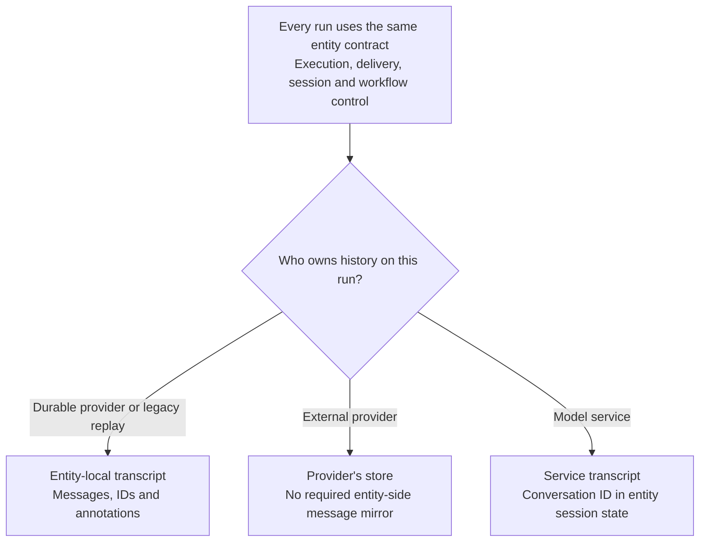
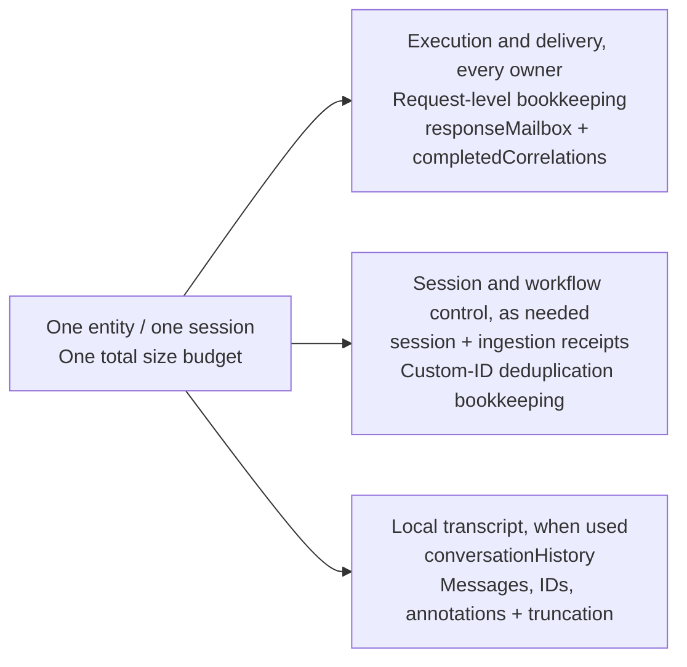
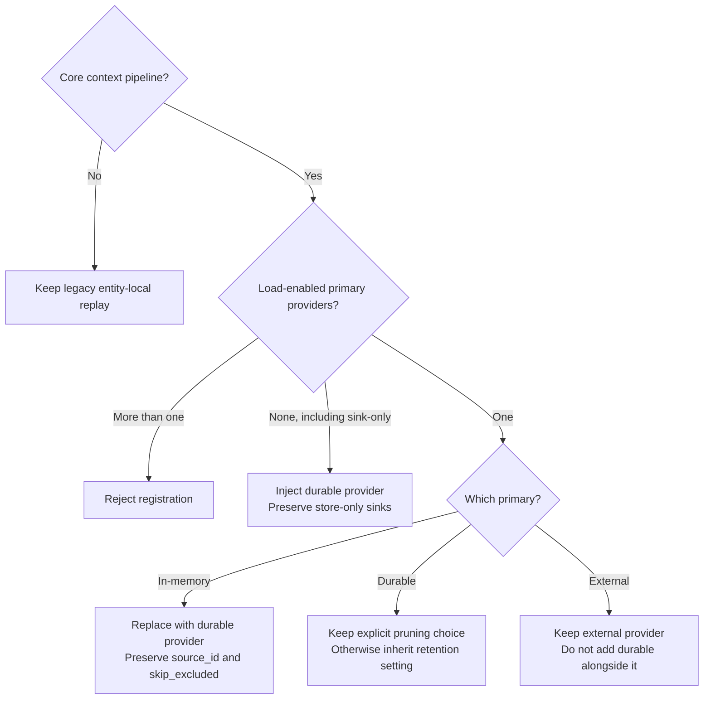
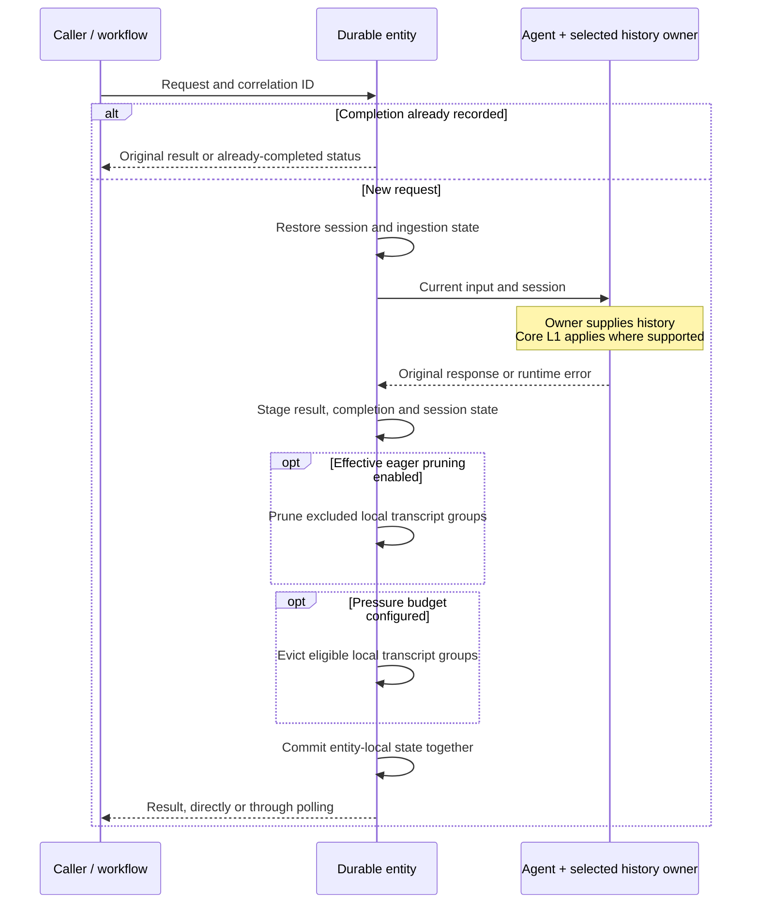
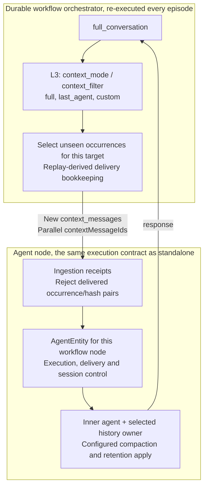
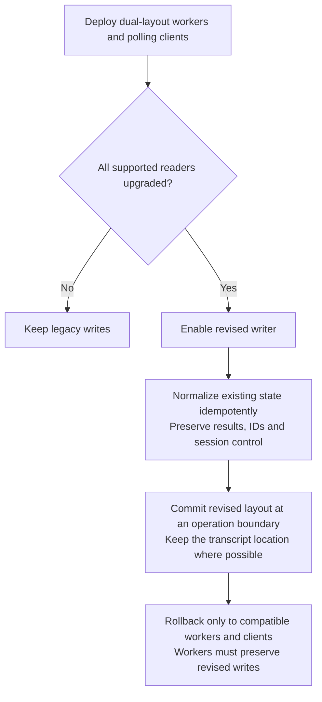

# Thread Compaction for Durable Agents and Workflows

> This local PR #59 implementation ADR adjusts the earlier proposal for isolated version-2
> deployment, explicit state migration, workflow occurrence transport and service-branch isolation.
> These are local implementation adjustments. The canonical sibling ADR is unchanged and the
> adjustments have not been pushed. References to `c4582a1` describe the historical prototype only.
> [Current Local Implementation Status](#current-local-implementation-status) separates recorded
> checks from remaining release and deployment gates.

## Decision Summary

Use core's history-provider abstraction for durable conversation storage, together with workflow
context projection and per-target delta transport (Options 6 and 4). Keep execution and result
delivery independent of transcript ownership.

- The entity owns request correlation, completion, original result delivery and duplicate-request
  suppression for every history configuration.
- The selected history owner supplies the transcript. Durable-owned history remains entity-local.
  External and service-owned history does not require an entity-side message mirror.
- Workflow delta transport uses occurrence/fingerprint pairs without rewriting public message IDs.
  Custom filters need not select positions monotonically.
- Core compaction controls model input. Eager transcript pruning and pressure eviction are separate
  opt-ins, defaulting to `retention="keep_all"` and `max_state_bytes=None`.
- All entity-local slices share one size budget and commit at one operation boundary. External
  writes and tool side effects are outside that transaction.
- Version-2 writers require an isolated hub/deployment and compatible workers and clients. Old
  workflow histories stay on the old engine. Legacy state is read-only unless explicitly migrated
  into an empty, separately addressed destination.
- Service-owned runs suppress both loading and storing through the inactive primary provider.
  This is an intentional branch-isolation restriction, not universal core hook parity.

The shared design remains proposed. The Python contract below describes the local implementation,
not .NET parity or release readiness. The earlier combined execution/transcript prototype is
recorded separately in [Prototype Evidence](#prototype-evidence).

**Sections**

- [Context and Terminology](#context-and-terminology)
- [Considered Options](#considered-options)
- [Ownership and State Model](#ownership-and-state-model)
- [Execution, Delivery and Session Lifecycle](#execution-delivery-and-session-lifecycle)
- [Retention Policy](#retention-policy)
- [Workflow Context](#workflow-context)
- [State Evolution and Compatibility](#state-evolution-and-compatibility)
- [Consequences](#consequences) and [Validation Requirements](#validation-requirements)
- [Dependencies and Follow-up Work](#dependencies-and-follow-up-work)
- [Current Local Implementation Status](#current-local-implementation-status)
- [Prototype Evidence](#prototype-evidence)

## Context and Terminology

Durable agents persist conversation state across worker restarts. Durable workflows also carry
conversation context between executors in checkpointed envelopes. These create three distinct
pressures.

| Pressure | Scope | Control |
| --- | --- | --- |
| Model context window | Input to one model call, in both core and durable execution | Core compaction |
| Token cost and latency | History sent on each call, in both runtimes | Core compaction and workflow projection |
| Persisted state capacity | Cumulative state and transport payloads in durable execution | Backend offload and explicit retention |

Reducing model input does not necessarily reduce storage. An exclusion-and-summary strategy can
retain the original messages and add summaries, increasing stored size. A token-window setting is
therefore not a storage-byte limit.

Durable Task Scheduler (DTS) has an unoffloaded message limit of 1 MB. The Azure Storage backend
compresses payloads above 45 KB into a `<taskhub>-largemessages` blob instead, but still incurs CPU,
I/O and memory costs. The design must work without offload and must distinguish a hard transport
limit from an operator-selected storage budget.

Core's [compaction design][adr0019] provides two relevant mechanisms:

1. **In-run filtering** projects the messages supplied to the model without deleting the originals.
   It can operate on context supplied by any supported history provider.
2. **Store reduction** rewrites stored history. In the implementations evaluated for this ADR,
   Python's `after_strategy` targets session-state history, while .NET exposes `IChatReducer` on
   `InMemoryChatHistoryProvider`, including the `strategy.AsChatReducer()` bridge. External stores
   do not share a general rewrite contract. See [Dependencies](#dependencies-and-follow-up-work).

The original durable entity bypassed the history-provider pipeline and rebuilt a session for each
operation. The design restores that pipeline and session state rather than introducing a separate
durable-only compaction API. It must preserve user configuration, message ordering and atomic
tool-call/result and reasoning groups, while keeping deletion explicit and observable.

| Term | Meaning in this ADR |
| --- | --- |
| History provider | Python `HistoryProvider` or .NET `ChatHistoryProvider` |
| Primary provider | A history provider with loading enabled. Additional providers may be store-only sinks. |
| Transcript | Messages and associated history/compaction metadata, distinct from execution receipts |
| `conversationHistory` | The entity's existing persisted transcript field, not a requirement for every history owner |
| Execution and delivery state | Request-level bookkeeping, original results and completion receipts |
| Service-storing client | A client whose default is service-side storage |
| Service-owned run | A run for which the model service supplies history, determined from effective options |
| `source_id` / `history_source_id` | The provider's identifier / the identifier a compaction provider uses to locate that history |
| Non-evictable floor | Serialized entity data that transcript retention cannot remove |

The labels L1, L2 and L3 identify different integration points, not three forms of storage eviction.

| Surface | Mechanism | Effect |
| --- | --- | --- |
| L1, agent context | Core `CompactionProvider` / `compaction_strategy` | Projects model input without deleting stored history |
| L2, eager pruning | `retention="follow_compaction"` | Opt-in deletion of excluded local transcript messages |
| L3, workflow context | `context_mode` / `context_filter` and delta transport | Selects and transports context between executors |
| Capacity safety | Optional `max_state_bytes` budget | Evicts eligible local transcript groups under pressure, independently of L2 |

The Python prototype demonstrates the L1/L2 integration. The evaluated .NET compaction-state
representation has an additional storage constraint described in dependency 4. The target contract
does not imply that both implementations already provide every capability.

## Considered Options

1. **In-run filtering alone, rejected.** It bounds model input but leaves cumulative durable state
  unbounded.
2. **Bespoke pre-write compaction in the entity, rejected.** It duplicates core strategies and
  grouping rather than integrating with the history-provider abstraction.
3. **Separate on-storage maintenance, deferred.** It may suit expensive summarization, but cannot
  prevent state from exceeding its limit during an active turn.
4. **Workflow projection and delta transport, selected.** Honor `AgentExecutor.context_mode` and
  `context_filter`, then avoid resending already-delivered messages to a target.
5. **Automatically derive a lossy store reducer, rejected as a default.** A model-input exclusion
  is not implicit permission to delete. Users can opt into `follow_compaction`, or independently
  set a pressure budget without configuring compaction.
6. **Durable storage as a core history provider, selected.** Reuse the core pipeline and session
  state while keeping execution/delivery independent of history ownership. Each store retains its
  own lifecycle policy.
7. **Large-payload offload, optional and backend-specific.** The DTS
  [large-payload extension][offload] raises the ceiling without deleting content, but requires an
  Azure Blob payload store and is not available through every host. Azure Storage already offloads
  internally. No portable guarantee in this ADR depends on offload being present.

## Ownership and State Model

### Transcript ownership

The entity owns execution and delivery in every configuration. That state includes original result
snapshots, not only metadata. The history owner independently supplies and retains the transcript.

| History owner | Transcript location | Transcript policy |
| --- | --- | --- |
| `DurableHistoryProvider` | Entity-local `conversationHistory` | Configured eager pruning and pressure eviction |
| External primary provider | Redis, Cosmos, file or its chosen store | The provider's own retention policy |
| Custom session-backed primary, including an in-memory subclass | Serialized provider session state | Provider policy, protected from durable transcript eviction |
| Model service | The service | Service retention, continued through its conversation ID |
| Agent without a context pipeline | Entity-local history through legacy replay | Optional pressure eviction |

External and service-owned turns do not require contentless copies of each request message.
Execution correlation does not require a message-level mirror, and entity-local message IDs do not
necessarily identify external-store records. Any message journal needs an explicit consumer and
lifecycle. Required [workflow deduplication state](#workflow-context) must nevertheless survive
transcript pruning. Selecting a different owner does not implicitly discard existing local history.

### Logical state slices

The state has three logical slices. This separation does not require new nested JSON objects or
relocating `conversationHistory`.

History providers own transcript read, append and reconciliation behavior. The entity runtime
physically commits all entity-local slices at the operation boundary. One owner must append each
transcript input and output, preserving provider storage choices without competing writers. This
does not guarantee a single external append across retries; see
[failure boundaries](#commit-and-failure-boundaries). The prototype's append ownership is described
in [Prototype Evidence](#prototype-evidence).

Each standalone session receives a distinct entity key. Workflow agent entities are scoped by
workflow instance and executor. Their full entity identity also supplies a stable external-provider
session key, so workflow nodes cannot accidentally share a conversation. Explicit migration retains
the original logical session ID for that external store, despite using a new destination entity.
Unmigrated old sessions occupy separate entities and do not consume a new session's capacity.

### Provider selection

Registration selects the history adapter without changing the execution contract or mutating the
caller's agent. Preserve `source_id` when replacing a provider so compaction configured through
`history_source_id` continues to resolve the same history. Core's default history source is
`"in_memory"`. Substitution preserves existing compaction triggers and does not enable compaction.

| Configuration | Registration behavior |
| --- | --- |
| No load-enabled primary, including sink-only configurations | Append durable history after existing providers using core's default `source_id`. Preserve store-only sinks. |
| Exact built-in `InMemoryHistoryProvider` | Replace it with durable history, preserving `source_id`, `skip_excluded`, storage flags and optional hook-cadence metadata. |
| Custom `InMemoryHistoryProvider` subclass | Keep the custom provider, hooks and session state. Its transcript is protected session data, not pressure-managed `conversationHistory`. |
| Hand-configured `DurableHistoryProvider` | Preserve explicit `prune_excluded`. If unset, inherit the registration retention policy. |
| External load-enabled primary | Keep it. Do not add durable history alongside it. |
| Service-storing client without an external primary | Keep durable history available for client-owned runs and silent on service-owned runs. |
| No core context pipeline | Preserve the legacy entity-local replay path. |

Reject more than one load-enabled primary and duplicate provider `source_id` values. A sink using
`"in_memory"` without a primary prevents default injection, rather than sharing its state namespace.
Additional store-only audit or evaluation sinks retain their configured storage and lifecycle.
If substitution is needed, shallow-copy the agent and its provider list. Automatic history is
appended so core's reverse-order after hooks save the turn before earlier compaction hooks inspect
it. Explicit provider order is unchanged. Preserve `after_run_once_per_turn` when available, without
requiring that optional hint on core 1.13. Substitution does not import an exact built-in provider's
pre-registration transcript. In the diagram, "In-memory" means only the exact built-in type.
Custom session-backed primaries follow the diagram's preserved-provider branch, with storage in
the protected session slice rather than an external service.

### Per-run ownership

Resolve `store` from run options, then agent defaults, then the client's `STORES_BY_DEFAULT`.
Durable resolves ownership per run rather than pinning an owner for the session. An attached
durable provider neither loads nor stores local history on a service-owned run and is available
on client-owned runs. These are ownership states, not retention modes.

Keeping the durable provider available prevents core from injecting an unmanaged in-memory history
slice into persisted session state on a `store=False` run. An external primary already occupies
that role, so it needs no additional durable provider.

**Intentional branch-isolation restriction.** On a service-owned run, an adapter suppresses the
external or custom primary's `before_run`, `after_run`, load and store calls, including per-service-call
persistence. Client-owned runs use the original provider and hooks. Core 1.16 can still persist to
a configured external primary during a service-owned run. Durable deliberately does not, to avoid
mixing the branches in `store=True -> False -> True`. This is not unchanged provider-hook semantics
or universal core parity. To record both branches, configure a distinct store-only audit sink with
its own `source_id`. Such sinks are not suppressed and retain their configured storage flags.

Changing `store` does not migrate service history, create placeholders for missing content, or
promote mailbox responses into the transcript. In a `store=True -> False -> True` sequence, exclude
the saved service conversation ID from the client-owned model invocation and history-provider hook
decisions, while retaining it in session control. The later service-owned run may resume that
service branch if still valid, without importing the intervening client-owned transcript. Neither
branch receives history synthesized from mailbox results. Explicit ownership migration or forking
belongs in the core lifecycle follow-up.

## Execution, Delivery and Session Lifecycle

The execution path is the same for every history owner. Workflow projection and delta selection
occur before the entity receives the request.

### Result delivery and completion receipts

Signal-based client and HTTP paths poll entity state by correlation ID. `responseMailbox` retains
an independent inline JSON snapshot of the original serializable success or runtime-error result,
including response metadata and structured `value`, until a configured delivery expiry. It excludes
opaque SDK representations and Python response-format classes. The existing polling API cannot
acknowledge receipt. An acknowledgement operation or offloaded result reference is a possible later
capability, not part of the current inline mailbox implementation.

At the logical delivery deadline, lookup returns `response_expired` with `already_completed`, even
if the payload still physically exists. New runs, duplicate runs and reset remove expired mailbox
payloads. Both hosts also expose the backend entity operation `expire_responses`, without model,
tool or provider execution. Idle entities have no timer. Physical cleanup while idle requires an
application-owned schedule or an explicit backend signal/manual operation. There is no generated
public HTTP or MCP cleanup endpoint, authenticated or otherwise.

Keep the `completedCorrelations` tombstone until the entity is deleted. A duplicate correlation
returns its retained result or an already-completed status, not another agent invocation. Transcript
compaction, reset and mailbox cleanup never remove completion receipts. Runtime-error results and
receipts are not model context. Version-2 lookup never reopens delivery from a transcript response.

An indefinitely active entity accumulates tombstones without a fixed bound. They can eventually fill
the non-evictable floor even after transcript pruning. This long-session limitation requires
[bounded completion bookkeeping](#7-bounded-completion-bookkeeping) as a durable follow-up, not
automatic receipt expiry under transcript retention.

Any future shared immutable payload storage must keep delivery readable throughout its window,
independently of evictable transcript entries. An orchestration records the `call_entity` result
for replay, independently of entity completion records and any assistant message retained as history.

### Session restoration

Create each operation's session through the agent's own `create_session()` and restore provider
state. Apply the [per-run ownership rules](#per-run-ownership) to the saved service conversation ID.
Carry the resulting session, pending tool approvals and any inactive service conversation ID
forward on committed successes and errors. The current Python serialization bridge uses
`AgentSession.to_dict()` with JSON-compatibility validation. The state bag may contain more than
metadata, and its full serialized size counts toward the entity budget.

Exclude only the durable provider's transient `messages` buffer and `_positions` index from its
session slice. Preserve other JSON-compatible custom durable-provider state. Rebuild the buffer
from persisted messages, IDs and annotations each turn and reconcile compaction by message ID
before serialization. A custom in-memory subclass is not substituted, so its full session transcript
remains in the protected floor. Core's process-local type registry requires registering already
loaded serializable types during restore. Broad Pydantic subclass discovery is not used because of
identifier-collision risk.

Final-response callbacks receive a deep copy that retains Pydantic fields and structured values,
not a lossy JSON reconstruction. Detaching an opaque SDK `raw_representation` is best effort. If
that field cannot be deep-copied, omit it from the callback copy. This is not a promise to clone
every SDK object.

Provider-owned versioned snapshots are the intended replacement for broad session serialization.
See [provider lifecycle dependencies](#dependencies-and-follow-up-work) for the missing contract.

### Commit and failure boundaries

Execution, session, ingestion and local transcript changes commit together once per entity
operation. A completion receipt proves a committed outcome, not completion of every intermediate
model or tool call. A worker failure before commit leaves the previous local state intact, and a
retry may repeat those calls and side effects. The design does not checkpoint between tool calls.

External providers and the model service have independent commits. Their writes may succeed before
the entity commits. Local slice consistency therefore does not provide a distributed transaction or
exactly-once execution of uncommitted effects.

An external append followed by a worker failure before local commit leaves no completion receipt
for that attempt. Retrying can append the same logical write again, even with only one append path.
Existing core history providers remain supported without a new idempotency requirement. Stronger
external-write guarantees are an optional
[durable integration capability](#8-retry-safe-external-history-writes).

If capacity prevents the entity commit, even a durable error result may not fit. Report failure
through the operation error channel where available and through diagnostics. A state-polling signal
caller may time out instead. Do not persist a successful completion receipt for an uncommitted turn.

### Service conversation errors

For the structured `previous_response_not_found` error on a service-owned run, reuse the invocation
arguments for up to three additional attempts, waiting 0.5, 1.0 and 1.5 seconds. Retry only while no
stream update or function execution has started and the service session ID has not advanced. Check
these conditions again after every refusal. A different error, observed progress or exhausted
attempts produces an error result without restarting the conversation.

These retries can recover transient visibility failures without retaining a duplicate transcript. A
genuinely expired conversation ID cannot be recovered this way. Full-transcript recovery is not part
of the design because it requires storing a second conversation continuously. The observations and
storage trade-off are recorded in [Prototype Evidence](#prototype-evidence).

The guards do not prove arbitrary provider hooks or external side effects safe to repeat. Do not
promise identical hook effects. Unsupported streaming is negotiated through a matching `TypeError`
before stream consumption, not a generic non-streaming retry after model/runtime failure.

## Retention Policy

Two independent registration controls govern transcript deletion. Application defaults may be
overridden per agent. They do not change the agent's compaction configuration or an external
provider's storage policy.

| Control | Value | Behavior |
| --- | --- | --- |
| `retention` | `keep_all` **(default)** | Do not delete merely because compaction excluded a message. |
| `retention` | `follow_compaction` | Prune excluded local messages after each turn. Without compaction there are no exclusions to prune. |
| `max_state_bytes` | `None` **(default)** | Disable pressure eviction. The backend can still reject an oversized write. |
| `max_state_bytes` | `"backend_limit"` | Resolve 1,048,576 bytes with `DurableTaskSchedulerWorker`. Reject an unresolved limit on generic workers or Functions. |
| `max_state_bytes` | positive integer | Use that explicit serialized-state budget. |

Neither control enables the other. An explicitly pinned provider `prune_excluded` value takes
precedence over the registration retention mode. The matrix below assumes no such provider override.

| | No pressure budget | Pressure budget set |
| --- | --- | --- |
| `keep_all` | Never delete transcript messages. | Do not prune because of exclusions, but evict eligible oldest groups under pressure. |
| `follow_compaction` | Delete only what the user's compaction strategy excluded. | Delete exclusions eagerly, then evict oldest groups if the remainder still crosses the high watermark. |

### Defaults and scope

Deletion is opt-in because a model-input exclusion should not silently become irreversible storage
loss. The core configuration examined for this ADR likewise leaves in-memory history unbounded,
defaults `RedisHistoryProvider.max_messages` and `compaction_strategy` to `None`, and requires an
explicit `max_context_window_tokens` for context-window compaction. That token setting governs L1,
not entity storage.

Without pressure eviction, an oversized write can fail while the last committed state remains
available. Recovery requires an applicable configuration change, such as enabling pruning or using
supported offload. Raising an application budget alone does not raise a backend's hard limit.
Neither offload nor an external history provider removes the cost of entity delivery/control state.

### Whole-entity pressure budget

Measure the serialized entity JSON, including transcript, mailbox, completion receipts, session,
ingestion metadata and temporary compatibility copies. This excludes transport framing added
outside the state payload. Logical slices do not receive separate allowances or make duplicate
payload bytes free.

When a pressure budget is set, evaluate it before the operation's state commit, after any enabled
eager pruning. Configurable `high_watermark=0.85` and `low_watermark=0.70` must satisfy
`0 < low_watermark < high_watermark <= 1`. Below high, do nothing. At pressure, target low using
core's deterministic oldest-group fallback via `TokenBudgetComposedStrategy(strategies=[])`.

Plan with detached messages whose exclusion flags are cleared, leaving stored annotations intact.
All otherwise eligible old groups compete by age, including groups excluded from model context.
Preserve atomic tool-call/result and reasoning groups. Hold system messages out of the candidate
set, since core's stricter fallback can otherwise evict them. Protect the newest exchange, live
mailbox obligations, completion receipts, session state and ingestion/custom-ID control state.

Calculate that non-evictable floor before deleting anything. If it alone exceeds the configured
limit, fail without deleting transcript history. If the low watermark is unreachable, raise the
target only enough to get below high where possible. If no target below high is reachable, report
the capacity condition without a futile eviction pass.

The strategy accepts tokens, but its budget conversion must use persisted evictable-message bytes
and their token count after subtracting the floor. Do not derive it from `message.text`, which can
be empty for large tool payloads. Remeasure actual serialized state rather than treating the token
estimate as the storage limit. No model call is needed for pressure eviction.

### Observable deletion

Persist `truncation` with `evictedMessageCount`, `firstEvictedAt` and `lastEvictedAt`. Use bounded
aggregate evidence, not a growing list of removed messages. Absence means no recorded transcript
eviction. This record describes lost model context, while `completedCorrelations` describes
completed execution. Neither substitutes for the other.

## Workflow Context

Workflow agent nodes use the same `DurableAIAgent` to `AgentEntity` to inner-agent path as
standalone durable agents. They inherit execution, session, compaction and retention contracts. Only
inter-executor projection and transport are workflow-specific. Each node's transcript stays with its
selected history owner.

### Projection and delta transport

Honor `AgentExecutor.context_mode`: `full` (the default), `last_agent`, or `custom` with a
`context_filter` of type `Callable[[list[Message]], list[Message]]`. Project the upstream
`AgentExecutorResponse.full_conversation` first, then send unseen occurrence/fingerprint pairs as
`RunRequest.context_messages`, with parallel `context_message_ids` (`contextMessageIds` on the wire).
Preserve selected order and application `Message.message_id` values. Transport IDs do not rewrite
public message IDs or become application metadata. These are invocation inputs, not a mandatory
entity-local transcript mirror.

Projection controls which context may reach a target. Delta transport avoids repeatedly sending the
same selected messages without changing that semantic choice. Entity-side deduplication occurs too
late to reduce the serialized call payload. The prototype's complete-projection measurements are in
[Prototype Evidence](#prototype-evidence).

New transport uses `wf:occurrence:` hashes of deterministic structural addresses scoped to the
workflow instance. Complete-message fingerprints distinguish revisions of the same occurrence.
The replay-local ledger tracks sent pairs independently for each target, including fan-out and
fan-in. It is rebuilt through replay, not retained on shared executors or independently committed.
Private forwarding provenance travels on dispatch copies through internal checkpoints only. It is
not a public message ID or an `additional_properties` convention. Legacy `wf_{executor}_{position}`
IDs remain relevant to migration evidence, not the new transport identity contract.

Custom filters need not be position-monotonic. Exact occurrence receipts preserve gaps, so after
selecting positions `[1, 3]`, a later `[2, 4]` can still deliver both new occurrences. Changed
content can produce a new fingerprint. Synthesized or ambiguous detached selections receive new
handoff-scoped occurrences rather than guessing global identity from equal text or reused IDs.
An empty or wholly repeated projection stays empty, never falling back to an unfiltered last item.

The outgoing `full_conversation` preserves the complete selected logical conversation plus **all**
messages from the actual `AgentResponse`, not just the transmitted delta or the last response text.
`last_agent` selects all latest response messages. Typed `AgentExecutorRequest` input is normalized,
and `should_respond=False` caches input in replay-local state without an entity/model dispatch until
a responding request arrives. Agent `user_input_requests`, including tool approval, pause forwarding
and resume the same agent entity after the required replies arrive. Output-designated agents emit
their actual response as workflow output, rather than requiring an activity to forward its text.

Entity `ingestedMessages` receipts survive transcript eviction and commit with the turn. Direct
context callers without parallel occurrence IDs use message IDs plus fingerprints. Anonymous direct
inputs are not content-deduplicated. Legacy custom-ID markers are preserved explicitly by migration.
These receipts can grow and count in the non-evictable floor. Capacity failure is preferable to
forgetting delivery evidence. This transport contract does not promise identical repeated-message
counts to in-process cycles, globally meaningful external-store IDs or arbitrary filter side effects.

### Replay constraints and projection placement

While executed inside orchestration replay, a `context_filter` must be synchronous, deterministic,
side-effect-free and independent of time, randomness or external state. It can run more than once
for a logical handoff. `full` and `last_agent` are deterministic list projections. A custom filter's
side effects can repeat, its I/O can fail a later replay, and its latency is paid on each episode.
These execution-location constraints do not require position-monotonic selection.

The evaluated Durable Task SDK compares action identity and kind, not action-input equality. A
different recomputed input can be discarded in favor of the recorded result without a
`NonDeterminismError`. This is not permission to use impure filters or a guarantee that arbitrary
user code is safe during replay.

Projection remains in the orchestrator so only its result crosses the handoff. Target-side
projection would carry the full conversation on the wire. An activity could isolate arbitrary user
code from orchestration replay at the cost of a scheduling round trip per handoff. That alternative
and public accessors replacing `_context_mode` / `_context_filter` reads are tracked in
[#79][issue79].

## State Evolution and Compatibility

### Isolated version-2 contract

**Local adjustment.** The earlier two-phase, in-place rollout is not implemented. Both hosts require
`deployment_mode="isolated_v2"`, or `DURABLE_AGENTS_DEPLOYMENT_MODE=isolated_v2` when the argument is
`None`. The standalone `DurableAIAgentWorker`, `AgentFunctionApp` and Functions `create_agent_entity`
factory reject missing or other values. This is operator acknowledgement, not a worker/client
handshake, security boundary or proof of isolation. The operator must use a separate hub/deployment,
keep old workers and histories on the old engine, and upgrade every client accessing version-2 state.

Entity, activity and orchestration naming is unchanged. Reusing an old `@name@key` against an empty
new hub creates or addresses a different empty entity. It does not move state, provider ownership or
workflow history and is not migration. Rollback on the new hub is limited to workers and clients
that preserve its version-2 write, lookup and workflow protocol. The current .NET converter rejects
major version 2, so mixed-runtime access remains blocked.

| Persisted layout | Reading | Entity `run`, `reset`, `expire_responses` |
| --- | --- | --- |
| Legacy `1.x.y` | Legacy response lookup and supported data round-trip | Read-only, no automatic conversion |
| Exactly `2.0.0` | Mailbox/completion lookup, never transcript fallback | Writable |
| Other supported `2.x.y`, including future minor versions | Read/round-trip with unknown JSON data preserved | Rejected for writing |

Read tolerance is not semantic write compatibility. Malformed or unsupported versions are rejected,
not treated as fresh state. Unknown entry kinds stay out of model context.

### Workflow starts are not history migration

`DurableWorkflowClient`, generated Functions start routes and internal child dispatch wrap newly
scheduled input with workflow engine version 2. Host orchestrators reject raw/legacy recorded starts
before revised actions execute. Native custom schedulers must use the public `wrap_workflow_input`
helper for **new** starts. The helper marks a protocol, not authorization or input sanitization.
Rewrapping a recorded start does not migrate its action history. Existing workflows, including
paused legacy HITL instances, must finish on their old engine.

### Explicit entity migration

Both hosts expose `AgentEntity.migrate` as a privileged backend entity operation, not a generated
HTTP or MCP route. Operators must quiesce the legacy owner and authorize the export, journal and
ownership transfer. The destination must be empty and separately addressed on the isolated new hub.
The runtime validates request consistency but cannot fence the old deployment or prove ownership.

| Request key | Meaning |
| --- | --- |
| `source` | Unmodified strict-JSON legacy state export |
| `sourceDigest` | `state_snapshot_digest(source)`, SHA-256 of canonical full source JSON |
| `sourceSessionId` | Original logical session identity, including its namespace |
| `destinationSessionId` | This destination entity's full identity, different from the source |
| `migrationId` | Nonblank migration identifier |
| `ownershipTransferId` | Nonblank operator-authorized transfer identifier, not proof of authorization |
| `deliveryEvidence` | Optional accepted-message journal, required for nonempty scalar `ingestedPositions` |

`deliveryEvidence` contains exactly `sourceDigest`, `evidenceId`, `complete=True` and `messages`.
The operator asserts that it is the complete authoritative accepted-message journal from the
quiesced source, including evicted inputs and every accepted revision. Complete canonical messages
must round-trip losslessly. Digests bind the journal to the export, and producer/max-position checks
establish consistency only. Sparse positions are valid. No delivered prefix, journal authority or
completeness is inferred. If the evicted-message journal is unavailable, keep the old session on the
old engine rather than guessing receipts from surviving transcript entries.

The public pure `migrate_legacy_state` helper stages detached state without backend, model, tool or
provider calls. The entity operation adds destination/request metadata, validates the entire budget
without pruning and commits once. Its whole-request digest makes an exact retry return the recorded
migration without rewriting or refreshing grace, including after cold reload and a subsequent run.
Changed requests cannot overwrite a nonempty destination. The helper alone does not provide this
backend idempotency or authorization.

Only recorded outcomes backfill completion evidence. Surviving legacy responses receive a bounded
delivery grace window, but may already be partial and are not guaranteed original full responses.
Existing delivery records are not reopened. Removed outcomes cannot be reconstructed. Revised
immutable-result guarantees apply to new writes. Migration preserves the original external-provider
logical session ID and does not copy the provider's transcript. It does not migrate workflow history.

### Superseded rollout diagram

The original six diagrams are retained for comparison. **This earlier rollout diagram is not an
available deployment procedure.** Its lazy normalization and mixed-reader transition were replaced
by isolation plus explicit destination migration above.

## Consequences

- Agents reuse core compaction configuration. Execution/delivery semantics remain consistent across
  durable, external and service-owned history, without a required external message mirror.
- Eager pruning and pressure eviction can be enabled separately. Both remain non-deleting by
  default, so an unconfigured session can still reach its backend limit.
- Pruning cannot change an original result or erase completion evidence. Those protected records
  accumulate throughout an active entity's lifetime and can prevent further writes even when
  transcript retention is enabled. Bounded completion bookkeeping remains a durable follow-up.
- Custom selection can require growing sets of ingestion receipts. That control-state cost belongs
  to Durable rather than a new monotonicity requirement on core filters.
- Pressure eviction changes available future history, not the current model projection. It operates
  near the configured budget rather than deleting continuously.
- Local slices commit together, but external writes and uncommitted tool effects can repeat after
  failure. Optional retry-safe history adapters do not make the entity and store transactional or
  guarantee exactly-once model/tool effects.
- The state transition requires an isolated deployment and compatible workers and polling clients,
  even though names are unchanged. Old workflow histories cannot resume on this new engine.
- Service-branch isolation deliberately suppresses the inactive primary's storage hooks. It is a
  semantic restriction, not unchanged behavior for every core history provider.
- The Python integration uses a session-buffer bridge until core exposes provider lifecycle APIs.
  The evaluated .NET compaction-state format requires additional work for eager-pruning parity.

## Validation Requirements

The following are acceptance requirements for the proposed implementation, not claims about the
existing prototype's coverage.

1. **Provider-independent execution.** Test success, errors, polling, repeated correlations and
   cold reloads with durable, external, service-owned and legacy agents. Verify one transcript
   append path, provider storage choices, stable IDs, annotation round-trips and summary ordering.
2. **Delivery lifetime.** Original inline mailbox responses must survive transcript
   annotation, summary insertion, pruning and clearing. Test delivery expiry, completion receipts,
  and a duplicate request after its transcript response was removed. Distinguish logical expiry
  from physical cleanup on new/duplicate runs, reset and both hosts' backend maintenance operation.
3. **Retention matrix.** Exercise all four combinations of eager pruning and pressure budget,
   explicit provider overrides, `"backend_limit"`, custom watermarks and unresolved host limits.
   Test system messages, newest exchanges, atomic tool/reasoning groups, metadata-only floors,
   growing completion/ingestion receipts, oversized results, unreachable targets and truncation
   evidence.
4. **Session continuity.** Restore provider types, pending approvals and service conversation IDs
   on committed success/error paths. Cold-reload through `store=True -> False -> True` with a
   valid saved service ID. The client-owned run must ignore that ID in model calls and history
    hooks; the later service-owned invocation must receive the preserved ID. Suppress both loading
    and storage through the inactive primary, including per-call hooks, while a distinct store-only
    sink can record both branches. Neither transcript may be synthesized from mailbox results or
    merged with the other. Also cover transitions without a service ID and current-input preservation.
    Exercise bounded matching-error retries, but prohibit restart after stream/tool progress or
    service-session advancement. Verify callback copies retain typed fields without assuming opaque
    SDK objects can always be detached.
5. **Workflow inputs.** Test cycles, fan-out, fan-in, replay, delivery receipts and eviction.
   A custom projection `[1, 3]` followed by `[2, 4]` must deliver both `2` and `4` on the second
   visit at the sender and receiver, including after cold reload and transcript eviction. Assert
   previously delivered positions are not re-ingested, each target/producer advances independently,
   and the selected order is preserved. Distinguish repeated context under a new correlation from
   repeated request delivery. Include custom, missing and fully repeated message IDs, plus
    deterministic non-monotonic projection, changed-content fingerprints and occurrence collisions.
    Assert public IDs remain unchanged, forwarding provenance stays private, and the outgoing logical
    conversation contains the full selection plus all response messages. Include typed/cache-only
    requests, agent tool approval/HITL and output-designated agents.
6. **Registration.** Verify no-primary and sink-only injection, in-memory replacement, preserved
   `source_id`/`skip_excluded`, explicit `prune_excluded` precedence, external-provider preservation
   and rejection of multiple load-enabled primaries or duplicate state namespaces. Replace only the
   exact built-in in-memory type. Preserve subclass hooks/session transcripts and custom durable
   JSON state, automatic append order and optional cadence hints on each supported core version.
7. **State transition.** Test required deployment acknowledgement at each host/factory boundary,
   legacy read-only operations, exactly-`2.0.0` writes and future-minor read-only round-trips. Reject
   old workflow starts before actions, including child paths. Test migration into an empty separate
   destination, whole-request idempotency after cold reload/new runs, original logical session ID,
   partial legacy outcomes, grace and unknown fields. Reject missing/inconsistent scalar-delivery
   journals without inferring a prefix. Python/.NET compatibility remains a separate unmet gate.
8. **Failure boundaries.** Inject failures around local commit and external writes. Uncommitted
   effects must not become protected completed operations. Verify the polling timeout/error
   behavior when capacity prevents even an error-response commit. Include an ordinary append-only
   provider whose write succeeds before a worker failure and can repeat on retry; do not claim
   duplicate-free external storage for it. Retry-safe adapters, when added, require separate
   failure-injection tests for their declared guarantees.

Live scheduler-limit tests, offload validation and cross-language compaction parity remain required
as those capabilities are implemented. Any future LLM-based reducer also needs stable summary
identities and retry/idempotency tests. Reduced-budget prototype tests do not substitute for these.

## Dependencies and Follow-up Work

The constraints below describe the implementations evaluated during prototype development, not an
assertion that later package versions retain every limitation. Revalidate each dependency against
the versions selected for its implementation PR. New follow-up issues will be filed after ADR
approval.

Bounded completion bookkeeping and retry-safe external writes are durable-owned follow-ups. They
do not add mandatory capabilities to core history providers.

### 1. Provider-owned store reduction

The evaluated Python `CompactionProvider.after_strategy` mutates
`session.state[history_source_id]["messages"]`, unlike `before_strategy`, which acts on invocation
context. An external provider can therefore supply input for L1 without exposing its store to L2.
.NET similarly attaches `IChatReducer` to `InMemoryChatHistoryProvider` rather than all stores.

The Python durable provider publishes a transient session-state working buffer and reconciles
messages by ID during its hooks and the entity's final flush. This dependency must be isolated and
tested. It does not give Redis, Cosmos, file or other providers a general rewrite capability. Core
should expose store-rewrite capabilities and diagnose a configured hook that cannot reach its store.

### 2. Append, lifecycle and snapshot capabilities

`save_messages()` receives new messages rather than a replacement transcript. In the evaluated Redis
provider, `rpush` appends content and `max_messages`/`ltrim` bounds it independently. A Cosmos
container can use TTL. Neither mechanism is a core compaction rewrite contract.

The upstream provider contract needs:

- Discoverable store reduction and `replace_messages()` / `flush()` with an expected version.
- `clear()` / `delete_session()` owned by the provider's lifecycle policy.
- Versioned `snapshot_state()` / `restore_state()` with provider-defined payloads and migration.
- Core's resolved service-versus-client ownership decision, avoiding drift from durable's duplicate
  option-precedence logic.
- Equivalent .NET capabilities, including the message metadata described in dependency 3.

Dependencies 1 and 2 gate general provider-owned compaction/lifecycle parity. They do not gate the
initial Python durable bridge, logical state separation or use of an external provider's existing
API. Versioned `{provider, version, payload}` snapshots must wait for a real provider version and
migration policy. Until then, retain the documented session serialization bridge. General history-owner
migration/forking remains a core follow-up, distinct from the implemented legacy entity import.

### 3. Message metadata across runtimes

Message identity and annotations must round-trip through durable state. The Python prototype
includes the `messageId` and `extensionData` mappings and schema conformance coverage. Unknown-field
tolerance alone did not ensure those fields were preserved by conversion code.

The evaluated .NET `FromChatMessage` / `ToChatMessage` path loses `MessageId` and
`AdditionalProperties`. `[JsonExtensionData]` preserves otherwise unmapped JSON but does not supply
those mappings. The pinned `ChatMessage` exposes `MessageId`. .NET exclusions live on
`CompactionMessageGroup.IsExcluded`, while `_is_summary` is message metadata, so mapping these
fields is necessary but not sufficient for full compaction parity.

### 4. .NET compaction-state representation

The evaluated `CompactionProvider.State` stores `List<CompactionMessageGroup>` with complete
`ChatMessage` copies in `AgentSession.StateBag`. Persisting it alongside a durable transcript
duplicates messages. Omitting it loses exclusions and incremental summarization state. Returning
only included messages can cause `CompactionMessageIndex.Update()` to rebuild that state.

Lightweight compaction metadata keyed by `MessageId` is the desired upstream representation. Until
that gap is resolved, pressure retention can operate independently, but Python's eager-pruning
integration does not establish .NET parity.

### 5. Provider callback cadence

With `require_per_service_call_history_persistence=True`, history providers run per model call
while compaction remains once per run. Annotations made after the final history flush can therefore
be persisted later than intended. The evaluated implementation enables this on `HarnessAgent`.
Preserve the configured cadence and test the final flush ordering.

### 6. Host payload-store access

The Functions Python dependency evaluated here is `>=1.3.1,<2`, without SDK payload-store access.
The inspected `2.0.0b1`/`2.0.0b2` previews require Python 3.13+ and `durabletask>=1.9.0`, but
their `DurableFunctionsWorker` and `DurableFunctionsClient` do not expose the base `payload_store`
parameter. The direct durabletask path does. Exposing that parameter remains a host dependency.

Backend metadata for `max_state_bytes="backend_limit"` is also needed where the host cannot identify
a hard limit. Do not silently infer an unlimited or offloaded budget in that case. An explicit byte
budget remains the portable option.

### 7. Bounded completion bookkeeping

Evaluate acknowledgement plus a defined redelivery window, compact sequence watermarks where the
request protocol permits them, or offloaded completion receipts. Any bound must define what happens
to a duplicate request after its receipt expires without silently allowing completed work to run
again. Idle-session TTL does not bound an entity kept active by new requests. This work does not
block the initial implementation; until a replacement protocol is defined, tombstones remain until
entity deletion and their growth remains an explicit capacity limitation.

### 8. Retry-safe external history writes

Provide stronger append guarantees through optional durable-owned adapters or integration
capabilities using the existing core history-provider API. Do not require every provider to change
its implementation, and do not silently replace a user's selected external provider.

A retry-safe integration needs a stable write identity scoped to provider, session, logical request
and append step, established before the write and reused on retries. The backing store must
atomically apply the append and its duplicate-detection record, or support an expected-version
protocol that distinguishes a prior successful write from a conflicting one. Define behavior for
the same identity with different content, partial batches and receipt expiry before claiming
duplicate-free writes. Preserve provider callback cadence, including multiple appends within a run.

An entity-only receipt, activity or outbox does not alone close the external-write/acknowledgement
gap. The stronger guarantee requires backing-store cooperation, but not a universal core API change
or an entity-side transcript mirror. It protects history appends, not repeated model calls or tool
effects. Existing providers remain supported with the documented possible-duplicate behavior; this
capability does not block their initial integration.

### Release gates and excluded scope

- Isolation and state/response-consumer compatibility must precede revised writes, following
  [State Evolution and Compatibility](#state-evolution-and-compatibility).
- Moving arbitrary custom projection into an activity and exposing public context accessors are
  tracked in [#79][issue79]. The purity contract remains in force meanwhile.
- Idle entity TTL is separate from mailbox expiry and from bounding an active session. Mailbox
  maintenance exists, but idle physical cleanup needs an application-owned schedule. Cross-language
  entity cleanup parity remains tracked in [#10][issue10].
- Broad provider snapshot/restore capabilities and general history-owner migration are follow-ups,
  not additional requirements on every external provider for this first implementation.

## Current Local Implementation Status

Source-reviewed on 2026-09-09. The contract above incorporates local adjustments, not an approved
or pushed revision of the canonical sibling ADR. Validation below distinguishes tested behavior
from deployment prerequisites and checks blocked by dependency downloads.

### Implemented contract, not validation results

| Area | Local implementation |
| --- | --- |
| Deployment and writes | Required `isolated_v2` acknowledgement, separate hub/deployment, compatible clients, exactly `2.0.0` writes. Legacy and future-minor reads do not authorize writes. Names are unchanged. |
| Migration | Explicit backend `migrate` plus pure `migrate_legacy_state`, empty separate destination, operator-supplied journal where required, whole-request retry digest and retained original logical session ID. No workflow-history migration. |
| Delivery | Independent inline response snapshots, including serializable metadata and structured `value`. Default window is 60 seconds. Logical expiry precedes opportunistic or scheduled physical cleanup. Completion receipts survive reset and cleanup. |
| History and retention | Provider-owned append, exact built-in substitution, preserved custom hooks/state, final durable flush, independent `keep_all`/budget defaults. Custom session transcripts remain protected, not pressure-managed. |
| Workflow | Parallel occurrence IDs and fingerprints, private checkpoint provenance, full selected logical conversation plus all response messages, typed/cache-only requests, agent HITL and designated outputs. New starts and children use protocol version 2. Generated agent outputs/events use portable response JSON; typed values remain available to worker-side conditions and activities. |
| Service and failures | Inactive primary load and store hooks suppressed, distinct store-only sinks preserved. Missing-parent retries stop after observed progress. Callback copies preserve typed fields with best-effort opaque SDK detachment. |
| Reset | Local reset clears session/transcript while retaining live delivery, completion and ingestion evidence. A non-durable custom/external primary rejects reset pending provider-owned lifecycle support. |

`"backend_limit"` resolves to 1,048,576 bytes only with `DurableTaskSchedulerWorker`. Generic workers
and Functions reject an unresolved limit. Explicit positive budgets remain portable. `INHERIT`
inherits a host budget and explicit `None` disables it. Neither transcript retention nor response
cleanup bounds completion-receipt growth. There is no distributed transaction or exactly-once
guarantee for external history writes or uncommitted model/tool effects.

### Recorded validation and remaining gates

Both packages declare `agent-framework-core>=1.13.0,<2`. Durable Task requires `pydantic>=2.11,<3`,
also inherited by the Functions package. All unit results below are post-cleanup and include the
final portable-output and terminal-history fixes. Six obsolete private-helper tests were removed
with the unused lossy text helper, leaving the production-path regression coverage intact.

| Check | Status |
| --- | --- |
| Python 3.13 / core 1.16 | 3,259 passed, zero skipped, 94.83 seconds with coverage |
| Python 3.13 / core 1.13 | 3,259 passed, zero skipped, 53.18 seconds |
| Python 3.10 / core 1.16 | 3,259 passed, zero skipped, 52.51 seconds |
| Coverage | 96% overall; entity 97%, history provider 99%, retention 99%, shared orchestrator 98% |
| Lint, formatting, MyPy and both source Pyright checks | Passed after cleanup. MyPy checked 64 direct-host and 34 Functions test files |
| Live direct DTS | 42 passed, zero skipped, 317.16 seconds, after the final runtime fixes |
| Live Azure Functions | 43 passed, zero skipped, 571.72 seconds, after the final runtime fixes |
| Package builds | Both wheels and source distributions built successfully |
| Pydantic 2.11 minimum runtime | Blocked by artifact TLS download failures. Runs above used Pydantic 2.13.4; the API floor is declared, not runtime-validated |
| Dependency lock verification | Passed offline after synchronizing the declared Pydantic and schema-test dependency metadata |
| Regression discrimination | Replacing generated-output serialization with the old pickle path in memory caused 25 failures; a fresh process with the implementation passed all 43 output-boundary tests |
| Python/.NET compatibility, live scheduler limit and offload | Not established. The current .NET reader rejects version 2 |

These results do not establish deployment isolation or a fully green release matrix. Bounded
completion bookkeeping, optional retry-safe external-history
adapters and general provider lifecycle remain follow-ups, without mandatory core API changes.
Independent source review verified the final output-designation, portable-response, HTTP-value and
terminal-history repairs. The local tests do not prove mixed-version deployment safety. The two
integration containers started for validation were stopped afterward; existing Azurite was left alone.

## Prototype Evidence

The implementation reference is [Python prototype PR #59][prototype], at `c4582a1`. The observations
below were recorded during its development. They illustrate design trade-offs, not guaranteed size
ratios, performance targets or validation of the revised execution/delivery layout.

### Implementation status and compatibility trade-off

The prototype retains the combined `conversationHistory` representation. `AgentEntity` appends
requests and responses, and `DurableHistoryProvider.save_messages()` is a no-op. External and
service-owned request content is cleared after invocation, leaving metadata-only message records.
Its replay converters already skip records with no replayable content.

Retaining that layout avoided relocating transcripts in the prototype. It did not establish safe
resumption on the changed version-2 engine, which now requires isolation and explicit entity import.
Empty per-message records are not a universal execution requirement, although the prototype's
custom-ID deduplication fallback consumed some retained IDs.

The prototype demonstrates provider substitution, ID/annotation round-trips, synthetic summary
insertion, reconciliation, session persistence, workflow projection and target-side deduplication.
Its retention tests cover the original `keep_all`, `auto` and `follow_compaction` modes, not the
independent controls specified here. Twenty-turn tests use a reduced budget with `keep_all` as the
control. Scheduler integration covers persisted metadata, external-provider session identity,
schema conformance, downstream workflow context and a Redis-owned conversation. This does not
validate the proposed mailbox/receipt layout, exact delivery tracking, source-side delta transport
or `store=True -> False -> True` service-branch isolation. The target's `ingestedPositions` remains
a per-producer maximum, and the Redis sample appends without a retry receipt.

### Recorded observations

| Scenario | Observation | Design implication |
| --- | --- | --- |
| Six-turn durable conversation with exclusions and appended summaries | 3,422 bytes without compaction, 10,177 with retained originals/summaries, 2,296 with `follow_compaction` | Model-input compaction alone can increase stored state |
| Same strategy with in-memory history | 809 to 1,087 bytes | The growth is not specific to durability, but a backend limit changes its consequence |
| Service-storing client with per-run `store=False` and no durable provider | Persisted session slice grew about 321 bytes per turn | Provider injection must follow possible run options, not only client defaults |
| Store-side strategy with in-memory versus file history | 11 exclusions and 4 summaries with in-memory history, none with the evaluated `FileHistoryProvider` | Session-buffer mutation does not rewrite an arbitrary external store |
| Serialization of a 1 MB prototype state | Approximately 8 ms in the development measurement | Measure overhead during implementation validation, not as a latency guarantee |

The state-size observations used the prototype's combined layout. Mailbox payloads, receipts and
transition data will change that accounting. The recorded timings do not specify a portable hardware
baseline, and are not release acceptance thresholds.

### Complete workflow projection sizes

These are serialized bytes for complete projections before target-side deduplication, not measured
delta-transport results.

| Turns | `full` | `last_agent` | `custom`, last 4 messages |
| ---: | ---: | ---: | ---: |
| 10 | 8,370 | 837 | 1,674 |
| 50 | 42,010 | 841 | 1,682 |
| 200 | 168,560 | 845 | 1,690 |
| 800 | 675,560 | 845 | 1,690 |

At 800 turns the complete `full` projection was 64.4% of the 1 MB limit and `last_agent` about 0.1%.
Reducing context can help when workflow semantics allow it, but is not a general replacement for
avoiding repeated prefixes. The delta implementation requires its own tests and measurements.

### Service conversation visibility

Early Azure OpenAI streaming probes observed returned response IDs that were not immediately
readable, affecting roughly half of sampled streamed responses versus none of the non-streamed
ones. Subsequent development probes found chaining working while `responses.retrieve` still lagged.
These are observations of the service during development, not a claim that the original failure
persists in every deployment.

Retaining both sides locally for full-transcript recovery roughly doubled stored state in an
eight-turn service-backed comparison. The prototype removed that fallback and retained bounded
same-request retry. Expired IDs remain failures, consistent with the decision not to maintain a
second transcript as automatic recovery insurance.

## References

- [ADR-0019, core context compaction][adr0019]
- [DTS large-payload extension][offload]
- [#4, compaction within durable backend limits][issue4]
- [#5, external durable-agent conversation storage][issue5]
- [#10, automatic session cleanup][issue10]
- [#79, workflow context-filter replay][issue79]
- [Python prototype PR #59][prototype]

[adr0019]: https://github.com/microsoft/agent-framework/blob/main/docs/decisions/0019-python-context-compaction-strategy.md
[offload]: https://learn.microsoft.com/azure/durable-task/scheduler/durable-task-scheduler-large-payloads
[issue4]: https://github.com/microsoft/agent-framework-durable-extension/issues/4
[issue5]: https://github.com/microsoft/agent-framework-durable-extension/issues/5
[issue10]: https://github.com/microsoft/agent-framework-durable-extension/issues/10
[issue79]: https://github.com/microsoft/agent-framework-durable-extension/issues/79
[prototype]: https://github.com/microsoft/agent-framework-durable-extension/pull/59
