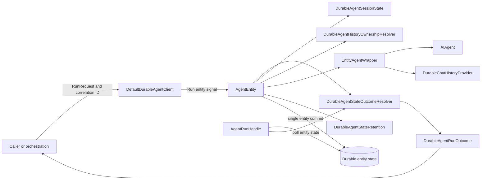
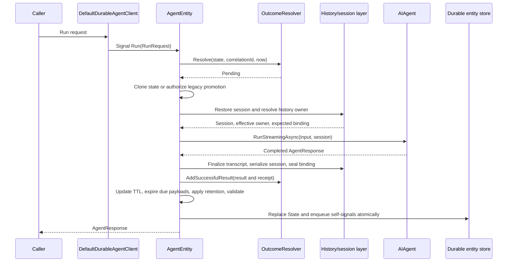
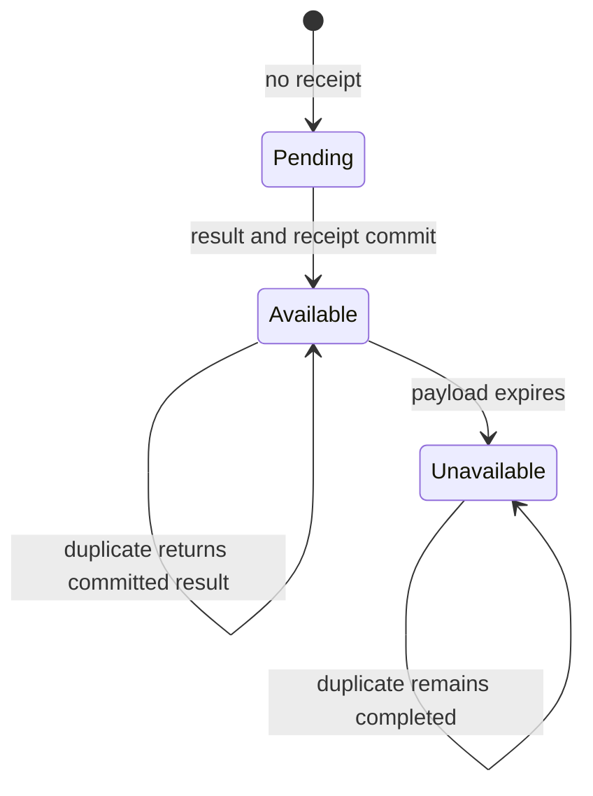

# Durable agent state architecture

Each durable agent session is represented by one Durable Entity. The entity coordinates agent execution and persists the state needed to deliver each result and resume the next turn.

Schema 2 separates request completion from conversation history. A completed request remains completed when its transcript is removed or its result expires, and a resumed session uses exactly one source of conversation history.

Schema `2.0.0` is being introduced in stages so .NET, Python, and other state consumers can adopt the same contract safely. Production .NET readers and writers remain on schema `1.2.0`; schema 2 writes stay disabled until the cross-runtime rollout requirements are satisfied.

The [schema 2 contract](../../../schemas/README.md) defines the wire fields and cross-runtime invariants.

## Runtime components

`AgentEntity` is the transaction coordinator. It owns the working copy, invokes the agent, stages all entity-local changes, validates the complete state, and replaces `State` only after the operation succeeds. `DurableAgentStateOutcomeResolver` is shared by entity execution and polling so both paths interpret legacy transcript state and schema 2 mailbox state identically.

`DurableAgentHistoryOwnershipResolver` determines which component supplies prior conversation context. `DurableChatHistoryProvider` is created per operation only for entity-owned history because it must write to that operation's working copy and correlation ID. `DurableAgentSessionState` restores and serializes the Agent Framework `AgentSession` independently of transcript ownership.

## Persisted state

Schema 2 separates data by authority and lifetime:

| State | Concrete representation | Authority and lifetime |
| --- | --- | --- |
| Conversation transcript | `conversationHistory` containing `DurableAgentStateEntry` values | Model context when the entity is the owner; eligible for pressure retention |
| Terminal result mailbox | `terminalResults[correlationId]` containing `DurableAgentStateTerminalResult` | Caller-visible response or failure; optionally expires |
| Completion evidence | `completionReceipts[correlationId]` containing `DurableAgentStateCompletionReceipt` | Authoritative proof that the correlation completed; survives result expiry and transcript removal |
| History owner | `historyBinding` interpreted by `DurableAgentHistoryBinding` | Fixed logical owner profile used to reject incompatible restoration |
| Agent continuation | `session` handled by `DurableAgentSessionState` | Opaque Agent Framework session state needed after worker restart |
| Entity deletion | `expirationTimeUtc` plus a scheduled self-signal | Deletes the entire session only when whole-entity TTL is enabled |
| Retention evidence | `truncation` | Records destructive transcript eviction without becoming delivery evidence |

The central invariant is:

> Removing transcript or result payload data must never make a completed correlation executable again.

Consequently, schema 2 never falls back to `conversationHistory` when resolving a correlation. No receipt means pending or unknown. An available receipt requires a matching terminal result. An unavailable receipt proves completion even though the payload can no longer be returned.

## New request flow

The operation begins by resolving the correlation before constructing or invoking the agent. A new request operates on a clone so cancellation, model failure, provider failure, validation failure, or serialization failure leaves the hydrated entity state unchanged.

After the outer agent response completes, `AgentEntity` re-evaluates history ownership because a model service can establish a conversation ID during the call. It then finalizes only the transcript owned by the entity, serializes the session without duplicating entity-owned in-memory history, seals the fixed binding, and calls `DurableAgentStateOutcomeResolver.AddSuccessfulResult`. The result and receipt are therefore part of the same working state as session continuation, binding, transcript, TTL, ingestion bookkeeping, and retention evidence.

Setting `State` and scheduling entity self-signals use the Durable Entity operation/outbox commit. External model calls, tool calls, model-service conversations, and custom history-provider writes occur outside that transaction and require their own idempotency behavior.

## Duplicate and polling flow

Both `AgentEntity.Run` and `AgentRunHandle.ReadAgentOutcomeAsync` call `DurableAgentStateOutcomeResolver.Resolve`.

For a duplicate signal, `AgentEntity.Run` resolves the committed outcome before validating new message content or invoking the model. An available result is returned. An unavailable result raises `DurableAgentResultUnavailableException`. Neither path executes the agent again.

For a polling caller, `AgentRunHandle` reads entity state with exponential backoff and uses the same resolver. Legacy state resolves a single matching `DurableAgentStateResponse` from the transcript. Schema 2 resolves only the receipt/result maps and treats malformed or inconsistent pairs as `DurableAgentStateCorruptionException`.

The caller-provided correlation ID is the idempotency key. The implementation intentionally does not compare duplicate request bodies, so a caller must never reuse one correlation ID for different work.

## History ownership and restart flow

History ownership controls where prior model context comes from; it does not control mailbox delivery. The internal `DurableAgentHistoryOwnership` enum represents the resolved runtime cases:

| Ownership | Context source | Entity transcript behavior |
| --- | --- | --- |
| `Entity` | `conversationHistory`, exposed through the operation-scoped `DurableChatHistoryProvider` | Request and final response are retained |
| `ExternalProvider` | Configured Agent Framework `ChatHistoryProvider` | No transcript mirror is added |
| `Service` | Restored model-service conversation | No transcript mirror is added |
| `AgentSession` | Opaque restored session for a generic agent | Only the current request is passed |
| `NoContextPipeline` | No discoverable Agent Framework context pipeline | `DurableAgentHistoryReplayMode` selects entity preload or current-request-only behavior |

On each cold operation, `DurableAgentSessionState.RestoreAsync` reconstructs the session. `DurableAgentHistoryOwnershipResolver` inspects the public Agent Framework surface available from the agent and session, applies the configured replay policy, and produces the effective owner. `DurableAgentHistoryBinding` compares that owner with the persisted fixed binding and rejects a different owner or provider identity before model execution.

After execution, ownership is resolved again. A newly assigned real service conversation ID can transition a provisional first turn to service ownership. The final binding and serialized continuation are validated and committed together. Later workers must restore the same logical owner.

The application or external provider remains responsible for availability, authorization, retention, deletion, residency, and consistency of history stored outside the entity. The durable extension is responsible for restoring the recorded continuation, selecting only one context source, and failing closed when it cannot prove a compatible owner.

## History configuration

Closed choices are represented by enums: `DurableAgentHistoryReplayMode` has `PreloadEntityHistory` and `CurrentRequestOnly`; `DurableAgentHistoryRetentionMode` has `KeepAll` and `Auto`. History ownership is also a closed internal enum after resolution.

Agent names and logical provider identities are open sets, so an enum is not appropriate for them. The current options address history policy by agent name and persist a logical provider key through:

- `SetServiceManagedPerServiceCallHistory`
- `SetHistoryReplayMode`
- `SetHistoryProviderKey`

History policy belongs to the agent registration; it should not require callers to repeat an agent name. A logical provider identity crosses the JSON wire as a string for interoperability, while public configuration can represent it with a validated value object or registration token. Applications should define any unavoidable identifier once as a constant or static typed value.

The persisted `ownerKind` strings are not application configuration. `DurableAgentStateHistoryBinding` owns the constants and `DurableAgentHistoryBinding` converts the internal ownership enum to the wire profile. Callers should not construct `historyBinding` JSON or select an owner with a string.

## Result expiry, transcript retention, and entity TTL

These are independent mechanisms:

| Mechanism | Trigger | Removes | Preserves |
| --- | --- | --- | --- |
| Result expiry | `ResultRetentionPeriod` and `CheckAndExpireResults` | `terminalResults[correlationId]` payload | Completion receipt with unavailable state |
| Pressure retention | `DurableAgentHistoryRetentionMode.Auto` and serialized-state high watermark | Oldest eligible connected transcript groups | Mailbox, receipts, binding, session, TTL, bookkeeping, system groups, newest group |
| Whole-entity TTL | `expirationTimeUtc` and `CheckAndDeleteIfExpired` | Entire entity | Nothing in that session |

`AgentEntity.ApplyRetentionAndCommit` performs due result expiry, writes the next generation-aware expiry schedule, invokes `DurableAgentStateRetention.Enforce`, validates serialization, schedules required self-signals, and finally replaces entity state. Automatic retention measures the complete serialized extension state, starts eviction at 85% of `MaxStateBytes`, and targets 70%. It fails the operation with `DurableAgentStateSizeLimitExceededException` when protected state cannot fit rather than deleting correctness-critical data.

Model-context compaction is not pressure retention. Stateful compaction is rejected by the ownership layer because the current public Agent Framework contracts do not allow the durable runtime to prove safe replay and persistence behavior.

## Failure boundary

Only a successful outer entity operation publishes a new terminal result. The following failures leave the prior entity state authoritative and the request retryable unless a separately committed terminal contract says otherwise:

- Cancellation or incomplete response-stream consumption.
- Model, tool, provider, or session serialization failure.
- History-owner or provider-key mismatch.
- State validation, serialization, or protected-capacity failure.
- Backend failure before the Durable Entity operation commits.

An external service or provider may have observed a call even when the entity commit fails. Schema 2 prevents a committed completion from being forgotten; it cannot make external side effects atomic with the entity store.

## Documentation authority

| Document | Authority |
| --- | --- |
| [Durable agents overview](README.md) | Current public programming model and hosting options |
| [.NET state README](../../../dotnet/src/Microsoft.Agents.AI.DurableTask/State/README.md) | .NET serialization and compatibility behavior |
| [Schema 2 contract](../../../schemas/README.md) | Cross-runtime wire semantics and rollout requirements |
| [JSON schema](../../../schemas/durable-agent-entity-state.json) | Machine-readable wire shape |
| [ADR 0032 review](https://github.com/microsoft/agent-framework-durable-extension/pull/88) | Decision rationale and alternatives |
