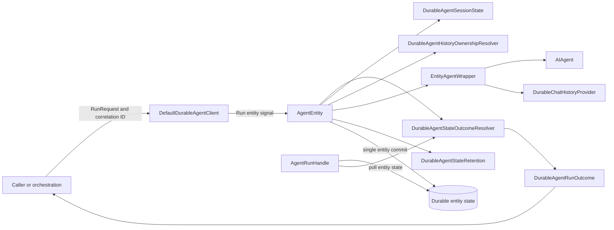
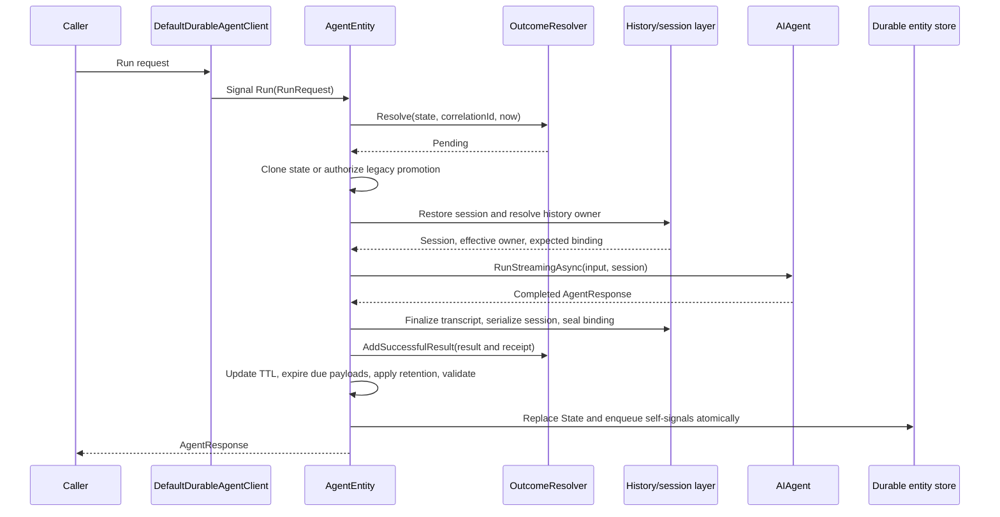
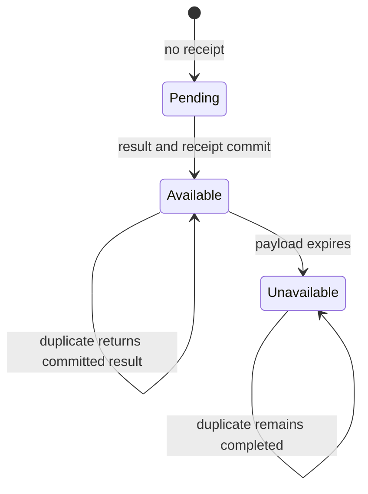

# Durable agent state architecture

Each durable agent session is represented by one Durable Entity. The entity coordinates agent execution and persists the state needed to deliver each result and resume the next turn.

Schema 2 separates request completion from conversation history. A completed request remains completed when its transcript is removed or its result expires, and a resumed session uses exactly one source of conversation history.

Schema `2.0.0` is being introduced in stages so .NET, Python, and other state consumers can adopt the same contract safely. Production .NET readers and writers remain on schema `1.2.0`; schema 2 writes stay disabled until the cross-runtime rollout requirements are satisfied.

The [schema 2 contract](../../../schemas/README.md) defines the wire fields and cross-runtime invariants.

## Runtime components

```mermaid
flowchart LR
    Caller[Caller or orchestration] -->|RunRequest and correlation ID| Client[DefaultDurableAgentClient]
    Client -->|Run entity signal| Entity[AgentEntity]
    Entity --> Resolver[DurableAgentStateOutcomeResolver]
    Entity --> Session[DurableAgentSessionState]
    Entity --> Owner[DurableAgentHistoryOwnershipResolver]
    Entity --> Wrapper[EntityAgentWrapper]
    Wrapper --> Agent[AIAgent]
    Wrapper --> DurableProvider[DurableChatHistoryProvider]
    Entity --> Retention[DurableAgentStateRetention]
    Entity -->|single entity commit| Store[(Durable entity state)]
    Handle[AgentRunHandle] -->|poll entity state| Store
    Handle --> Resolver
    Resolver --> Outcome[DurableAgentRunOutcome]
    Outcome --> Caller
```

`AgentEntity` is the transaction coordinator. It owns the working copy, invokes the agent, stages all entity-local changes, validates the complete state, and replaces `State` only after the operation succeeds. `DurableAgentStateOutcomeResolver` is shared by entity execution and polling so both paths interpret legacy transcript state and schema 2 mailbox state identically.

`DurableAgentHistoryOwnershipResolver` determines which component supplies prior conversation context. `DurableChatHistoryProvider` is created per operation only for entity-owned history because it must write to that operation's working copy and correlation ID. `DurableAgentSessionState` restores and serializes the Agent Framework `AgentSession` independently of transcript ownership.

## Persisted state

Schema 2 separates data by authority and lifetime:

| State | Concrete representation | Authority and lifetime |
| --- | --- | --- |
| Conversation transcript | `conversationHistory` containing `DurableAgentStateEntry` values | Model context when the entity is the owner; eligible for pressure retention |
| Terminal result mailbox | `terminalResults[correlationId]` containing `DurableAgentStateTerminalResult` | Caller-visible response or failure; optionally expires |
| Completion evidence | `completionReceipts[correlationId]` containing `DurableAgentStateCompletionReceipt` | Authoritative proof that the correlation completed; survives result expiry and transcript removal |
| History owner | `historyBinding` interpreted by `DurableAgentHistoryBinding` | Fixed logical owner profile used to reject incompatible restoration |
| Agent continuation | `session` handled by `DurableAgentSessionState` | Opaque Agent Framework session state needed after worker restart |
| Entity deletion | `expirationTimeUtc` plus a scheduled self-signal | Deletes the entire session only when whole-entity TTL is enabled |
| Retention evidence | `truncation` | Records destructive transcript eviction without becoming delivery evidence |

The central invariant is:

> Removing transcript or result payload data must never make a completed correlation executable again.

Consequently, schema 2 never falls back to `conversationHistory` when resolving a correlation. No receipt means pending or unknown. An available receipt requires a matching terminal result. An unavailable receipt proves completion even though the payload can no longer be returned.

## New request flow

```mermaid
sequenceDiagram
    participant C as Caller
    participant D as DefaultDurableAgentClient
    participant E as AgentEntity
    participant R as OutcomeResolver
    participant H as History/session layer
    participant A as AIAgent
    participant S as Durable entity store

    C->>D: Run request
    D->>E: Signal Run(RunRequest)
    E->>R: Resolve(state, correlationId, now)
    R-->>E: Pending
    E->>E: Clone state or authorize legacy promotion
    E->>H: Restore session and resolve history owner
    H-->>E: Session, effective owner, expected binding
    E->>A: RunStreamingAsync(input, session)
    A-->>E: Completed AgentResponse
    E->>H: Finalize transcript, serialize session, seal binding
    E->>R: AddSuccessfulResult(result and receipt)
    E->>E: Update TTL, expire due payloads, apply retention, validate
    E->>S: Replace State and enqueue self-signals atomically
    E-->>C: AgentResponse
```

The operation begins by resolving the correlation before constructing or invoking the agent. A new request operates on a clone so cancellation, model failure, provider failure, validation failure, or serialization failure leaves the hydrated entity state unchanged.

After the outer agent response completes, `AgentEntity` re-evaluates history ownership because a model service can establish a conversation ID during the call. It then finalizes only the transcript owned by the entity, serializes the session without duplicating entity-owned in-memory history, seals the fixed binding, and calls `DurableAgentStateOutcomeResolver.AddSuccessfulResult`. The result and receipt are therefore part of the same working state as session continuation, binding, transcript, TTL, ingestion bookkeeping, and retention evidence.

Setting `State` and scheduling entity self-signals use the Durable Entity operation/outbox commit. External model calls, tool calls, model-service conversations, and custom history-provider writes occur outside that transaction and require their own idempotency behavior. A provider or service adapter must treat a failed or missing acknowledgement as uncertain because the remote write may have completed even when the entity operation later fails.

## Duplicate and polling flow

Both `AgentEntity.Run` and `AgentRunHandle.ReadAgentOutcomeAsync` call `DurableAgentStateOutcomeResolver.Resolve`.

```mermaid
stateDiagram-v2
    [*] --> Pending: no receipt
    Pending --> Available: result and receipt commit
    Available --> Available: duplicate returns committed result
    Available --> Unavailable: payload expires
    Unavailable --> Unavailable: duplicate remains completed
```

For a duplicate signal, `AgentEntity.Run` resolves the committed outcome before validating new message content or invoking the model. An available result is returned. An unavailable result raises `DurableAgentResultUnavailableException`. Neither path executes the agent again.

For a polling caller, `AgentRunHandle` reads entity state with exponential backoff and uses the same resolver. Legacy state resolves a single matching `DurableAgentStateResponse` from the transcript. Schema 2 resolves only the receipt/result maps and treats malformed or inconsistent pairs as `DurableAgentStateCorruptionException`.

The caller-provided correlation ID is the idempotency key. The implementation intentionally does not compare duplicate request bodies, so a caller must never reuse one correlation ID for different work.

## History ownership and restart flow

History ownership controls where prior model context comes from; it does not control mailbox delivery. The internal `DurableAgentHistoryOwnership` enum represents the resolved runtime cases:

| Ownership | Context source | Entity transcript behavior |
| --- | --- | --- |
| `Entity` | `conversationHistory`, exposed through the operation-scoped `DurableChatHistoryProvider` | Request and final response are retained |
| `ExternalProvider` | Configured Agent Framework `ChatHistoryProvider` | No transcript mirror is added |
| `Service` | Restored model-service conversation | No transcript mirror is added |
| `AgentSession` | Opaque restored session for a generic agent | Only the current request is passed |
| `NoContextPipeline` | No discoverable Agent Framework context pipeline | `DurableAgentHistoryReplayMode` selects entity preload or current-request-only behavior |

When the internal schema 2 writer is active, each cold operation uses `DurableAgentSessionState.RestoreAsync` to reconstruct the session. `DurableAgentHistoryOwnershipResolver` inspects the public Agent Framework surface available from the agent and session, applies the configured replay policy, and produces the effective owner. `DurableAgentHistoryBinding` compares that owner with the persisted fixed binding and rejects a different owner or provider identity before model execution. Schema 1 remains the public default and preserves the pre-profile behavior without creating or enforcing a fixed binding.

In schema 1, explicitly configured in-memory providers retain their declared session state, including reducer and filter output, across cold restarts. Their state is not a disposable copy of the entity transcript. The implicit default provider retains the legacy entity-replay behavior, while schema 2 uses the operation-scoped durable adapter for entity-owned history; superseded default-provider transcript state is excluded without removing unrelated session state.

Recognized provisional bindings are also authoritative for provider identity: an explicitly configured provider key must match before the agent is constructed, while truly unrecognized profiles remain opaque and are never interpreted as C# provider identities. Prior continuity includes transcript entries, terminal results, completion receipts, recognized or opaque binding state, serialized sessions, ingestion positions, and truncation evidence, so transcript pruning cannot make an established session appear fresh.

After execution, ownership is resolved again. A newly assigned real service conversation ID can transition a provisional first turn to service ownership. The final binding and serialized continuation are validated and committed together. Later workers must restore the same logical owner.

External providers must declare continuation `StateKeys`, and every declared key must contain usable non-empty JSON state before a bound invocation or final seal. Missing, null, blank-string, empty-container, and marker-only values do not prove that the same logical provider history can resume. A restored real service conversation and a custom history provider are conflicting authorities and are rejected before provider or model callbacks.

The application or external provider remains responsible for availability, authorization, retention, deletion, residency, consistency, idempotency, and uncertain acknowledgement handling for history stored outside the entity. The durable extension is responsible for restoring the recorded continuation, selecting only one context source, and failing closed when it cannot prove a compatible owner.

## History configuration

Closed public replay choices are represented by `DurableAgentHistoryReplayMode`, with `PreloadEntityHistory` and `CurrentRequestOnly`. Pressure-retention choices remain an internal enum alongside the default-off schema-2 writer gate; applications are not offered an activation surface that the public rollout cannot yet support. History ownership is also a closed internal enum after resolution.

Agent names and logical provider identities are open sets, so an enum is not appropriate for them. History policy is attached to `AddAIAgent` or `AddAIAgentFactory` through `DurableAgentHistoryOptions`; callers do not repeat the agent name. `DurableAgentHistoryProviderKey` validates the logical provider identity before registration. It crosses the JSON wire as a string for interoperability, but applications can define it once as a static typed value.

The persisted `ownerKind` strings are not application configuration. `DurableAgentStateHistoryBinding` owns the constants and `DurableAgentHistoryBinding` converts the internal ownership enum to the wire profile. Callers should not construct `historyBinding` JSON or select an owner with a string.

## Result expiry, transcript retention, and entity TTL

These are independent mechanisms:

| Mechanism | Trigger | Removes | Preserves |
| --- | --- | --- | --- |
| Result expiry | `ResultRetentionPeriod` (60 seconds by default) and `CheckAndExpireResults` | `terminalResults[correlationId]` payload | Completion receipt with unavailable state |
| Pressure retention | Internal `Auto`, explicit positive storage-envelope budget, and configured high watermark | Oldest eligible transcript groups | Mailbox, receipts, binding, session, TTL, bookkeeping, system groups, newest exchange and its tool pairs |
| Whole-entity TTL | `expirationTimeUtc` and `CheckAndDeleteIfExpired` | Entire entity | Nothing in that session |

`AgentEntity.ApplyRetentionAndCommit` performs due result expiry, writes the next generation-aware expiry schedule, invokes staged retention, validates serialization, schedules required self-signals, and finally replaces entity state. Automatic retention measures the converter output as an escaped JSON-string storage envelope. Its default 0.85 high and 0.70 low watermarks are internally configurable with `0 < low < high <= 1`; there is no implicit portable budget. A protected-floor failure leaves the input state unchanged and fails before model/provider effects when the floor is deterministically knowable.

Protection is a fixed-point connected-component closure over correlation membership and tool-call/result links. The actual newest entry and every entry containing a system message seed protection. Every entry in any reached non-null correlation is protected, and every occurrence of a reached non-empty tool ID is protected; newly reached entries recursively expand protection through their own correlation and tool links until closure. Pressure eviction removes only an oldest prefix of atomic components that remain disconnected from that closure. A newest or system-message component may therefore connect to older history and raise the protected floor above the budget, in which case retention fails atomically without publishing the working state.

The `.NET` runtime uses meter `agent_framework.durabletask`, nine `durable.retention.*` instruments, and a `commit_status` dimension. These names align with the Python retention implementation proposed in [microsoft/agent-framework-durable-extension#123](https://github.com/microsoft/agent-framework-durable-extension/pull/123); this does not claim that Python parity is already merged or released. Cumulative `evictedMessageCount` evidence is a nonnegative signed `Int64`; a selected eviction that would overflow it fails atomically without publishing transcript, mailbox, receipt, or session changes. Per-attempt metrics remain bounded measurements and never replace durable evidence. These measurements describe staged attempts and host write boundaries; they do not claim durable commit confirmation.

Model-context compaction is not pressure retention. `CompactionProvider` may reduce only the messages sent to the model; its serialized session state counts toward the complete entity-state budget, and the durable transcript remains unchanged. Store-pruning behavior that follows compaction is deferred.

## Failure boundary

Only a successful outer entity operation publishes a new terminal result. The following failures leave the prior entity state authoritative and the request retryable unless a separately committed terminal contract says otherwise:

- Cancellation or incomplete response-stream consumption.
- Model, tool, provider, or session serialization failure.
- History-owner or provider-key mismatch.
- State validation, serialization, or protected-capacity failure.
- Backend failure before the Durable Entity operation commits.

An external service or provider may have observed a call even when the entity commit fails. Schema 2 prevents a committed completion from being forgotten; it cannot make external side effects atomic with the entity store.

## Documentation authority

| Document | Authority |
| --- | --- |
| [Durable agents overview](README.md) | Current public programming model and hosting options |
| [.NET state README](../../../dotnet/src/Microsoft.Agents.AI.DurableTask/State/README.md) | .NET serialization and compatibility behavior |
| [Schema 2 contract](../../../schemas/README.md) | Cross-runtime wire semantics and rollout requirements |
| [JSON schema](../../../schemas/durable-agent-entity-state.json) | Machine-readable wire shape |
| [ADR 0032 review](https://github.com/microsoft/agent-framework-durable-extension/pull/88) | Decision rationale and alternatives |
